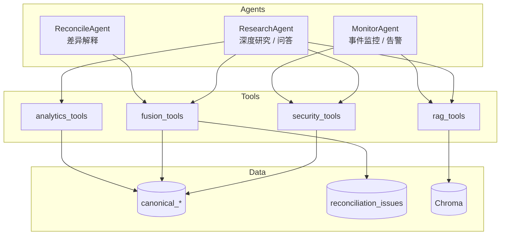
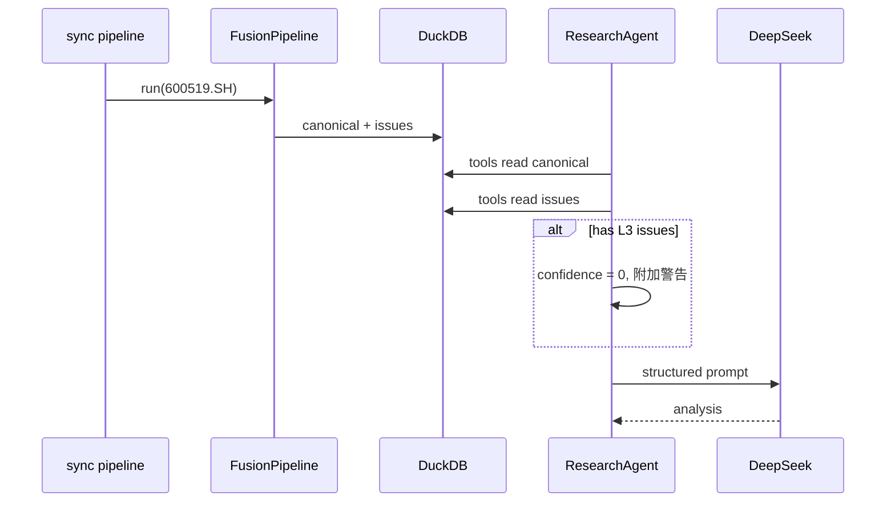

# Agent 与智能层设计文档

> 关联：[ARCHITECTURE.md](./ARCHITECTURE.md) · [FUSION_RECONCILE.md](./FUSION_RECONCILE.md)

---

## 1. 概述

智能层是平台的 **解读与编排层**，不是 **数据生产层**。

### 1.1 核心约束（铁律）

```
┌────────────────────────────────────────────────────────┐
│  DeepSeek 不生产数字                                    │
│  DeepSeek 不直接调用 AKShare / Tushare                  │
│  DeepSeek 只读 canonical_* + reconciliation_issues      │
│  DeepSeek 解读必须引用 Tool 返回的结构化数据              │
│  存在 L3 未解决差异时，禁止输出确定性投资结论              │
└────────────────────────────────────────────────────────┘
```

### 1.2 LLM 选型

| 属性 | 值 |
|------|-----|
| 首期模型 | DeepSeek Chat (`deepseek-chat`) |
| API | https://api.deepseek.com |
| 环境变量 | `DEEPSEEK_API_KEY` |
| 后期扩展 | LiteLLM 抽象，支持 Claude/GPT 切换 |

---

## 2. Agent 架构

### 2.1 三 Agent 分工



| Agent | 职责 | 触发方式 |
|-------|------|----------|
| **ResearchAgent** | 单标的深度研究、自然语言问答、生成研报 | CLI `research` / `ask` |
| **ReconcileAgent** | 解释多源差异原因、建议信哪个源 | `reconcile` 后自动 / 用户追问 |
| **MonitorAgent** | 扫描持仓/自选，检测异常与事件 | 定时任务 `monitor run` |

### 2.2 Agent 执行循环

```python
class BaseAgent:
  max_iterations: int = 5

  async def run(self, task: str, security_id: str) -> AgentResult:
      messages = [system_prompt, user_message(task, security_id)]
      for _ in range(self.max_iterations):
          response = await self.llm.chat(messages, tools=self.tools.schema())
          if response.tool_calls:
              for call in response.tool_calls:
                  result = self.tools.execute(call.name, call.arguments)
                  messages.append(tool_result(call, result))
          else:
              return self.parse_output(response)
      raise MaxIterationsError
```

---

## 3. Tool Registry

### 3.1 工具清单

| Tool | 参数 | 返回 | 只读 |
|------|------|------|------|
| `get_security_overview` | security_id | 名称、行业、估值摘要、数据新鲜度 | ✓ |
| `get_fused_financials` | security_id, years=3 | 财务时间序列 + lineage | ✓ |
| `get_fused_valuation` | security_id | PE/PB/市值 | ✓ |
| `get_fused_bars` | security_id, days=60 | 近期 K 线 | ✓ |
| `get_reconciliation_issues` | security_id, min_severity? | 差异列表 | ✓ |
| `compare_peers` | security_id, peer_ids? | 同业对比表 | ✓ |
| `get_indicators` | security_id | MA/RSI 等 | ✓ |
| `search_documents` | security_id, query, top_k=5 | RAG 片段 + 来源 URL | ✓ |
| `get_event_timeline` | security_id, days=30 | 事件列表 | ✓ |
| `get_money_flow` | security_id, days=10 | 资金流向 | ✓ |

**禁止提供的工具**（防幻觉）：

- ❌ `predict_price`
- ❌ `get_live_api_data`（直连外部源）
- ❌ `calculate_financials`（应由 analytics 层预计算）

### 3.2 Tool 返回格式

所有 Tool 返回统一 envelope：

```json
{
  "success": true,
  "security_id": "600519.SH",
  "data": { ... },
  "meta": {
    "source": "canonical_financials",
    "as_of": "2026-06-14",
    "has_unresolved_l3": false,
    "confidence": 1.0
  }
}
```

`confidence` 计算规则：

```python
confidence = 1.0
for issue in open_issues:
    if issue.severity == "L2": confidence -= 0.2
    if issue.severity == "L3": confidence = 0.0  # 阻断
```

---

## 4. ResearchAgent

### 4.1 系统提示词（要点）

```text
你是投资研究助手，不是投资顾问。

规则：
1. 所有数字必须来自 Tool 返回，禁止估算或编造
2. 每个结论标注数据来源与日期
3. 若 meta.has_unresolved_l3=true，必须声明数据不可靠
4. 不做买卖建议，只提供研究视角
5. 输出结构化 Markdown
```

### 4.2 典型任务流程

**任务**：「分析贵州茅台近 3 年盈利质量」

```
Step 1: get_security_overview("600519.SH")
Step 2: get_fused_financials("600519.SH", years=3)
Step 3: get_reconciliation_issues("600519.SH", min_severity="L1")
Step 4: compare_peers("600519.SH")
Step 5: search_documents("600519.SH", "业绩说明会")
Step 6: DeepSeek 综合 → ResearchReport
```

### 4.3 输出结构

```markdown
# 600519.SH 贵州茅台 研究报告
> 生成时间：2026-06-14 | 数据截至：2026-06-13 | 置信度：0.8

## 摘要
...

## 财务趋势
| 年份 | 营收 | 净利润 | 毛利率 | ROE |
（数据来自 canonical_financials）

## 估值与同业
...

## 多源数据说明
- PE(TTM) 存在 L1 差异（akshare 24.1 vs tushare 23.7），已取融合值 23.9

## 风险因素
1. ...
2. ...

## 待验证问题
- ...

---
免责声明：本报告由 AI 辅助生成，仅供研究参考，不构成投资建议。
```

---

## 5. ReconcileAgent

### 5.1 职责

- 读取 `reconciliation_issues`
- 可选读取 `raw_snapshots` 元数据
- 用 DeepSeek **解释** 差异原因（不是掩盖差异）

### 5.2 输出示例

```markdown
## PE(TTM) 差异解释

**观测值**：AKShare 24.1 vs Tushare 23.7（差异 1.7%，L1）

**可能原因**：
1. TTM 盈利计算窗口不同（最新季报纳入时点）
2. 总股本/市值取值时点不同
3. 东财与 Tushare 对亏损股 PE 处理规则不同

**建议**：估值分析使用融合值 23.9，报告中标注双源差异。
```

---

## 6. MonitorAgent

### 6.1 监控规则

| 规则 ID | 条件 | 级别 |
|---------|------|------|
| `RECON_L3` | 存在 open 的 L3 对账问题 | critical |
| `PRICE_DIFF` | 多源收盘价 diff > 0.5% | warning |
| `NEW_ANN` | 24h 内新公告 | info |
| `EARNINGS` | 业绩预告/快报 | info |
| `NORTH_FLOW` | 北向单日变动超阈值 | info |

### 6.2 告警输出

```json
{
  "alert_id": "alt_001",
  "security_id": "600519.SH",
  "rule": "RECON_L3",
  "message": "营收数据存在 6.2% 多源差异，已阻断融合",
  "created_at": "2026-06-14T08:00:00"
}
```

### 6.3 推送通道（M4+）

- 企业微信 Webhook
- 邮件 SMTP
- 本地日志 + Markdown 告警文件

---

## 7. DeepSeek 集成

### 7.1 客户端封装

```python
class DeepSeekClient:
    def __init__(self, api_key: str, model: str = "deepseek-chat"):
        self.model = model

    async def chat(self, messages, tools=None, response_format=None):
        # OpenAI 兼容 API
        # 支持 function calling
        ...

    async def extract_structured(self, text, schema: type[BaseModel]):
        # JSON Mode + Pydantic 校验
        ...
```

### 7.2 结构化抽取（新闻 → 事件）

```python
class NewsEvent(BaseModel):
    event: str
    entities: list[str]
    sentiment: float          # -1 ~ 1
    impact_chain: list[str]
    confidence: float
    source: str
    published_at: datetime
```

用于 `EventTimeline` 入库，不仅做利好/利空三分类。

### 7.3 Token 与成本优化

| 策略 | 说明 |
|------|------|
| Tool 返回摘要 | 财务 3 年只传关键字段，不传全表 |
| RAG Top-K | 限制 5 片段，每段 500 字 |
| 缓存研报 | 同日同标的不重复生成 |
| 分层模型 | 抽取用便宜模型，研报用 deepseek-chat |

---

## 8. Prompt 模板管理

```
src/dataanalysisbase/llm/prompts/
├── research_system.txt
├── research_user.txt
├── reconcile_system.txt
├── news_extract.txt
└── daily_brief.txt
```

模板变量：

```jinja2
{# research_user.txt #}
标的：{{ security_id }} {{ name }}

## 结构化数据（由系统提供，请勿编造）
{{ tool_results_json }}

## 未解决对账问题
{{ reconciliation_issues }}

请按模板输出研究报告。
```

---

## 9. 与融合层的协作



---

## 10. 错误处理

| 场景 | 处理 |
|------|------|
| DeepSeek API 失败 | 重试 3 次，降级输出「仅数据表格无解读」 |
| Tool 无数据 | 明确告知用户需先 `sync` |
| L3 阻断 | 输出对账报告，不生成投资性结论 |
| Tool 循环 | max_iterations=5 强制终止 |

---

## 11. 测试策略

| 测试 | 内容 |
|------|------|
| Tool 单测 | mock DuckDB，验证返回 schema |
| Agent 集成 | mock LLM，验证 tool 调用顺序 |
| Prompt 回归 | 固定输入，snapshot 对比输出结构 |
| 幻觉检测 | 输出数字 ⊆ Tool 返回数字 |

---

*环境变量示例见项目根目录 `.env.example`（实施阶段创建）*
