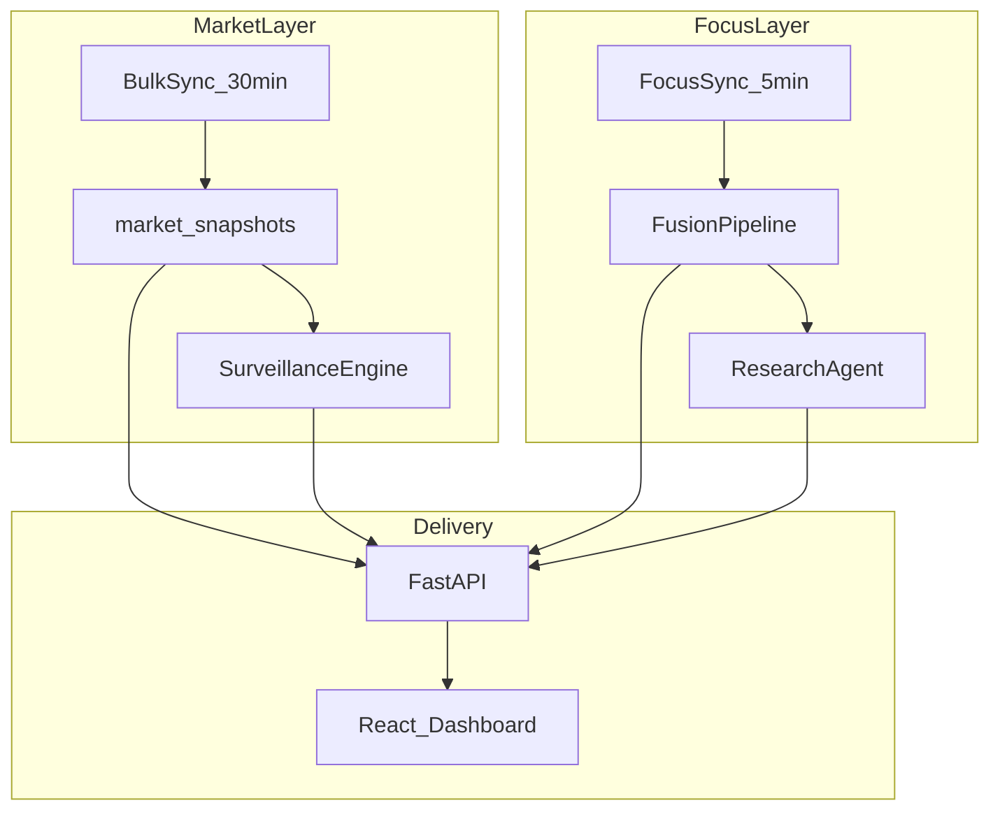
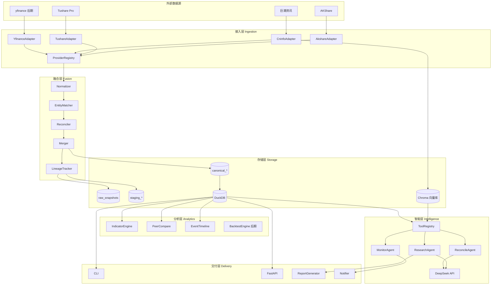
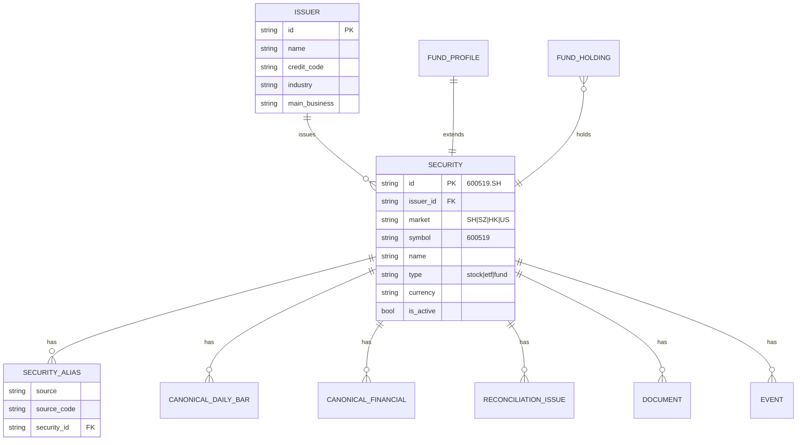
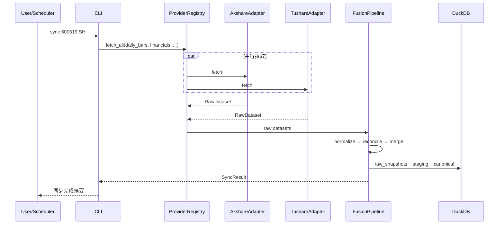
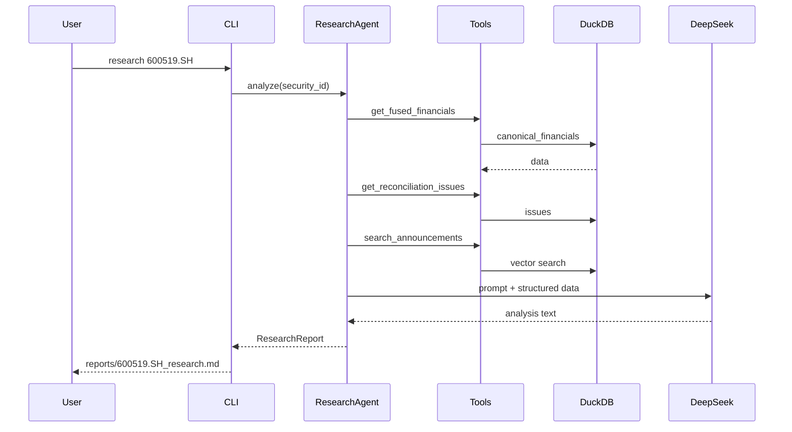

# DataAnalysisBase 系统架构设计文档

| 属性 | 值 |
|------|-----|
| 项目名称 | DataAnalysisBase |
| 版本 | v0.2.0 |
| 状态 | 设计阶段（文档已完成，待实现） |
| 目标市场 | A 股（优先）→ 港股 / 美股（扩展） |
| LLM | DeepSeek（首期） |
| 文档日期 | 2026-06-14 |

---

## 目录

1. [背景与目标](#1-背景与目标)
2. [设计原则](#2-设计原则)
3. [系统定位与边界](#3-系统定位与边界)
4. [总体架构](#4-总体架构)
5. [领域模型](#5-领域模型)
6. [分层设计](#6-分层设计)
7. [数据流与核心工作流](#7-数据流与核心工作流)
8. [存储架构](#8-存储架构)
9. [接口设计](#9-接口设计)
10. [项目结构](#10-项目结构)
11. [技术选型](#11-技术选型)
12. [非功能性需求](#12-非功能性需求)
13. [安全与合规](#13-安全与合规)
14. [风险与缓解](#14-风险与缓解)
15. [相关文档](#15-相关文档)

---

## 1. 背景与目标

### 1.1 背景

个人投资者在进行 A 股研究时，通常面临以下问题：

- **信息分散**：行情在炒股软件、财务在年报、新闻在财经网站，难以统一视角
- **数据源不一**：东方财富、Tushare、新浪财经等同指标数值存在差异，缺乏对账机制
- **重复劳动**：下载 CSV、手算指标、整理研报，耗时长且不可复现
- **AI 误用**：直接让 LLM 预测涨跌或估算财务数字，幻觉风险高

### 1.2 项目目标

构建一套 **本地 A 股全市场智能监管与分析平台**：

| 目标 | 描述 |
|------|------|
| **全市场覆盖** | 沪深京 ~5000+ 只股票定时快照与监管（见 [MARKET_SURVEILLANCE.md](./MARKET_SURVEILLANCE.md)） |
| **本地 Web 仪表盘** | React 前端直观展示市场、行业、告警（见 [UI_DESIGN.md](./UI_DESIGN.md)） |
| **行业分类** | 板块排行、热力图、成分股浏览 |
| **自动化监管** | 全市场变化检测与告警流（SurveillanceEngine） |
| **重点股深度** | 自选更高频跟踪、多源融合、对账、AI 研报（FocusLayer） |
| **多源接入** | AKShare（全市场主）+ Tushare（重点股对账） |
| **实体中心** | `Security` / `Issuer` 为主键，全市场与重点股共用 |

### 1.3 非目标（明确不做）

- ❌ AI 直接预测涨跌、涨停股
- ❌ 全自动下单交易系统（首期）
- ❌ 替代 Wind / Choice 等机构终端
- ❌ 实时 Level-2 高频交易

---

## 2. 设计原则

### 2.1 核心原则

```
实体中心 > 数据源中心
可验证数字 > AI 自由发挥
融合对账 > 盲信单源
本地真相库 > 每次现拉
工具调用 > 纯 Prompt
```

### 2.2 原则详解

| 原则 | 含义 | 落地方式 |
|------|------|----------|
| **实体中心** | 股票/基金/公司为一等公民 | 所有 API、表、Agent 工具以 `security_id` 为主键 |
| **源无关** | 业务层不感知 AKShare/Tushare | Provider 抽象 + Adapter 实现 |
| **多源不盲信** | 差异必须可见、可解释 | Reconciler + reconciliation_issues 表 |
| **数字与文字分离** | 指标由 Python 计算，LLM 只解读 | Agent Tools 返回结构化 JSON |
| **可追溯** | 结论可回溯到数据源与时间 | lineage_json + raw_snapshots |
| **渐进扩展** | MVP 可运行，模块可插拔 | 分阶段路线图（见 ROADMAP.md） |

---

## 3. 系统定位与边界

### 3.1 产品定位

```
┌─────────────────────────────────────────────────────────┐
│                    DataAnalysisBase                      │
│      本地 A 股全市场智能监管与分析平台（个人版）          │
├─────────────────────────────────────────────────────────┤
│  全市场层：5000+ 股快照、行业视图、异动监管告警            │
│  重点股层：自选深度跟踪、多源对账、AI 研报                 │
├─────────────────────────────────────────────────────────┤
│  交付：本地 Web 仪表盘（主）+ CLI（高级）+ DuckDB 数据层   │
│  用户：个人开发者 / 个人投资者                           │
└─────────────────────────────────────────────────────────┘
```

### 3.2 系统边界

| 在边界内 | 在边界外 |
|----------|----------|
| 多源数据采集与缓存 | 交易所直连 |
| 数据融合与对账 | 投资顾问牌照服务 |
| 指标计算与回测 | 实盘交易执行 |
| AI 研报与问答 | 保证投资收益 |
| 事件监控与推送 | 全市场毫秒级行情 |
| Web 仪表盘全市场浏览 | 机构级专业终端 |

### 3.3 v0.2 双层架构（MarketLayer + FocusLayer）



| 层级 | 覆盖 | 频率 | 文档 |
|------|------|------|------|
| MarketLayer | 全 A 股 | 30min 快照 + 日终日 K | [MARKET_SURVEILLANCE.md](./MARKET_SURVEILLANCE.md) |
| FocusLayer | watchlist | 5min + 周/按需财务 | [FUSION_RECONCILE.md](./FUSION_RECONCILE.md) |

---

## 4. 总体架构

### 4.1 逻辑架构图



### 4.2 分层职责

| 层级 | 职责 | 关键模块 |
|------|------|----------|
| **接入层** | 从外部源拉取原始数据，封装为统一 `RawDataset` | Adapter, Registry |
| **融合层** | 标准化、对账、融合、记录血缘 | Normalizer, Reconciler, Merger |
| **存储层** | 原始快照、分层数据、向量文档 | DuckDB, Chroma |
| **分析层** | 技术指标、同业对比、事件时间线 | IndicatorEngine, PeerCompare |
| **智能层** | Agent 编排、工具调用、LLM 解读 | ResearchAgent, DeepSeek |
| **交付层** | CLI、API、报告、通知 | cli.py, FastAPI |

### 4.3 依赖方向

```
Delivery → Intelligence → Analytics → Storage (canonical)
                              ↑
Ingestion → Fusion → Storage (staging/raw)
```

**硬性约束**：

- Agent / 分析层 **只读** `canonical_*` 表
- Agent **禁止**直接调用 AKShare / Tushare
- 融合层 **不依赖** 智能层

---

## 5. 领域模型

### 5.1 核心实体



### 5.2 Security ID 规范

统一格式：`{symbol}.{market}`

| 市场 | 示例 | 说明 |
|------|------|------|
| 沪市 A 股 | `600519.SH` | 6 开头 |
| 深市 A 股 | `300750.SZ` | 0/3 开头 |
| 北交所 | `920799.BJ` | 后期支持 |
| 港股 | `00700.HK` | 5 位补零 |
| 美股 | `AAPL.US` | 后期支持 |
| 场外基金 | `110022.OF` | 无交易所后缀时用 OF |

**解析规则**（`domain/symbols.py`）：

```python
resolve("600519")      → "600519.SH"
resolve("贵州茅台")     → 查 issuers 表 → "600519.SH"
resolve("sh600519")    → "600519.SH"
```

### 5.3 数据集类型（DatasetType）

| 类型 | 说明 | 融合策略参考 |
|------|------|--------------|
| `daily_bars` | 日 K 线 | priority |
| `valuation` | PE/PB/PS 等估值 | median_of_sources |
| `financials` | 财报三表 + 指标 | authoritative |
| `money_flow` | 资金流向 | priority |
| `news` | 新闻 | union_dedupe |
| `announcements` | 公告 | authoritative |
| `fund_nav` | 基金净值 | priority |
| `fund_holdings` | 基金重仓 | authoritative |

### 5.4 RawDataset 契约

所有 Adapter 返回的统一结构：

```python
@dataclass
class RawDataset:
    source: str              # "akshare" | "tushare"
    dataset_type: DatasetType
    security_id: str
    fetched_at: datetime
    records: list[dict]
    metadata: dict           # 请求参数、行数等
    raw_hash: str            # SHA256，用于审计
```

---

## 6. 分层设计

### 6.1 接入层（Ingestion）

#### 6.1.1 DataProvider 接口

```python
class DataProvider(Protocol):
    name: str
    priority: int

    def supports(self, dataset_type: DatasetType) -> bool: ...
    def fetch(self, dataset_type: DatasetType, security_id: str, **kwargs) -> RawDataset: ...
    def health_check(self) -> ProviderHealth: ...
```

#### 6.1.2 ProviderRegistry

- 按 `providers.yaml` 加载已启用 Adapter
- 按 `dataset_type` 路由到多个 Provider（并行拉取）
- 统一限流、重试、错误隔离（一个源失败不影响另一个）

详见 [DATA_SOURCES.md](./DATA_SOURCES.md)

### 6.2 融合层（Fusion）

流水线：`Normalizer → EntityMatcher → Reconciler → Merger → LineageTracker`

详见 [FUSION_RECONCILE.md](./FUSION_RECONCILE.md)

### 6.3 存储层（Storage）

三层数据模型：

```
raw_snapshots     原始 JSON 快照（审计）
    ↓
staging_*         各源标准化记录（带来源标记）
    ↓
canonical_*       融合后真相数据（业务只读）
```

### 6.4 分析层（Analytics）

| 模块 | 输入 | 输出 |
|------|------|------|
| IndicatorEngine | canonical_daily_bars | MA, RSI, MACD 等 |
| PeerCompare | security_id + peers | 估值/财务对比表 |
| EventTimeline | news + announcements | 时间线事件 |
| BacktestEngine | canonical + strategy | 回测报告（M4+） |

### 6.5 智能层（Intelligence）

三个 Agent + Tool Registry + DeepSeek

详见 [AGENT_INTELLIGENCE.md](./AGENT_INTELLIGENCE.md)

### 6.6 交付层（Delivery）

| 通道 | 用途 |
|------|------|
| CLI | 开发调试、定时任务入口 |
| FastAPI | Copilot 对话 API（M3+） |
| Markdown 报告 | 研究研报、对账报告 |
| Notifier | 企业微信 / 邮件告警（M4+） |

---

## 7. 数据流与核心工作流

### 7.1 单标的同步流程



### 7.2 研究分析流程



### 7.3 对账工作流

```
1. 同一 security_id + as_of + field，收集各源 staging 值
2. 计算相对/绝对差异
3. 按 reconcile_thresholds.yaml 定 severity (L0~L3)
4. 写入 reconciliation_issues
5. Merger 根据 fusion_policy.yaml 决定融合值
6. L3 问题 block canonical 写入，触发告警
7. ReconcileAgent 可选：生成差异解释报告
```

---

## 8. 存储架构

### 8.1 DuckDB 表清单

#### 实体表

```sql
-- 发行人（上市公司）
CREATE TABLE issuers (
    id              VARCHAR PRIMARY KEY,
    name            VARCHAR NOT NULL,
    credit_code     VARCHAR,
    industry        VARCHAR,
    main_business   TEXT,
    created_at      TIMESTAMP,
    updated_at      TIMESTAMP
);

-- 证券（股票/ETF/基金）
CREATE TABLE securities (
    id              VARCHAR PRIMARY KEY,  -- 600519.SH
    issuer_id       VARCHAR REFERENCES issuers(id),
    market          VARCHAR NOT NULL,
    symbol          VARCHAR NOT NULL,
    name            VARCHAR NOT NULL,
    type            VARCHAR NOT NULL,     -- stock|etf|fund
    currency        VARCHAR DEFAULT 'CNY',
    is_active       BOOLEAN DEFAULT TRUE,
    created_at      TIMESTAMP,
    updated_at      TIMESTAMP
);

-- 数据源内代码映射
CREATE TABLE security_aliases (
    source          VARCHAR NOT NULL,
    source_code     VARCHAR NOT NULL,
    security_id     VARCHAR NOT NULL REFERENCES securities(id),
    PRIMARY KEY (source, source_code)
);
```

#### 原始与分层表

```sql
-- 原始快照（审计）
CREATE TABLE raw_snapshots (
    id              VARCHAR PRIMARY KEY,
    security_id     VARCHAR NOT NULL,
    source          VARCHAR NOT NULL,
    dataset_type    VARCHAR NOT NULL,
    fetched_at      TIMESTAMP NOT NULL,
    payload_json    JSON NOT NULL,
    raw_hash        VARCHAR NOT NULL,
    record_count    INTEGER
);

-- 标准化 staging（每源一份，示意：日线）
CREATE TABLE staging_daily_bars (
    source          VARCHAR NOT NULL,
    security_id     VARCHAR NOT NULL,
    trade_date      DATE NOT NULL,
    open            DOUBLE,
    high            DOUBLE,
    low             DOUBLE,
    close           DOUBLE,
    volume          DOUBLE,
    amount          DOUBLE,
    fetched_at      TIMESTAMP,
    PRIMARY KEY (source, security_id, trade_date)
);
```

#### 融合真相表

```sql
-- 融合日 K
CREATE TABLE canonical_daily_bars (
    security_id     VARCHAR NOT NULL,
    trade_date      DATE NOT NULL,
    open            DOUBLE,
    high            DOUBLE,
    low             DOUBLE,
    close           DOUBLE,
    volume          DOUBLE,
    amount          DOUBLE,
    lineage_json    JSON,       -- 来源、差异、融合策略
    merged_at       TIMESTAMP,
    PRIMARY KEY (security_id, trade_date)
);

-- 融合财务
CREATE TABLE canonical_financials (
    security_id     VARCHAR NOT NULL,
    end_date        DATE NOT NULL,
    report_type     VARCHAR,    -- Q1|Q2|Q3|annual
    revenue         DOUBLE,
    net_profit      DOUBLE,
    gross_margin    DOUBLE,
    roe             DOUBLE,
    debt_ratio      DOUBLE,
    operating_cf    DOUBLE,
    free_cf         DOUBLE,
    lineage_json    JSON,
    merged_at       TIMESTAMP,
    PRIMARY KEY (security_id, end_date, report_type)
);

-- 融合估值
CREATE TABLE canonical_valuation (
    security_id     VARCHAR NOT NULL,
    as_of_date      DATE NOT NULL,
    pe_ttm          DOUBLE,
    pb              DOUBLE,
    ps_ttm          DOUBLE,
    market_cap      DOUBLE,
    lineage_json    JSON,
    merged_at       TIMESTAMP,
    PRIMARY KEY (security_id, as_of_date)
);
```

#### 对账与事件

```sql
CREATE TABLE reconciliation_issues (
    id              VARCHAR PRIMARY KEY,
    security_id     VARCHAR NOT NULL,
    dataset_type    VARCHAR NOT NULL,
    field_name      VARCHAR NOT NULL,
    as_of_date      DATE,
    values_json     JSON NOT NULL,      -- {"akshare": 24.1, "tushare": 23.7}
    diff_pct        DOUBLE,
    severity        VARCHAR NOT NULL,   -- L0|L1|L2|L3
    status          VARCHAR DEFAULT 'open',  -- open|resolved|ignored
    recommendation  TEXT,
    created_at      TIMESTAMP,
    resolved_at     TIMESTAMP
);

CREATE TABLE event_timeline (
    id              VARCHAR PRIMARY KEY,
    security_id     VARCHAR NOT NULL,
    event_time      TIMESTAMP NOT NULL,
    event_type      VARCHAR NOT NULL,
    title           VARCHAR NOT NULL,
    summary         TEXT,
    sentiment       DOUBLE,
    sources_json    JSON,
    created_at      TIMESTAMP
);

CREATE TABLE computed_indicators (
    security_id     VARCHAR NOT NULL,
    trade_date      DATE NOT NULL,
    ma20            DOUBLE,
    ma60            DOUBLE,
    rsi14           DOUBLE,
    PRIMARY KEY (security_id, trade_date)
);
```

### 8.2 向量库（Chroma）

存储公告、新闻、研报片段：

```python
# 元数据字段
{
    "security_id": "600519.SH",
    "doc_type": "announcement|news|report",
    "title": "...",
    "published_at": "2026-06-01",
    "source_url": "http://..."
}
```

### 8.3 文件存储

```
data/
├── duckdb/
│   └── analytics.duckdb
├── chroma/
│   └── ...
├── cache/
│   └── parquet/          # 可选大数据缓存
└── reports/
    └── 600519.SH/
        ├── research_20260614.md
        └── reconcile_20260614.md
```

---

## 9. 接口设计

### 9.1 CLI 命令

```bash
# 实体管理
python cli.py resolve 600519              # 解析证券 ID
python cli.py watchlist show                # 显示自选股

# 数据同步
python cli.py sync 600519.SH                # 同步单标的全量数据
python cli.py sync --watchlist              # 同步自选股列表

# 融合对账
python cli.py reconcile 600519.SH           # 输出对账报告
python cli.py overview 600519.SH            # 融合后全景摘要

# 研究分析
python cli.py research 600519.SH            # 生成 AI 研报
python cli.py ask "茅台估值贵不贵"           # 对话式研究

# 监控
python cli.py monitor run                   # 执行监控检查
python cli.py daily                         # 生成每日简报
```

### 9.2 REST API（M3+）

```
GET  /api/v1/securities/{id}/overview
GET  /api/v1/securities/{id}/financials?years=3
GET  /api/v1/securities/{id}/reconciliation
POST /api/v1/research/ask                   # Copilot 对话
POST /api/v1/sync/{id}
GET  /api/v1/health
```

### 9.3 Agent Tools 契约

| Tool | 参数 | 返回 | 数据源 |
|------|------|------|--------|
| `get_security_overview` | security_id | 全景 JSON | canonical |
| `get_fused_financials` | security_id, years | 财务序列 | canonical_financials |
| `get_fused_valuation` | security_id | 估值 | canonical_valuation |
| `get_reconciliation_issues` | security_id, severity? | 差异列表 | reconciliation_issues |
| `compare_peers` | security_id, peer_ids | 对比表 | canonical + computed |
| `search_documents` | security_id, query | RAG 片段 | Chroma |
| `get_event_timeline` | security_id, days | 事件列表 | event_timeline |

---

## 10. 项目结构

```
DataAnalysisBase/
├── docs/                          # 架构与设计文档
│   ├── ARCHITECTURE.md
│   ├── DATA_SOURCES.md
│   ├── FUSION_RECONCILE.md
│   ├── AGENT_INTELLIGENCE.md
│   ├── ROADMAP.md
│   └── examples/
├── config/                        # 运行配置（从 docs/examples 复制）
│   ├── fusion_policy.yaml
│   ├── reconcile_thresholds.yaml
│   ├── providers.yaml
│   ├── watchlist.yaml
│   └── settings.yaml
├── src/
│   └── dataanalysisbase/
│       ├── __init__.py
│       ├── domain/                # 领域模型
│       │   ├── models.py
│       │   └── symbols.py
│       ├── providers/             # 数据源 Adapter
│       │   ├── base.py
│       │   ├── registry.py
│       │   ├── akshare_adapter.py
│       │   └── tushare_adapter.py
│       ├── fusion/                # 融合引擎
│       │   ├── normalizer.py
│       │   ├── reconciler.py
│       │   ├── merger.py
│       │   └── lineage.py
│       ├── storage/               # 存储
│       │   ├── duckdb.py
│       │   ├── schema.sql
│       │   └── vector_store.py
│       ├── ingest/                # 同步任务
│       │   ├── sync_security.py
│       │   └── scheduler.py
│       ├── analytics/             # 分析
│       │   ├── indicators.py
│       │   ├── peers.py
│       │   └── timeline.py
│       ├── agents/                # 智能 Agent
│       │   ├── base.py
│       │   ├── research_agent.py
│       │   ├── reconcile_agent.py
│       │   └── monitor_agent.py
│       ├── tools/                 # Agent 工具
│       │   ├── registry.py
│       │   ├── security_tools.py
│       │   ├── fusion_tools.py
│       │   └── rag_tools.py
│       ├── llm/                   # LLM 客户端
│       │   ├── client.py
│       │   └── prompts/
│       ├── reports/               # 报告生成
│       │   ├── generator.py
│       │   └── templates/
│       ├── api/                   # FastAPI
│       │   └── main.py
│       └── cli.py
├── data/                          # 运行时数据（gitignore）
├── tests/
├── .env.example
├── pyproject.toml
└── README.md
```

---

## 11. 技术选型

| 类别 | 选型 | 理由 |
|------|------|------|
| 语言 | Python 3.11+ | 金融生态成熟 |
| 包管理 | uv / poetry | 现代依赖管理 |
| 结构化存储 | DuckDB | 单机 OLAP 性能强，SQL 友好 |
| 向量库 | Chroma | 轻量、本地、够用 |
| 数据处理 | Pandas, Polars（可选） | 生态兼容 |
| 数据源 | AKShare + Tushare | A 股覆盖 |
| LLM | DeepSeek API | 中文金融、性价比 |
| LLM 抽象 | LiteLLM（可选） | 后期多模型切换 |
| 结构化输出 | Pydantic / Instructor | 强制 JSON schema |
| API | FastAPI | 异步、类型友好 |
| CLI | Typer | 现代 CLI 框架 |
| 任务调度 | APScheduler / Windows 计划任务 | 轻量 |
| 回测 | vectorbt（M4+） | 向量化、研究向 |
| Embedding | bge-m3 本地 或 API | 中文公告 RAG |

---

## 12. 非功能性需求

| 维度 | 目标 |
|------|------|
| **可复现** | 同一 security 重复 sync，canonical 数字一致（除非源数据更新） |
| **可审计** | raw_snapshots 保留原始响应，lineage_json 记录融合决策 |
| **可扩展** | 新 Provider 只需实现 Adapter + 注册，不改业务层 |
| **容错** | 单源失败不阻断另一源；降级策略明确 |
| **性能** | 单标的全量 sync < 30s（网络正常）；研报生成 < 60s |
| **成本** | DeepSeek 单次研报 < ¥0.1；本地 DuckDB 零运维 |
| **可测试** | Provider / Fusion / Tools 均可 mock 单元测试 |

---

## 13. 安全与合规

| 项 | 措施 |
|----|------|
| API Key | `.env` 存储，`TUSHARE_TOKEN`, `DEEPSEEK_API_KEY` 不进 git |
| 数据用途 | 仅限个人研究，遵守 AKShare / Tushare 使用条款 |
| 免责声明 | 系统输出不构成投资建议，报告模板内置声明 |
| 敏感信息 | 不存储券商账户、持仓密码等 |

---

## 14. 风险与缓解

| 风险 | 影响 | 缓解 |
|------|------|------|
| AKShare 接口失效 | 数据中断 | 双源 + 本地缓存 + Tushare 兜底 |
| Tushare 积分不足 | 财务数据缺失 | AKShare 降级 + 明确告警 |
| LLM 幻觉 | 错误结论 | 数字只来自 canonical；强制引用；L3 差异阻断 |
| 源间系统性偏差 | 融合值失真 | 对账报告 + ReconcileAgent 解释 |
| 过度工程 | 迟迟不可用 | 严格按 ROADMAP 分阶段交付 |

---

## 15. 相关文档

| 文档 | 说明 |
|------|------|
| [REQUIREMENTS.md](./REQUIREMENTS.md) | 产品需求规格（v0.2 基线） |
| [MARKET_SURVEILLANCE.md](./MARKET_SURVEILLANCE.md) | 全市场层与监管引擎 |
| [UI_DESIGN.md](./UI_DESIGN.md) | Web 仪表盘与 API 契约 |
| [DESIGN_REVIEW.md](./DESIGN_REVIEW.md) | 设计评审、优化点与风险 |
| [PRODUCT_OUTCOMES.md](./PRODUCT_OUTCOMES.md) | 最终实现效果 |
| [DATA_SOURCES.md](./DATA_SOURCES.md) | 数据源说明 |
| [FUSION_RECONCILE.md](./FUSION_RECONCILE.md) | 重点股融合与对账 |
| [AGENT_INTELLIGENCE.md](./AGENT_INTELLIGENCE.md) | Agent 与 DeepSeek |
| [ROADMAP.md](./ROADMAP.md) | Phase A~E 路线图 |
| [CONFIG_REFERENCE.md](./CONFIG_REFERENCE.md) | 调度与监管配置 |
| [examples/](./examples/) | YAML 配置示例 |

---

*本文档 v0.2.0 — 设计阶段优先，实现见 ROADMAP。*
