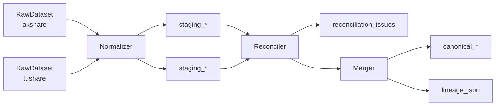

# 多源融合与对账引擎设计

> 关联：[ARCHITECTURE.md](./ARCHITECTURE.md) · [DATA_SOURCES.md](./DATA_SOURCES.md)

---

## 1. 概述

融合与对账是本平台的 **核心差异化能力**。目标不是简单「选一个源」，而是：

1. **标准化** — 多源字段映射到统一 Canonical Schema
2. **对账** — 检测同源异值，分级告警
3. **融合** — 按数据类型执行可配置策略
4. **血缘** — 记录每个融合值的来源与决策

---

## 2. 处理流水线



---

## 3. Normalizer（标准化器）

### 3.1 职责

- 将各源 `RawDataset.records` 映射为统一字段名与类型
- 写入 `staging_*` 表（保留 `source` 列）
- 处理日期格式、单位换算、空值

### 3.2 映射配置示例

```yaml
# config/field_mappings.yaml（概念）
daily_bars:
  akshare:
    trade_date: { from: "日期", transform: date }
    close: { from: "收盘", transform: float }
  tushare:
    trade_date: { from: "trade_date", transform: date }
    close: { from: "close", transform: float }

financials:
  akshare:
    revenue: { from: "营业收入", transform: float }
  tushare:
    revenue: { from: "total_revenue", transform: float }
    roe: { from: "roe", transform: float }
```

### 3.3 匹配键（Match Key）

对账与融合时，用以下组合定位「同一条逻辑记录」：

| DatasetType | Match Key |
|-------------|-----------|
| daily_bars | security_id + trade_date |
| financials | security_id + end_date + report_type |
| valuation | security_id + as_of_date |
| money_flow | security_id + trade_date |

---

## 4. Reconciler（对账引擎）

### 4.1 对账算法

对每个 `(security_id, dataset_type, match_key, field)`：

```python
def reconcile(field: str, values: dict[str, float], thresholds: dict) -> ReconciliationResult:
  """
  values = {"akshare": 24.1, "tushare": 23.7}
  """
  if len(values) < 2:
      return ReconciliationResult(severity="L0", diff_pct=0)

  v_list = list(values.values())
  median = statistics.median(v_list)
  max_diff_pct = max(abs(a - b) / median for a, b in combinations(v_list, 2) if median != 0)

  severity = classify_severity(field, max_diff_pct, thresholds)
  return ReconciliationResult(
      severity=severity,
      diff_pct=max_diff_pct,
      values=values,
      recommendation=recommend_action(severity, values)
  )
```

### 4.2 严重级别

| 级别 | 名称 | 典型场景 | 系统行为 |
|------|------|----------|----------|
| **L0** | ignore | 收盘价差 0.01 元 | 自动融合，不记录 |
| **L1** | notice | PE 差 2% | 写入 issues，融合继续 |
| **L2** | warning | 收盘价差 0.5% | 降级 confidence，标注报告 |
| **L3** | critical | 营收差 5%+ | **阻断** canonical 写入，告警 |

配置见 [examples/reconcile_thresholds.yaml](./examples/reconcile_thresholds.yaml)

### 4.3 reconciliation_issues 记录

```json
{
  "id": "issue_20260614_600519_pe",
  "security_id": "600519.SH",
  "dataset_type": "valuation",
  "field_name": "pe_ttm",
  "as_of_date": "2026-06-13",
  "values_json": {
    "akshare": 24.1,
    "tushare": 23.7
  },
  "diff_pct": 0.017,
  "severity": "L1",
  "status": "open",
  "recommendation": "取中位数 23.9，标注双源差异"
}
```

### 4.4 对账报告输出

Markdown 模板章节：

```markdown
## 多源对账摘要

| 字段 | AKShare | Tushare | 差异 | 级别 | 融合值 |
|------|---------|---------|------|------|--------|
| close | 1688.00 | 1687.50 | 0.03% | L0 | 1688.00 |
| pe_ttm | 24.1 | 23.7 | 1.7% | L1 | 23.9 |
```

---

## 5. Merger（融合器）

### 5.1 融合策略

| 策略 | 代码 | 适用场景 |
|------|------|----------|
| `priority` | 取 trusted_source，另一源校验 | 日 K、资金流 |
| `median_of_sources` | 多源中位数 | 估值 |
| `authoritative` | 权威源优先，备源填补缺失 | 财务、公告 |
| `union_dedupe` | 合并去重 | 新闻 |
| `latest` | 取 fetched_at 最新 | 实时行情 |

配置见 [examples/fusion_policy.yaml](./examples/fusion_policy.yaml)

### 5.2 priority 策略伪代码

```python
def merge_priority(values: dict[str, Any], trusted: str, fallback: str) -> MergeResult:
    if trusted in values:
        primary = values[trusted]
        lineage = {"primary": trusted, "values": values}
        if fallback in values:
            diff = calc_diff(values[trusted], values[fallback])
            lineage["verified_by"] = fallback
            lineage["diff"] = diff
        return MergeResult(value=primary, lineage=lineage)
    elif fallback in values:
        return MergeResult(value=values[fallback], lineage={"primary": fallback, "degraded": True})
    else:
        raise NoDataError
```

### 5.3 median_of_sources 策略

```python
def merge_median(values: dict[str, float]) -> MergeResult:
    nums = [v for v in values.values() if v is not None]
    return MergeResult(
        value=statistics.median(nums),
        lineage={"strategy": "median", "sources": list(values.keys()), "values": values}
    )
```

### 5.4 union_dedupe 策略（新闻）

```python
def merge_news(datasets: list[RawDataset], similarity_threshold=0.85) -> list[dict]:
    all_items = flatten([d.records for d in datasets])
    return dedupe_by_title_similarity(all_items, threshold=similarity_threshold)
```

---

## 6. Lineage（血缘追踪）

### 6.1 lineage_json 结构

每条 `canonical_*` 记录附带：

```json
{
  "strategy": "priority",
  "primary_source": "tushare",
  "verified_by": "akshare",
  "source_values": {
    "tushare": 1687.50,
    "akshare": 1688.00
  },
  "diff_pct": 0.0003,
  "reconciliation_severity": "L0",
  "merged_at": "2026-06-14T08:00:00Z",
  "fusion_policy_version": "1.0"
}
```

### 6.2 审计查询

```sql
-- 查某字段融合来源
SELECT close, lineage_json
FROM canonical_daily_bars
WHERE security_id = '600519.SH' AND trade_date = '2026-06-13';
```

---

## 7. L3 阻断机制

当存在未解决的 L3 问题时：

```
Merger.merge(financials, 600519.SH)
  → Reconciler 发现 revenue diff = 6.2% (L3)
  → 跳过 canonical_financials 写入
  → reconciliation_issues.status = 'open'
  → MonitorAgent 触发告警
  → ResearchAgent 读取时 confidence = 0, 附加警告
```

---

## 8. 基金数据融合

基金类 `Security(type=fund)` 使用独立融合规则：

| 数据 | 策略 | 说明 |
|------|------|------|
| fund_nav | priority | 净值以 AKShare 为主 |
| fund_holdings | authoritative | 季报披露为准 |
| fund_profile | priority | 规模、费率 |

基金重仓股链接到股票 `Security`：

```
fund_holdings.security_id = 512690.SH (酒ETF)
  → holdings: [600519.SH, 000858.SZ, ...]
  → 可触发「持仓股事件」监控
```

---

## 9. 模块接口

```python
class FusionPipeline:
    def __init__(self, store: DuckDBStore, config: FusionConfig): ...

    def run(self, security_id: str, dataset_types: list[DatasetType]) -> FusionResult:
        raw_datasets = self.registry.fetch_all(...)
        for raw in raw_datasets:
            self.store.save_raw_snapshot(raw)
        staging = self.normalizer.normalize_all(raw_datasets)
        self.store.save_staging(staging)
        issues = self.reconciler.reconcile(staging)
        self.store.save_issues(issues)
        canonical = self.merger.merge(staging, issues)
        self.store.save_canonical(canonical)
        return FusionResult(issues=issues, canonical_counts=...)
```

---

## 10. 测试策略

| 测试类型 | 内容 |
|----------|------|
| 单元测试 | Normalizer 字段映射、Reconciler 分级逻辑 |
| 集成测试 | 双源 mock 数据 → 验证 canonical + issues |
| 回归测试 | 固定 snapshot 对比融合结果 |
| 线上监控 | health_check + 源可用率统计 |

---

*关联配置：[examples/fusion_policy.yaml](./examples/fusion_policy.yaml) · [examples/reconcile_thresholds.yaml](./examples/reconcile_thresholds.yaml)*
