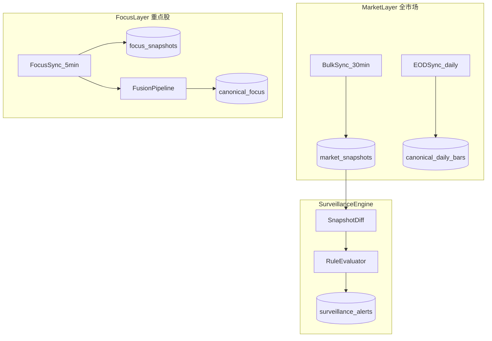
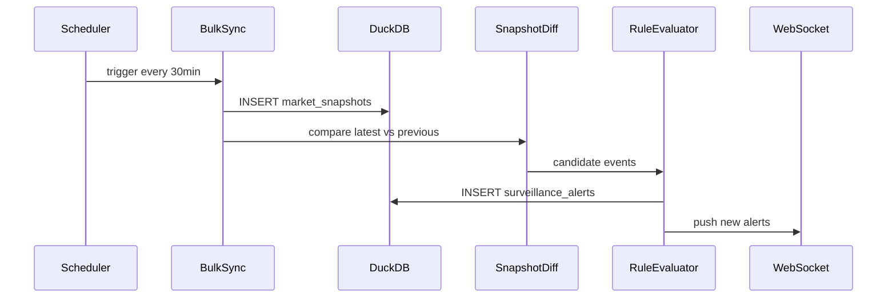

# 全市场层与监管引擎设计

| 版本 | v0.2.0 |
|------|--------|
| 关联 | [REQUIREMENTS.md](./REQUIREMENTS.md) · [ARCHITECTURE.md](./ARCHITECTURE.md) |

---

## 1. 概述

平台采用 **MarketLayer（全市场层）** 与 **FocusLayer（重点股层）** 双层数据架构：



| 层级 | 覆盖 | 目标 |
|------|------|------|
| **MarketLayer** | 全 A 股 ~5000+ | 看见整个市场、行业、异动 |
| **FocusLayer** | watchlist | 深度跟踪、多源融合、AI 分析 |

---

## 2. MarketLayer 数据采集

### 2.1 全市场批量快照（30 分钟）

**原则**：一次 API 拉全市场，禁止对 5000 只股票逐只轮询。

| 项 | 说明 |
|----|------|
| 数据源 | AKShare `stock_zh_a_spot_em()` |
| 频率 | 每 30 分钟（交易时段内，可配置） |
| 量级 | ~5000 行/次，~48 次/天，~24 万行/天 |
| 存储 | `market_snapshots` |

**快照字段（canonical）**：

```text
snapshot_time, security_id, name, price, change_pct, change_amount,
volume, amount, turnover_rate, volume_ratio, pe_ttm, pb,
market_cap, industry_code, source, fetched_at
```

### 2.1.1 快照状态与幂等

全市场快照必须先写入任务状态，再写入明细，最后提交为可用快照，避免 UI 读到半成品数据。

```sql
CREATE TABLE market_snapshot_runs (
    snapshot_time      TIMESTAMP PRIMARY KEY,
    source             VARCHAR NOT NULL,
    status             VARCHAR NOT NULL,  -- running | success | partial | failed
    expected_count     INTEGER,
    actual_count       INTEGER,
    missing_count      INTEGER,
    field_nulls_json   JSON,
    started_at         TIMESTAMP,
    finished_at        TIMESTAMP,
    error_message      TEXT
);
```

幂等规则：

- `market_snapshots` 以 `(snapshot_time, security_id, source)` 为唯一键
- 同一 `snapshot_time` 重试时先覆盖同源数据，再重新计算行业聚合和告警
- UI 只读取 `market_snapshot_runs.status IN ('success', 'partial')` 的最新快照

### 2.1.2 数据质量分级

| 状态 | 条件 | UI 表现 |
|------|------|---------|
| `fresh` | 最近快照成功，且未超过 45 分钟 | 正常 |
| `stale` | 最近快照超过 45 分钟 | 黄色提示 |
| `partial` | 快照成功但股票数低于预期或关键字段缺失 | 显示缺失数量 |
| `failed` | 最近任务失败 | 红色提示，沿用上一可用快照 |

### 2.2 日终同步（1 次/日）

| 任务 | 数据源 | 目标表 |
|------|--------|--------|
| 日 K 增量 | AKShare `stock_zh_a_hist` 或批量方案 | `canonical_daily_bars` |
| 证券主数据 | `stock_info_a_code_name` | `securities` |
| 行业分类 | `stock_board_industry_name_em` 等 | `industries`, `security_industry` |
| 指数行情 | `stock_zh_index_daily` | `index_daily_bars` |

日终任务建议在 **15:30 后** 执行，避开盘中 API 竞争。

### 2.3 市场总览聚合

由最新快照 SQL 聚合，不单独拉接口：

```sql
-- 概念：涨跌家数、涨停跌停数
SELECT
  COUNT(*) FILTER (WHERE change_pct > 0) AS advancers,
  COUNT(*) FILTER (WHERE change_pct < 0) AS decliners,
  COUNT(*) FILTER (WHERE change_pct >= 9.9) AS limit_up,
  COUNT(*) FILTER (WHERE change_pct <= -9.9) AS limit_down,
  SUM(amount) AS total_amount
FROM market_snapshots
WHERE snapshot_time = (SELECT MAX(snapshot_time) FROM market_snapshots);
```

---

## 3. FocusLayer 数据采集

### 3.1 重点股高频同步（5 分钟）

仅对 `watchlist.yaml` 内 `security_id` 执行：

| 数据类型 | 来源 | 表 |
|----------|------|-----|
| 行情估值 | AKShare + Tushare | `focus_snapshots`, `canonical_valuation` |
| 资金流向 | AKShare | `focus_money_flow` |
| 新闻标题 | AKShare `stock_news_em` | `event_timeline` |
| 财务指标 | Tushare / AKShare | `canonical_financials`（周/按需） |

### 3.2 与 MarketLayer 关系

```text
重点股 ⊆ 全市场

全市场快照：宽而浅（所有股的基础行情）
重点股同步：窄而深（多源、对账、财务、AI）
```

个股详情页：**优先读 Focus 深度数据**；非重点股仅展示 Market 层快照 + 日 K。

---

## 4. 行业体系

### 4.1 行业模型

```sql
CREATE TABLE industries (
    code        VARCHAR PRIMARY KEY,
    name        VARCHAR NOT NULL,
    source      VARCHAR,           -- eastmoney | sw
    level       INTEGER,           -- 1=一级行业
    updated_at  TIMESTAMP
);

CREATE TABLE security_industry (
    security_id   VARCHAR NOT NULL,
    industry_code VARCHAR NOT NULL,
    is_primary    BOOLEAN DEFAULT TRUE,
    PRIMARY KEY (security_id, industry_code)
);
```

### 4.2 行业聚合

每个 `snapshot_time` 按行业计算：

```text
industry_change_pct_avg   行业成分股涨跌幅均值
industry_amount_sum       行业成交额合计
industry_advancer_ratio   上涨家数占比
stock_count               成分股数量
```

写入 `industry_snapshots`，供热力图与排行 API 使用。

### 4.3 行业异动规则

当 `|industry_change_pct_avg| >= 阈值`（默认 2%）时，生成 `surveillance_alerts`，`alert_type = industry_move`。

---

## 5. SurveillanceEngine（监管引擎）

### 5.1 工作流程



### 5.2 快照对比（SnapshotDiff）

对同一 `security_id`，比较 `snapshot_time = T` 与 `T-1`：

| 衍生字段 | 计算 |
|----------|------|
| `delta_price_pct` | (price_T - price_T1) / price_T1 |
| `delta_volume_ratio` | volume_ratio_T |
| `delta_amount` | amount_T - amount_T1 |

#### 5.2.1 正确性约束（必须处理）

以下边界不处理会导致「看起来对、其实错」的误报：

| 陷阱 | 后果 | 处理 |
|------|------|------|
| **除权除息日** | 价格跳水使 `delta_price_pct` 误报暴跌/跌停 | 趋势 diff 用**前复权价**，或读除权标记，当天跳过价格类规则 |
| **首次快照无 T-1** | `delta_price_pct` 无定义 | 当日首快照以**昨收**为基准计算 |
| **停牌** | 误报零变化或异常 | 规则显式排除停牌标的 |
| **新股 / ST** | 涨跌幅口径不同（首日不设限 / ±5%） | 用专属阈值，不套用 9.9% |

#### 5.2.2 自适应异常分（增强）

固定阈值在不同市况与行业下噪音大，增加**相对基线**的纯统计异常分（不依赖 LLM）：

| 衍生字段 | 计算 | 含义 |
|----------|------|------|
| `zscore_change` | (change_pct - rolling_mean) / rolling_std | 自适应波动率的标准化异常 |
| `pct_rank_change_60d` | 当前涨跌幅相对自身 60 日分布的分位 | 相对自己是否异常 |
| `rel_strength_vs_industry` | change_pct - industry_change_pct_avg | 剥离板块共性的真异动 |
| `volume_zscore` | 量比/成交额的标准化异常 | 量能异常 |

规则可由「绝对阈值」升级为「绝对阈值 OR 相对异常分超限」，告警附带异常分用于解释。详见 [INTELLIGENCE_ROADMAP.md](./INTELLIGENCE_ROADMAP.md) §2.1。

### 5.3 规则配置

见 [CONFIG_REFERENCE.md](./CONFIG_REFERENCE.md)

| 规则 ID | 条件 | 级别 | 作用域 |
|---------|------|------|--------|
| `limit_up` | change_pct >= 9.9 | high | 全市场 |
| `limit_down` | change_pct <= -9.9 | high | 全市场 |
| `price_spike` | delta_price_pct >= 3% | medium | 全市场 |
| `volume_surge` | volume_ratio >= 2.0 | medium | 全市场 |
| `industry_move` | 行业均涨跌 >= 2% | info | 行业 |
| `focus_price` | 重点股自定义阈值 | configurable | Focus |

### 5.3.1 规则生命周期

每条规则需要具备版本、启停、冷却时间，避免上线后难以解释历史告警。

| 字段 | 说明 |
|------|------|
| `rule_id` | 稳定 ID，如 `price_spike` |
| `version` | 规则版本，写入告警 |
| `enabled` | 是否启用 |
| `cooldown_minutes` | 同一标的同一规则冷却窗口 |
| `severity` | high / medium / info |
| `explanation_template` | UI 展示原因 |

告警记录必须保存 `rule_id`、`rule_version`、`trigger_value`、`threshold`，避免规则变更后历史告警不可解释。

### 5.4 告警模型

```sql
CREATE TABLE surveillance_alerts (
    id              VARCHAR PRIMARY KEY,
    alert_time      TIMESTAMP NOT NULL,
    alert_type      VARCHAR NOT NULL,
    rule_id         VARCHAR NOT NULL,
    rule_version    VARCHAR,
    severity        VARCHAR NOT NULL,    -- high | medium | info
    security_id     VARCHAR,           -- 个股告警
    industry_code   VARCHAR,           -- 行业告警
    title           VARCHAR NOT NULL,
    message         TEXT,
    trigger_value   DOUBLE,
    threshold_value DOUBLE,
    metrics_json    JSON,              -- 触发时指标快照
    snapshot_time   TIMESTAMP,         -- 关联行情快照
    is_focus        BOOLEAN DEFAULT FALSE,
    created_at      TIMESTAMP
);
```

### 5.5 去重与抑制

避免同一标的同一规则在短窗口内重复告警：

```text
dedupe_key = (security_id, alert_type, snapshot_time_bucket)
bucket     = 30min 对齐
```

---

## 6. 调度设计

见 [CONFIG_REFERENCE.md](./CONFIG_REFERENCE.md)

| 任务 | Cron / 间隔 | 交易时段 |
|------|---------------|----------|
| `market_bulk_snapshot` | 每 30min | 09:30-11:30, 13:00-15:00 |
| `focus_deep_sync` | 每 5min | 同上 |
| `eod_daily_bars` | 15:35 每日 | 交易日 |
| `eod_master_data` | 15:40 每日 | 交易日 |
| `surveillance_eval` | 每次快照后链式触发 | — |

非交易时段：跳过盘中任务，仅保留日终（若当日为交易日）。

---

## 7. 存储与保留策略

| 表 | 保留建议 |
|----|----------|
| `market_snapshots` | 90 天（可配置）；超期归档 Parquet |
| `surveillance_alerts` | 180 天 |
| `canonical_daily_bars` | 永久（增量） |
| `focus_snapshots` | 90 天 |

DuckDB 按月分区或按 `snapshot_time` 定期 `DELETE` 旧数据。

### 7.1 建议容量估算

| 数据 | 估算 |
|------|------|
| 单次全市场快照 | 约 5000 行 |
| 每日快照 | 约 24 万行（按 48 次计算） |
| 90 天快照 | 约 2160 万行 |

DuckDB 可以承载该规模，但 UI 查询必须读取最近快照或聚合表，不应直接全表扫描历史快照。

### 7.2 聚合表策略

为降低前端查询压力，快照完成后同步维护：

| 表 | 用途 |
|----|------|
| `latest_market_snapshot` | 最新可用快照的物化视图/表 |
| `industry_snapshots` | 行业级聚合 |
| `market_overview_snapshots` | 市场总览历史序列 |

---

## 8. 失败与降级

| 场景 | 行为 |
|------|------|
| AKShare 全市场接口失败 | 记录错误；UI 显示「快照失败」；沿用上一快照时间 |
| 部分字段缺失 | 入库 NULL；规则跳过依赖字段 |
| 快照成功但监管失败 | 数据仍可用；告警延迟 |
| Tushare 不可用 | Focus 层降级 AKShare 单源 |
| 快照结果异常偏少 | 标记 partial，保留上一 success 快照供 UI 对比 |
| 规则配置错误 | 跳过错误规则并记录，不阻断快照入库 |

---

## 9. API 概要（监管相关）

| 方法 | 路径 | 说明 |
|------|------|------|
| GET | `/api/v1/market/overview` | 市场总览 |
| GET | `/api/v1/market/snapshots/latest` | 最近快照元信息 |
| GET | `/api/v1/stocks` | 全市场列表（分页、排序、筛选） |
| GET | `/api/v1/industries` | 行业排行 |
| GET | `/api/v1/industries/{code}/stocks` | 行业成分股 |
| GET | `/api/v1/alerts` | 告警列表 |
| WS | `/ws/v1/alerts` | 新告警推送 |

完整契约见 [UI_DESIGN.md](./UI_DESIGN.md)。

---

## 10. 与融合层边界

| 能力 | MarketLayer | FocusLayer |
|------|-------------|------------|
| 多源对账 | 不做（性能与必要性） | 做 |
| AI 研报 | 不做 | 做 |
| 监管规则 | 全市场规则 | 额外 focus 规则 |
| 数据精度 | 批量现货 | 精细 + lineage |

全市场层追求 **覆盖与时效**；重点股层追求 **准确与深度**。

---

*配置示例见 [CONFIG_REFERENCE.md](./CONFIG_REFERENCE.md)。*
