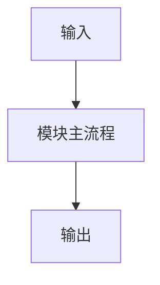

# 模块交付模板

> 用于模块进入实现阶段后的配套文档模板。关联：[MODULE_DELIVERY_STANDARD.md](./MODULE_DELIVERY_STANDARD.md)

## 1. 实施记录模板 `NN-module-implementation.md`

```md
# <module> 模块实施记录

| 属性 | 值 |
|------|-----|
| 模块 | `<module>` |
| 状态 | `planned / in_progress / blocked / implemented / verified / documented / done` |
| Phase | `A / B / C / D / E / F` |
| 负责人 | `<name>` |
| 最近更新 | `YYYY-MM-DD` |
| 关联设计 | `[NN-module.md](./NN-module.md)` |

## 1. 当前目标

本次要完成什么，不要写抽象口号，写明确交付物。

## 2. 本次范围

- 包含什么
- 不包含什么

## 3. 前置依赖

- 上游模块
- 配置文件
- 表结构
- 外部库 / 环境变量

## 4. 实现拆解

1. 第一步
2. 第二步
3. 第三步

## 5. 当前进度

### 已完成

- ...

### 进行中

- ...

### 未开始

- ...

## 6. 关键决策

| 决策 | 原因 | 影响 |
|------|------|------|
| ... | ... | ... |

## 7. 与原设计偏差

| 项 | 原设计 | 实际实现 | 原因 |
|----|--------|----------|------|
| ... | ... | ... | ... |

## 8. 代码位置

- `src/...`
- `tests/...`
- `config/...`

## 9. 风险与阻塞

- 当前风险
- 当前阻塞
- 临时规避方案

## 10. 下一步动作

1. ...
2. ...
3. ...
```

## 2. 验证记录模板 `NN-module-verification.md`

```md
# <module> 模块验证记录

| 属性 | 值 |
|------|-----|
| 模块 | `<module>` |
| 验证状态 | `not_started / in_progress / passed / partial / failed` |
| 最近更新 | `YYYY-MM-DD` |
| 关联实现 | `[NN-module-implementation.md](./NN-module-implementation.md)` |

## 1. 验收目标

- ...

## 2. 测试范围

- 单元测试
- 集成测试
- 手动验证

## 3. 验证清单

| 项 | 方法 | 结果 | 备注 |
|----|------|------|------|
| ... | ... | `pass/fail/partial` | ... |

## 4. 边界场景

- ...

## 5. 已知问题

- ...

## 6. 剩余风险

- ...

## 7. 验收结论

- 是否达到当前 Phase 交付标准
- 如未达到，还差什么
```

## 3. 使用说明模板 `NN-module-operations.md`

```md
# <module> 模块使用说明

| 属性 | 值 |
|------|-----|
| 模块 | `<module>` |
| 最近更新 | `YYYY-MM-DD` |
| 关联设计 | `[NN-module.md](./NN-module.md)` |

## 1. 模块用途

一句话说明这个模块在系统里的角色。

## 2. 运行方式

```bash
# 启动 / 调用命令
```

## 3. 配置项

| 配置 | 含义 | 默认值 | 风险 |
|------|------|--------|------|
| ... | ... | ... | ... |

## 4. 输入输出

### 输入

- ...

### 输出

- ...

## 5. 常见问题排查

| 现象 | 可能原因 | 排查方法 |
|------|----------|----------|
| ... | ... | ... |

## 6. 扩展方式

- 新增能力怎么接
- 哪些接口不能破坏

## 7. 变更注意事项

- 会影响哪些上游/下游
- 修改前后需要回归什么
```

## 4. 设计图最低要求模板

每个模块至少补一张图，建议放在主设计文档中；复杂模块可单独存图文件。

最低要覆盖以下一种：

- 主流程图
- 时序图
- 状态机图
- 数据流图

示例：



## 5. 使用方式

建议每个模块开工时直接复制 3 份模板：

- `NN-module-implementation.md`
- `NN-module-verification.md`
- `NN-module-operations.md`

然后在编码过程中持续更新，而不是最后补文档。
