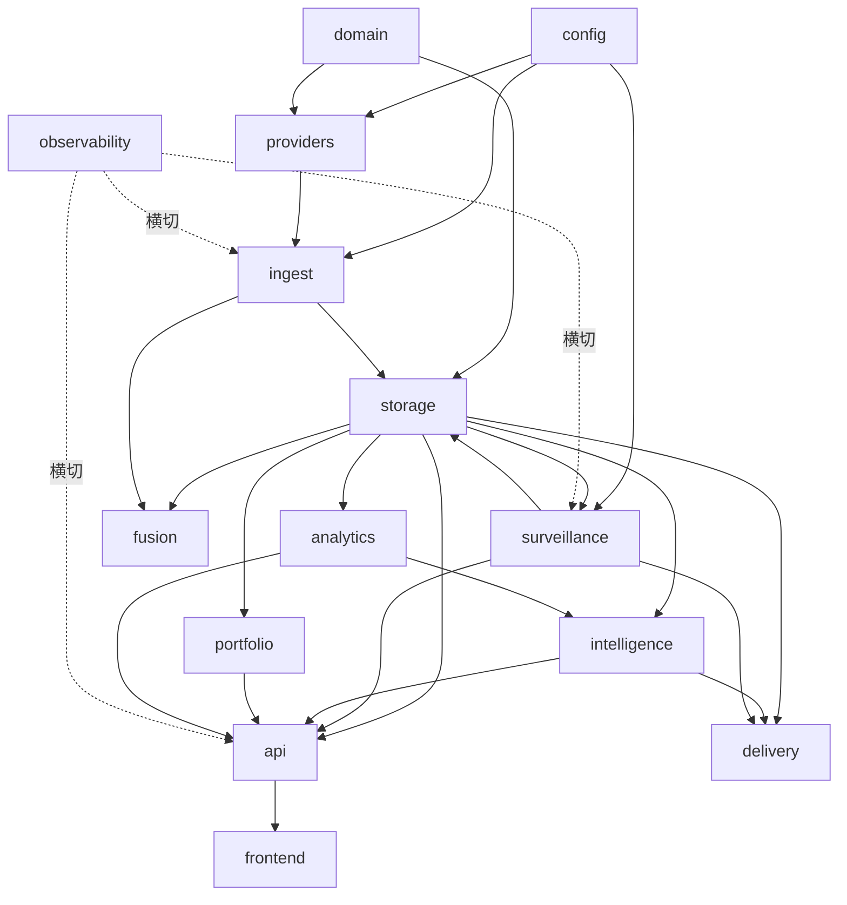

# 模块设计结构（单模块详细设计）

| 属性 | 值 |
|------|-----|
| 版本 | v0.2.2 |
| 状态 | 设计 |
| 目标 | 把分层架构细化到“单模块”粒度：每个模块的职责、目录、对外接口、输入输出契约、依赖、配置与表、所属 Phase、测试要点 |

> 关联：[ARCHITECTURE.md](./ARCHITECTURE.md)（分层与领域模型）· [MARKET_SURVEILLANCE.md](./MARKET_SURVEILLANCE.md) · [FUSION_RECONCILE.md](./FUSION_RECONCILE.md) · [AGENT_INTELLIGENCE.md](./AGENT_INTELLIGENCE.md) · [UI_DESIGN.md](./UI_DESIGN.md) · [INTELLIGENCE_ROADMAP.md](./INTELLIGENCE_ROADMAP.md)

本文档不替代各专题文档，而是把它们**收敛成统一的模块清单与边界约定**，作为编码时的“模块说明书”。

---

## 1. 模块总览

| # | 模块 | 包路径 | 层 | 职责一句话 | Phase |
|---|------|--------|----|-----------|-------|
| 1 | domain | `domain/` | 基础 | 实体模型、ID 规范、枚举、数据契约 | A |
| 2 | config | `config_loader/` | 基础 | 加载与校验 YAML/env，提供类型化配置 | A |
| 3 | storage | `storage/` | 存储 | DuckDB 读写、schema、迁移、聚合表、向量库 | A |
| 4 | providers | `providers/` | 接入 | 多源 Adapter、注册路由、限流、健康检查 | A/C |
| 5 | ingest | `ingest/` | 采集 | 全市场快照、重点股同步、日终、调度、任务状态 | A/C |
| 6 | fusion | `fusion/` | 融合 | 标准化、对账、融合、血缘（重点股） | D |
| 7 | surveillance | `surveillance/` | 监管 | 快照 diff、异常分、规则求值、告警、行业聚合 | B/F |
| 8 | analytics | `analytics/` | 分析 | 技术指标、同业对比、事件时间线、回测 | C/E |
| 9 | intelligence | `intelligence/` | 智能 | Agent、Tools、LLM、市场叙事、NL 查询 | D/F |
| 10 | portfolio | `portfolio/` | 业务 | 持仓、盈亏、行业敞口 | F |
| 11 | api | `api/` | 交付 | FastAPI 路由、DTO、WebSocket、依赖注入 | A+ |
| 12 | frontend | `frontend/` | 交付 | React 仪表盘六页 | A+ |
| 13 | delivery | `delivery/` | 交付 | CLI、报告生成、通知推送 | A/E |
| 14 | observability | `observability/` | 横切 | 指标、运行状态、日志、数据质量 | A+ |

横切关注点（错误类型、日志、幂等键、时间/交易日历工具）放在 `common/`，被所有模块复用。

---

## 2. 模块依赖图



**硬约束**（继承 ARCHITECTURE §4.3）：

- 依赖单向向下，禁止环依赖（如 fusion 不得反向依赖 api）。
- `intelligence` / `analytics` / `api` 只读 `canonical_*`、`*_snapshots`、聚合表，不直连数据源。
- `providers` 是唯一允许 import `akshare`/`tushare` 的模块。
- `surveillance` 只读快照与聚合表，不调用 LLM（LLM 叙事在 `intelligence`）。

---

## 3. 统一模块设计模板

每个模块按以下结构描述：

```text
职责        模块负责什么 / 不负责什么
目录        包内文件与子结构
对外接口    其他模块可调用的类/函数签名（稳定 API）
输入 → 输出  数据契约（进出该模块的数据形态）
依赖        上游（依赖谁）/ 下游（被谁依赖）
配置与表    读取的配置、读写的 DuckDB 表
Phase       归属实现阶段
测试要点    单测/集成测试关注点
```

---

## 4. 基础层模块

### 4.1 domain（领域模型）

- **职责**：定义全系统共享的实体与契约；无业务逻辑、无 IO。包含 `Security`/`Issuer`、`SecurityId` 解析、`DatasetType` 枚举、`RawDataset` 契约、严重级别枚举等。不负责持久化。
- **目录**：

```text
domain/
├── models.py        # Security, Issuer, FundProfile 等 dataclass/Pydantic
├── symbols.py       # SecurityId 解析与各源代码互转
├── enums.py         # DatasetType, Market, Severity(L0~L3), AlertSeverity
└── contracts.py     # RawDataset, SyncResult, FusionResult 等跨模块 DTO
```

- **对外接口**：

```python
def resolve(raw: str) -> SecurityId         # "600519" → 600519.SH
def to_source_code(sid: SecurityId, source: str) -> str
class RawDataset(BaseModel): source; dataset_type; security_id; records; raw_hash; fetched_at
```

- **输入 → 输出**：字符串/原始数据 → 类型化领域对象。
- **依赖**：无（最底层）。被所有模块依赖。
- **配置与表**：无。
- **Phase**：A。
- **测试要点**：`resolve` 各种输入格式；ID 往返转换；契约字段校验。

### 4.2 config（配置加载）

- **职责**：集中加载 `config/*.yaml` 与 `.env`，校验后暴露类型化配置对象；提供热加载入口（Phase F）。不负责业务默认值之外的逻辑。
- **目录**：

```text
config_loader/
├── settings.py        # 全局 Settings（路径、DB、LLM key 引用）
├── providers_cfg.py   # providers.yaml → ProvidersConfig
├── fusion_cfg.py      # fusion_policy / reconcile_thresholds
├── surveillance_cfg.py# sync_schedule / surveillance_rules
└── loader.py          # 通用 YAML 加载 + pydantic 校验 + 热加载
```

- **对外接口**：

```python
def load_settings() -> Settings
def load_surveillance_rules() -> list[RuleConfig]
def reload(name: str) -> None          # Phase F 热加载
```

- **输入 → 输出**：YAML/env 文件 → 校验通过的配置对象（非法配置启动即报错）。
- **依赖**：domain。被 providers/ingest/surveillance/fusion 依赖。
- **配置与表**：读取 `config/`（见 [CONFIG_REFERENCE.md](./CONFIG_REFERENCE.md)）。
- **Phase**：A（热加载 F）。
- **测试要点**：非法配置报错；缺省值填充；规则版本解析。

### 4.3 storage（存储层）

- **职责**：唯一的 DuckDB 访问层；管理 schema、迁移、读写、聚合表维护、Parquet 归档、Chroma 向量库。对上层暴露仓储方法，隐藏 SQL。
- **目录**：

```text
storage/
├── duckdb_store.py     # 连接管理、事务、通用 upsert
├── schema.sql          # 全部建表 DDL
├── migrations/         # 版本化迁移脚本
├── repositories/
│   ├── securities_repo.py
│   ├── snapshot_repo.py     # market_snapshots + runs
│   ├── canonical_repo.py    # canonical_* + issues
│   ├── alert_repo.py        # surveillance_alerts
│   └── aggregate_repo.py    # latest/industry/overview 聚合表
├── archiver.py         # 超期快照 → Parquet
└── vector_store.py     # Chroma 封装
```

- **对外接口**：

```python
class SnapshotRepo:
    def begin_run(self, snapshot_time, source) -> RunId
    def write_snapshot(self, rows: list[MarketRow]) -> None    # 幂等 upsert
    def commit_run(self, run_id, status, stats) -> None
    def latest_snapshot(self) -> Snapshot
class AggregateRepo:
    def refresh_latest(self); def refresh_industry(self); def refresh_overview(self)
```

- **输入 → 输出**：领域对象/行集 ↔ DuckDB 表（见 ARCHITECTURE §8 与 MARKET_SURVEILLANCE §2/§7）。
- **依赖**：domain、config。被几乎所有上层依赖。
- **配置与表**：所有表的属主；幂等键 `(snapshot_time, security_id, source)`。
- **Phase**：A（聚合表 A、归档 E）。
- **测试要点**：幂等 upsert 不产生重复；迁移可重放；聚合表与明细一致。

### 4.4 providers（接入层）

- **职责**：把外部源封装为统一 `RawDataset`；注册、按 `dataset_type` 路由、并行拉取、限流、错误隔离、健康检查。唯一允许直接 import 第三方数据库的模块。
- **目录**：

```text
providers/
├── base.py            # DataProvider Protocol, ProviderHealth
├── registry.py        # ProviderRegistry: 路由/并行/隔离
├── ratelimit.py       # 各源限流器
├── akshare_adapter.py # 全市场 spot + 个股
├── tushare_adapter.py # 重点股对账
├── cninfo_adapter.py  # 公告（E）
└── yfinance_adapter.py# 港美股（E）
```

- **对外接口**：

```python
class DataProvider(Protocol):
    name: str; priority: int
    def supports(self, dt: DatasetType) -> bool
    def fetch(self, dt, security_id, **kw) -> RawDataset
    def fetch_market_spot(self) -> RawDataset        # 全市场一次拉取
    def health_check(self) -> ProviderHealth
class ProviderRegistry:
    def fetch_all(self, dt, security_id, **kw) -> list[RawDataset]
```

- **输入 → 输出**：请求参数 → `RawDataset`（含 `raw_hash`）。
- **依赖**：domain、config。被 ingest 依赖。
- **配置与表**：`providers.yaml`；写 `raw_snapshots`（经 storage）。
- **Phase**：A（akshare 全市场）/ C（tushare）/ E（cninfo、yfinance）。
- **测试要点**：mock 上游响应；单源失败不影响其他源；限流生效；health 状态准确。

---

## 5. 管道层模块

### 5.1 ingest（采集 / 同步）

- **职责**：编排“拉取 → 入库 → 触发下游”的同步任务；管理快照任务状态与幂等；区分全市场、重点股、日终三类节奏；提供调度入口。不做融合/对账（交给 fusion）。
- **目录**：

```text
ingest/
├── market_bulk_sync.py  # 30min 全市场快照
├── focus_sync.py        # 5min 重点股深度
├── eod_sync.py          # 日终日K/主数据/行业
├── run_tracker.py       # market_snapshot_runs 写入与状态机
├── trading_calendar.py  # 交易日历（前置基础设施）
└── scheduler.py         # APScheduler 注册各任务
```

- **对外接口**：

```python
class MarketBulkSync:
    def run(self, snapshot_time) -> RunResult     # begin→fetch→upsert→aggregate→commit→surveil
class FocusSync:
    def run(self, watchlist: list[SecurityId]) -> None
class Scheduler:
    def register_all(self) -> None
```

- **输入 → 输出**：调度触发 → 快照入库 + 聚合刷新 + 触发 surveillance。
- **依赖**：providers、storage、config、（链式调用）surveillance、fusion。
- **配置与表**：`sync_schedule.yaml`；写 `market_snapshots`、`market_snapshot_runs`、`focus_snapshots`、`canonical_daily_bars`。
- **Phase**：A（bulk+eod）/ C（focus）。
- **测试要点**：任务状态机正确流转；重试幂等；交易日历跳过非交易日；首快照基准处理。

### 5.2 fusion（多源融合与对账）

- **职责**：仅对 FocusLayer 范围执行标准化 → 实体匹配 → 对账分级 → 融合 → 血缘。产出 `canonical_*` 与 `reconciliation_issues`。详见 [FUSION_RECONCILE.md](./FUSION_RECONCILE.md)。
- **目录**：

```text
fusion/
├── normalizer.py    # 各源字段 → canonical schema
├── entity_matcher.py# match key 对齐同一逻辑记录
├── reconciler.py    # 差异分级 L0~L3
├── merger.py        # priority/median/authoritative/union 策略
├── lineage.py       # lineage_json 生成
└── pipeline.py      # FusionPipeline 编排
```

- **对外接口**：

```python
class FusionPipeline:
    def run(self, security_id, dataset_types) -> FusionResult
```

- **输入 → 输出**：多源 `RawDataset` → `canonical_*` + `issues`（L3 阻断写入）。
- **依赖**：domain、storage、config。被 intelligence/api 间接消费。
- **配置与表**：`fusion_policy.yaml`、`reconcile_thresholds.yaml`；写 `staging_*`、`canonical_*`、`reconciliation_issues`。
- **Phase**：D。
- **测试要点**：分级阈值；L3 阻断；融合值可复现；lineage 完整。

### 5.3 surveillance（监管引擎）

- **职责**：基于相邻快照计算变化与异常分，按规则产生可解释、可去重的告警；行业聚合；事件聚类（F）。**不调用 LLM**。详见 [MARKET_SURVEILLANCE.md](./MARKET_SURVEILLANCE.md) 与 [INTELLIGENCE_ROADMAP.md](./INTELLIGENCE_ROADMAP.md) §2.1。
- **目录**：

```text
surveillance/
├── snapshot_diff.py     # T vs T-1 衍生字段（含除权/首快照处理）
├── anomaly.py           # zscore / 分位 / 行业相对强弱（F）
├── rule_evaluator.py    # 规则求值 + 冷却去重
├── industry_agg.py      # industry_snapshots 聚合
├── alert_writer.py      # surveillance_alerts 落库
└── clustering.py        # 告警聚类 → 候选事件（F）
```

- **对外接口**：

```python
class SurveillanceEngine:
    def evaluate(self, snapshot_time) -> list[Alert]
class IndustryAggregator:
    def aggregate(self, snapshot_time) -> None
```

- **输入 → 输出**：最新两期快照 → `surveillance_alerts`（+ 候选 `market_events`）。
- **依赖**：storage、config。被 api/delivery 消费；被 intelligence（叙事）读取。
- **配置与表**：`surveillance_rules.yaml`；读 `market_snapshots`，写 `surveillance_alerts`、`industry_snapshots`。
- **Phase**：B（规则）/ F（异常分、聚类）。
- **测试要点**：除权日不误报；冷却窗口去重；规则版本写入告警；阈值/异常分双路触发。

### 5.4 analytics（分析层）

- **职责**：基于 canonical 数据做派生计算：技术指标、同业对比、事件时间线、回测（含规则信号回测，F）。只读 canonical。
- **目录**：

```text
analytics/
├── indicators.py    # MA/RSI/MACD → computed_indicators
├── peers.py         # 同业对比表
├── timeline.py      # 新闻/公告 → event_timeline
└── backtest.py      # 向量化回测 + 规则信号回测（E/F）
```

- **对外接口**：

```python
class IndicatorEngine:
    def compute(self, security_id, window) -> IndicatorSet
class PeerCompare:
    def compare(self, security_id, peer_ids) -> PeerTable
```

- **输入 → 输出**：`canonical_daily_bars`/`financials` → 指标/对比/时间线表。
- **依赖**：storage、domain。被 intelligence/api 消费。
- **配置与表**：写 `computed_indicators`、`event_timeline`。
- **Phase**：C（指标/对比）/ E（回测）/ F（信号回测）。
- **测试要点**：指标数值正确性；缺数据降级；回测无未来函数。

---

## 6. 智能与业务模块

### 6.1 intelligence（智能层）

- **职责**：Agent 编排、Tool 调用、LLM 客户端，以及 Phase F 的全局智能：市场叙事、每日综述、自然语言查询。所有数字来自 Tool，LLM 只解读。详见 [AGENT_INTELLIGENCE.md](./AGENT_INTELLIGENCE.md)。
- **目录**：

```text
intelligence/
├── agents/
│   ├── base.py
│   ├── research_agent.py
│   ├── reconcile_agent.py
│   └── monitor_agent.py
├── tools/
│   ├── registry.py
│   ├── security_tools.py
│   ├── fusion_tools.py
│   └── rag_tools.py
├── llm/
│   ├── client.py        # DeepSeek/OpenAI 兼容
│   └── prompts/
├── narrative.py         # 告警聚类 → 板块叙事（F）
├── daily_brief.py       # 全局市场综述（F）
└── nl_query.py          # 自然语言 → 受控 filter DSL（F）
```

- **对外接口**：

```python
class ResearchAgent:
    def analyze(self, security_id, task) -> ResearchReport
class MarketNarrator:
    def narrate(self, events: list[Cluster]) -> list[MarketEvent]   # F
class NLQuery:
    def parse(self, text: str) -> FilterDSL                          # F，白名单校验
```

- **输入 → 输出**：security_id/自然语言/告警聚类 → 研报/叙事/受控查询条件。
- **依赖**：storage(只读)、analytics、surveillance(读告警)、config。被 api/delivery 消费。
- **配置与表**：`.env` 的 `DEEPSEEK_API_KEY`；写 `market_events`、`daily_briefs`（F）。
- **Phase**：D（Agent/研报）/ F（叙事、综述、NL）。
- **测试要点**：输出数字 ⊆ Tool 返回（幻觉检测）；L3 阻断结论；NL 非法字段被拒；叙事调用次数受控。

### 6.2 portfolio（持仓 / 组合，Phase F）

- **职责**：管理持仓成本、数量，计算浮动盈亏、仓位与行业敞口，为告警/详情提供盈亏语境。详见 [INTELLIGENCE_ROADMAP.md](./INTELLIGENCE_ROADMAP.md) §3.1。
- **目录**：

```text
portfolio/
├── models.py        # Position
├── repository.py    # positions 表 CRUD
└── service.py       # 盈亏/敞口计算（结合 latest_market_snapshot）
```

- **对外接口**：

```python
class PortfolioService:
    def upsert_position(self, p: Position) -> None
    def summary(self) -> PortfolioSummary   # 市值/浮盈/行业敞口
```

- **输入 → 输出**：持仓录入 + 最新行情 → 盈亏与敞口视图。
- **依赖**：storage。被 api 消费。
- **配置与表**：写 `positions`。
- **Phase**：F。
- **测试要点**：盈亏计算正确；敞口占比合计 100%；停牌股估值处理。

---

## 7. 交付与横切模块

### 7.1 api（FastAPI 后端）

- **职责**：把各模块能力暴露为 REST + WebSocket；统一响应包装（含 `data_status`）、分页、错误格式、依赖注入。详见 [UI_DESIGN.md](./UI_DESIGN.md)。
- **目录**：

```text
api/
├── main.py
├── deps.py            # repo/service 注入
├── envelope.py        # 统一响应 + data_status
├── routers/
│   ├── market.py      # overview, snapshots
│   ├── stocks.py      # 列表（服务端分页/排序/筛选）
│   ├── industries.py
│   ├── alerts.py
│   ├── focus.py
│   ├── portfolio.py   # F
│   ├── research.py    # 研报/NL 查询
│   └── system.py      # /system/status
└── ws.py              # /ws/v1/alerts
```

- **对外接口**：REST 路径见 ARCHITECTURE §9.2、MARKET_SURVEILLANCE §9、UI_DESIGN。
- **输入 → 输出**：HTTP 请求 → 统一 envelope JSON（成功/部分/失败 + 数据状态）。
- **依赖**：storage、surveillance、intelligence、analytics、portfolio。被 frontend 消费。
- **配置与表**：只读聚合表与 canonical，不直接写业务表。
- **Phase**：A 起，随各能力增量加路由。
- **测试要点**：分页不全表扫；envelope 含 data_status；WS 在快照后推送；错误码规范。

### 7.2 frontend（React 仪表盘）

- **职责**：本地浏览器可视化六页：市场总览、行业、全部股票、告警流、重点股、个股详情；顶栏展示快照状态。详见 [UI_DESIGN.md](./UI_DESIGN.md)。
- **目录**：

```text
frontend/src/
├── pages/            # Overview/Industry/Stocks/Alerts/Focus/StockDetail
├── components/       # 表格(虚拟滚动)、热力图、K线、状态栏
├── api/              # 后端 client + 类型
├── store/            # 状态管理
└── ws/               # 告警订阅
```

- **对外接口**：页面路由；消费 api 模块的 REST/WS。
- **输入 → 输出**：用户交互 → API 调用 → 可视化。
- **依赖**：api。
- **配置与表**：无（纯前端）。
- **Phase**：A（三页）/ B（告警/热力图）/ C（详情）/ D（研报/对账面板）/ F（持仓/NL 搜索）。
- **测试要点**：5000 行虚拟滚动性能；stale/partial/failed 显式提示；空数据态。

### 7.3 delivery（CLI / 报告 / 通知）

- **职责**：非 Web 的交付通道——CLI（开发与定时入口）、Markdown 报告生成、告警推送。
- **目录**：

```text
delivery/
├── cli.py            # Typer：sync/research/monitor/daily...
├── reports/
│   ├── generator.py
│   └── templates/
└── notifier.py       # 企业微信/邮件/本地文件（E）
```

- **对外接口**：

```python
# CLI 命令见 ARCHITECTURE §9.1
class ReportGenerator: def research(self, report) -> Path
class Notifier: def push(self, alert) -> None
```

- **输入 → 输出**：命令/研报对象/告警 → 文件或推送消息。
- **依赖**：ingest、fusion、intelligence、surveillance。
- **配置与表**：读 reports 目录、通知 webhook 配置。
- **Phase**：A（CLI）/ D（报告）/ E（通知）。
- **测试要点**：CLI 参数解析；报告含免责声明；推送失败降级本地文件。

### 7.4 observability（可观测，横切）

- **职责**：采集运行指标（同步耗时、成功率、告警量、LLM 成本）、数据质量状态，支撑 `/system/status` 与 System Status 页。
- **目录**：

```text
observability/
├── metrics.py        # 计数/耗时埋点
├── data_status.py    # fresh/stale/partial/failed 判定
└── system_status.py  # 汇总给 api
```

- **对外接口**：

```python
def record_sync(run: RunResult) -> None
def system_status() -> SystemStatus
def data_status(snapshot) -> DataStatus
```

- **输入 → 输出**：各模块埋点 → 状态/指标汇总。
- **依赖**：storage（读 runs）。被 api 消费。
- **配置与表**：读 `market_snapshot_runs`。
- **Phase**：A 起持续完善。
- **测试要点**：状态判定阈值（45min stale 等）；指标聚合正确。

---

## 8. 模块与 Phase 对照（落地顺序）

```text
Phase A: domain, config, storage, providers(akshare), ingest(bulk+eod),
         observability, api(market/stocks/industries), frontend(3页)
Phase B: surveillance(规则), api(alerts+ws), frontend(告警/热力图)
Phase C: providers(tushare), ingest(focus), analytics(指标/对比), frontend(详情)
Phase D: fusion, intelligence(agents/tools/llm), api(research), frontend(研报/对账)
Phase E: analytics(回测), delivery(报告/通知), providers(cninfo/yfinance), 归档
Phase F: surveillance(异常/聚类), intelligence(叙事/综述/NL), portfolio
```

---

## 9. 编码约定（跨模块）

| 约定 | 说明 |
|------|------|
| 单向依赖 | 按 §2 依赖图，禁止反向/环依赖 |
| 仓储隔离 | 只有 storage 写 SQL，其他模块用 repository 方法 |
| 数据源隔离 | 只有 providers import akshare/tushare |
| 契约先行 | 跨模块传递只用 domain 中的 DTO，不传裸 DataFrame |
| 幂等优先 | 所有写入按幂等键 upsert |
| 可观测内建 | 同步/规则/LLM 调用均埋点到 observability |
| 配置外置 | 阈值/规则/调度走 config，不硬编码 |

> 以上为**架构级**约定。**代码风格**（命名/格式/类型/docstring/工具链）与**工程范式**（错误处理/日志/测试/async/纯函数边界）见 [CODING_STANDARDS.md](./CODING_STANDARDS.md)，编码期强制对照。跨模块**接口对接**（共享 DTO、调用矩阵、各模块暴露签名）见 [MODULE_INTERFACES.md](./MODULE_INTERFACES.md)。

---

> **编号说明**：本节 §1 表格按「分层」编号，仅用于总览；`docs/modules/` 目录下的详细设计文件（`01`→`14`）按「实现批次/Phase」编号，是逐模块编码的权威清单。两套编号指向相同的 14 个模块，以模块名（而非编号）为准。

*本文档把分层架构细化到模块边界，作为各 Phase 编码的模块说明书；具体算法与表结构以各专题文档为准。*
