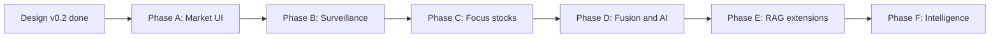

# 实施路线图

> 版本 v0.2.0 | 关联：[REQUIREMENTS.md](./REQUIREMENTS.md) · [ARCHITECTURE.md](./ARCHITECTURE.md)

---

## 1. 总览

v0.2 路线以 **「本地 Web 仪表盘 + 全 A 股监管」** 为优先交付路径，在现有多源融合设计上增加 MarketLayer / FocusLayer 双层架构。



| 阶段 | 周期 | 说明 |
|------|------|------|
| Design | 已完成 | 设计文档 v0.2 |
| PhaseA | 约 10 天 | 全市场快照与基础 UI |
| PhaseB | 约 7 天 | 监管引擎与告警 UI |
| PhaseC | 约 7 天 | 重点股与个股详情 |
| PhaseD | 约 10 天 | 多源融合与 AI 研报 |
| PhaseE | 约 14 天 | RAG、推送与扩展 |
| PhaseF | 约 14 天 | 智能化升级（自适应异常、事件叙事、NL 查询、持仓） |

> 智能化与扩展规划详见 [INTELLIGENCE_ROADMAP.md](./INTELLIGENCE_ROADMAP.md)。其中**数据正确性**（除权除息/停牌/首快照/交易日历）属前置必做，在 Phase B 实现监管引擎时一并处理。

---

## 2. 设计阶段（当前）

**目标**：完成可指导实现的文档体系，**不写业务代码**。

| 文档 | 状态 |
|------|------|
| [REQUIREMENTS.md](./REQUIREMENTS.md) | 需求基线 |
| [ARCHITECTURE.md](./ARCHITECTURE.md) v0.2 | 双层架构 |
| [MARKET_SURVEILLANCE.md](./MARKET_SURVEILLANCE.md) | 全市场 + 监管 |
| [UI_DESIGN.md](./UI_DESIGN.md) | 仪表盘 + API |
| [PRODUCT_OUTCOMES.md](./PRODUCT_OUTCOMES.md) | 效果说明 |
| [DATA_SOURCES.md](./DATA_SOURCES.md) | 数据源 |
| [FUSION_RECONCILE.md](./FUSION_RECONCILE.md) | 重点股融合 |
| [AGENT_INTELLIGENCE.md](./AGENT_INTELLIGENCE.md) | AI 层 |
| examples/*.yaml | 配置示例 |

**设计阶段验收**：

- [x] 全市场需求与双层架构文档化
- [x] 六类 UI 页面与 REST/WS 契约定义
- [x] 同步调度与监管规则可配置
- [x] 数据分层 L0~L3 明确

---

## 3. Phase A — 全市场快照 + 基础仪表盘（第 1~2 周）

**目标**：浏览器能看全 A 股市场、行业、股票列表。

| 任务 | 交付物 |
|------|--------|
| monorepo 初始化 | `backend/` + `frontend/` + `config/` |
| DuckDB schema | securities, industries, market_snapshots |
| MarketBulkSync | AKShare 全市场 30min 快照 |
| FastAPI | overview, stocks, industries |
| React | 市场总览、行业排行、股票列表（虚拟滚动） |
| 状态栏 | 数据最后更新时间 |
| 数据质量 | market_snapshot_runs、fresh/stale/partial/failed 状态 |

**验收**：

```bash
make dev
# 浏览器 http://localhost:5173
# 可见 ~5000 只股票，可按涨跌幅排序
```

- [ ] 快照任务具备幂等性，重复执行不会产生重复明细
- [ ] UI 顶栏展示最新快照时间、数据状态、缺失数量
- [ ] 股票列表走服务端分页，不直接全量加载历史快照

---

## 4. Phase B — 监管引擎 + 告警（第 2~3 周）

| 任务 | 交付物 |
|------|--------|
| SnapshotDiff | 相邻快照对比 |
| SurveillanceEngine | 规则求值 → surveillance_alerts |
| API + WS | GET /alerts, WS /ws/v1/alerts |
| React | 告警流页、行业热力图 |
| 配置 | surveillance_rules.yaml 生效 |
| 解释性 | 告警保存 rule_id、触发值、阈值、快照时间 |

**验收**：

- [ ] 涨停股自动产生 high 告警
- [ ] 新快照完成后 WebSocket 推送
- [ ] 告警可跳转个股详情
- [ ] 同一标的同一规则在冷却窗口内不会重复刷屏
- [ ] 告警详情可解释触发原因

---

## 5. Phase C — 重点股 + 个股详情（第 3~4 周）

| 任务 | 交付物 |
|------|--------|
| FocusSync 5min | focus_snapshots |
| EOD 日 K | canonical_daily_bars 全市场 |
| React Focus 页 | 自选卡片、更新频率展示 |
| 个股详情 | K 线、当日快照曲线、告警历史 |
| TushareAdapter | 重点股可选双源（基础） |

**验收**：

- [ ] watchlist 内标的 5min 更新
- [ ] 任意股票详情页可看 K 线
- [ ] 日终后日 K 数据可查

---

## 6. Phase D — 多源融合 + AI（第 4~5 周）

| 任务 | 交付物 |
|------|--------|
| FusionPipeline | 仅 Focus 范围 |
| 对账 UI | 重点股 reconciliation 面板 |
| DeepSeek | ResearchAgent + 研报 Tab |
| CLI | 保留 power-user 命令 |

**验收**：

- [ ] 重点股 PE 双源差异可见
- [ ] 一键生成 AI 研报，数字与 DB 一致
- [ ] L3 差异时 UI 警告

---

## 7. Phase E — 完善与扩展（后续）

| 任务 | 说明 |
|------|------|
| 公告/新闻 RAG | 重点股 |
| 推送 | 企业微信 / 邮件 |
| 港股 | YfinanceAdapter |
| 数据归档 | 快照超 90 天 Parquet |
| 回测模块 | 可选 |

---

## 7.5 Phase F — 智能化升级（后续，详见 [INTELLIGENCE_ROADMAP.md](./INTELLIGENCE_ROADMAP.md)）

**目标**：从「规则驱动告警」升级为「基线驱动 + LLM 叙事」。

| 任务 | 交付物 | 优先级 |
|------|--------|--------|
| 自适应异常检测 | 快照衍生 zscore / 分位 / 行业相对强弱字段 | 高 |
| 告警聚类 + 市场事件叙事 | `market_events` 表 + 单次 LLM 板块叙事 | 高 |
| 每日市场综述 | `daily_briefs`，全局单次 LLM | 中高 |
| 自然语言筛选 | NL → 受控 filter DSL → 查询 | 中 |
| 持仓 / 组合管理 | `positions` 表 + 盈亏 / 敞口 | 中高 |
| 告警生命周期 | new/read/handled/ignored 状态 | 中 |
| 规则即信号回测 | 规则触发后 N 日表现统计 | 中 |
| 相似形态 / 关联分析 | Chroma 形态向量 + 关联标的 | 低 |

**验收**：

- [ ] 异动告警同时给出绝对值与相对异常分
- [ ] 同板块多条告警可聚合为一条事件叙事
- [ ] 自然语言可筛选全市场，非法字段被拒绝
- [ ] 持仓可见浮动盈亏与行业敞口

---

## 8. 与 v0.1 路线对照

| v0.1 (M1~M6) | v0.2 映射 |
|--------------|-----------|
| M1 单标的 sync | → Phase A 全市场 bulk |
| M2 财务融合 | → Phase D，仅 Focus |
| M3 Research CLI | → Phase D Web 研报 |
| M4 Monitor | → Phase B 监管引擎 |
| M5 基金 | → Phase E |
| M6 港股 | → Phase E |

---

## 9. 开发顺序（实现时）

```text
1. backend storage schema + market bulk sync
2. FastAPI market/stocks/industries
3. frontend 三页（总览、行业、列表）
4. surveillance engine + alerts API/WS
5. frontend 告警 + 热力图
6. focus sync + detail page + K线
7. fusion + AI（Focus only）
```

---

## 10. 质量门禁

每个 Phase 完成前必须满足：

| 门禁 | 要求 |
|------|------|
| 数据门禁 | 有同步状态、错误记录、幂等验证 |
| UI 门禁 | 能展示 fresh/stale/partial/failed |
| 监管门禁 | 告警可解释、可去重、可追溯快照 |
| 正确性门禁 | 价格类规则处理除权除息/停牌/首快照；依赖交易日历 |
| 性能门禁 | 常用页面查询目标 < 2s；大表不全表扫 |
| 文档门禁 | 相关 API、表结构、配置更新到文档 |

---

*设计文档完成后，从 Phase A 开始编码。*
