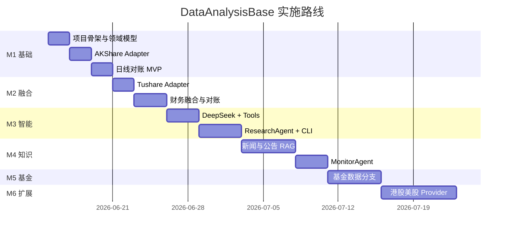

# 实施路线图

> 关联：[ARCHITECTURE.md](./ARCHITECTURE.md)

---

## 1. 总览



---

## 2. 里程碑详情

### M1 — 数据基础与日线对账（第 1 周）

**目标**：跑通「单标的同步 → 标准化 → 对账 → 全景」最小链路。

| 任务 | 交付物 |
|------|--------|
| 项目初始化 | `pyproject.toml`, 目录结构, `.env.example` |
| 领域模型 | `Security`, `RawDataset`, `symbols.py` |
| DuckDB Schema | `schema.sql`, 基础表 |
| AkshareAdapter | daily_bars, valuation |
| Normalizer | daily_bars 字段映射 |
| Reconciler | close 字段 L0~L3 分级 |
| Merger | priority 策略 |
| CLI | `sync`, `reconcile`, `overview` |

**验收命令**：

```bash
python -m dataanalysisbase.cli sync 600519.SH
python -m dataanalysisbase.cli reconcile 600519.SH
python -m dataanalysisbase.cli overview 600519.SH
```

**验收标准**：

- [ ] `600519` 可解析为 `600519.SH`
- [ ] sync 后 `canonical_daily_bars` 有数据
- [ ] reconcile 输出 Markdown 对账表
- [ ] `raw_snapshots` 可追溯原始数据
- [ ] 单源失败不崩溃

---

### M2 — 双源财务融合（第 2 周）

**目标**：Tushare 接入，财务数据融合与对账。

| 任务 | 交付物 |
|------|--------|
| TushareAdapter | daily_bars, fina_indicator, daily_basic |
| 财务 Normalizer | revenue, roe, gross_margin 等 |
| 财务 Reconciler | 阈值按 fusion_policy |
| 财务 Merger | authoritative 策略 |
| lineage_json | 全 canonical 表附带血缘 |
| watchlist 同步 | `sync --watchlist` |

**验收标准**：

- [ ] 双源日线收盘价差异可检出
- [ ] 财务指标融合写入 `canonical_financials`
- [ ] L3 问题阻断写入并记录 issues
- [ ] Tushare 无积分时优雅降级到 AKShare

---

### M3 — Research Agent（第 3 周）

**目标**：DeepSeek 驱动的单标的 AI 研究。

| 任务 | 交付物 |
|------|--------|
| DeepSeekClient | chat + function calling |
| Tool Registry | 6+ 工具 |
| ResearchAgent | 研报生成 |
| ReconcileAgent | 差异解释 |
| 报告模板 | Markdown Jinja2 |
| CLI | `research`, `ask` |

**验收命令**：

```bash
python -m dataanalysisbase.cli research 600519.SH
python -m dataanalysisbase.cli ask "茅台近3年ROE趋势如何"
```

**验收标准**：

- [ ] 研报数字与 canonical 表一致（自动化校验）
- [ ] 存在 L3 时报告含警告、confidence=0
- [ ] 研报含免责声明
- [ ] 单次研报 DeepSeek 成本可记录

---

### M4 — RAG 与监控（第 4 周）

**目标**：公告/新闻知识库 + 事件监控。

| 任务 | 交付物 |
|------|--------|
| 新闻同步 | AKShare news → event_timeline |
| Chroma 向量库 | 公告/新闻入库 |
| RAG Tools | search_documents |
| 新闻结构化抽取 | NewsEvent schema |
| MonitorAgent | 规则引擎 |
| 定时任务 | APScheduler / 计划任务 |
| CLI | `monitor`, `daily` |
| 推送 | 企业微信 webhook（可选） |

**验收标准**：

- [ ] 「公司回购」类问题可 RAG 回答并附 source_url
- [ ] 自选股每日简报自动生成
- [ ] L3 对账问题触发告警

---

### M5 — 基金分支（第 5 周）

**目标**：支持基金/ETF 实体研究。

| 任务 | 交付物 |
|------|--------|
| Fund 领域扩展 | fund_profile, fund_nav, fund_holdings |
| 基金 Adapter 映射 | AKShare 基金接口 |
| 重仓股关联 | 链接到 stock Security |
| 基金研报模板 | 含重仓分析章节 |

**验收标准**：

- [ ] `110022.OF` 可 sync 净值
- [ ] ETF 重仓可关联到股票事件监控

---

### M6 — 多市场扩展（第 6 周+）

**目标**：港股/美股 Provider 插件化。

| 任务 | 交付物 |
|------|--------|
| YfinanceAdapter | 港股/美股行情 |
| 市场扩展 symbol 解析 | `.HK`, `.US` |
| 跨市场 Issuer 关联 | 同一公司多证券 |
| fusion_policy 分市场配置 | — |

---

## 3. 每期工作量估算

| 里程碑 | 预估工时 | 依赖 |
|--------|----------|------|
| M1 | 15~20h | 无 |
| M2 | 15~20h | M1 |
| M3 | 20~25h | M2 |
| M4 | 20~25h | M3 |
| M5 | 15~20h | M2 |
| M6 | 25~30h | M1 |

---

## 4. 技术债务与后续

| 项 | 优先级 | 说明 |
|----|--------|------|
| FastAPI Copilot | P2 | M3 后可选 |
| vectorbt 回测 | P2 | M4 后 |
| LiteLLM 多模型 | P3 | 需要时再加 |
| Web UI (Streamlit) | P3 | 有需求再做 |
| 模拟盘对接 | P4 | 远期 |

---

## 5. 首期 MVP 定义（M1+M2 交集）

若时间紧，**最小可日常使用版本** = M1 + M2 部分：

```text
✓ 双源日线 + 估值对账
✓ 财务融合（至少 fina_indicator）
✓ overview + reconcile CLI
✗ 暂不含 Agent（M3）
```

---

## 6. 开发顺序建议

```
1. domain/models + symbols
2. storage/duckdb + schema
3. providers/akshare_adapter
4. fusion/normalizer → reconciler → merger
5. ingest/sync_security + cli sync/reconcile/overview
6. providers/tushare_adapter
7. 财务融合扩展
8. llm/client + tools + research_agent
9. RAG + monitor
```

---

## 7. 质量门禁

每个里程碑合并前：

- [ ] `pytest` 通过
- [ ] 至少 1 个端到端测试（600519.SH）
- [ ] 文档与代码配置一致
- [ ] 无 hardcoded API key

---

*下一步：按 M1 任务清单开始代码实施。*
