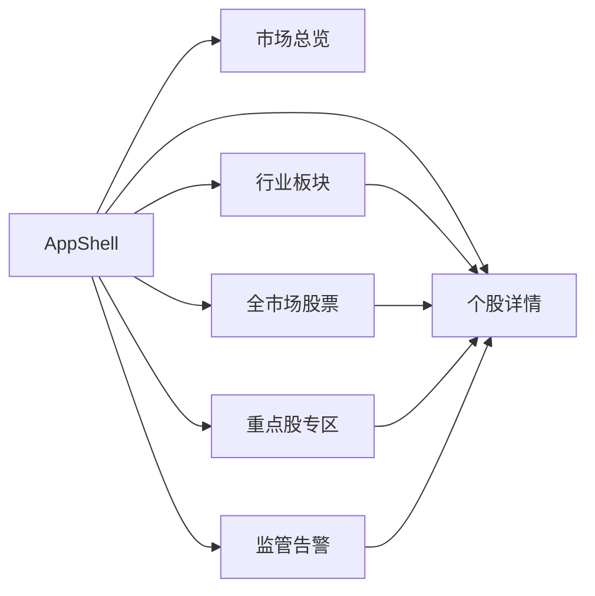

# 本地 Web 仪表盘设计

| 版本 | v0.2.0 |
|------|--------|
| 关联 | [REQUIREMENTS.md](./REQUIREMENTS.md) · [PRODUCT_OUTCOMES.md](./PRODUCT_OUTCOMES.md) |

---

## 1. 设计目标

- **本地可运行**：`http://localhost:5173` 访问，数据来自本机 DuckDB
- **最优体验**：React 18 + TypeScript + ECharts + shadcn/ui
- **信息密度高**：全市场 5000+ 股可浏览、可筛选，不卡顿
- **监管可见**：告警流与市场变化一目了然
- **状态透明**：快照失败、数据滞后、字段缺失必须可见，避免误读旧数据

---

## 2. 技术栈

| 层级 | 选型 |
|------|------|
| 前端框架 | React 18 + TypeScript + Vite |
| 路由 | React Router v6 |
| 数据请求 | TanStack Query + fetch |
| 实时 | WebSocket（告警、快照完成） |
| 图表 | ECharts（K 线、热力图、折线） |
| 表格 | TanStack Table + 虚拟滚动 |
| 样式 | Tailwind CSS + shadcn/ui |
| 后端 | FastAPI（port 8000） |
| 开发代理 | Vite proxy `/api` → `localhost:8000` |

---

## 3. 信息架构



### 3.1 全局布局（AppShell）

```text
┌────────────────────────────────────────────────────────────┐
│ Logo   市场总览 | 行业 | 股票 | 告警 | 重点股    🕐 更新于 10:30 │
├────────────────────────────────────────────────────────────┤
│                                                            │
│                     主内容区                                │
│                                                            │
├────────────────────────────────────────────────────────────┤
│ 数据仅供参考，不构成投资建议 | 快照周期 30min | 重点股 5min      │
└────────────────────────────────────────────────────────────┘
```

**顶栏状态**：
- 最后快照时间（绿色=正常，黄色=滞后>45min，红色=失败）
- 可选：未读告警数 Badge
- 数据源状态入口：点击可查看最近同步任务、错误、缺失数量

---

### 3.2 全局状态模型

所有页面统一展示数据状态：

| 状态 | 触发条件 | UI 行为 |
|------|----------|---------|
| `fresh` | 最近快照成功且未超过阈值 | 正常展示 |
| `stale` | 最近快照超过 45 分钟 | 顶栏黄色提示，页面仍可用 |
| `partial` | 快照成功但标的数或字段不完整 | 展示缺失数量和来源 |
| `failed` | 最近同步失败 | 顶栏红色提示，使用上一可用快照 |
| `offline` | 本地无网络或手动离线 | 只读本地历史数据 |

---

## 4. 页面设计

### 4.1 市场总览 `/`

**目的**：一眼看清 A 股整体温度。

| 区域 | 内容 | 组件 |
|------|------|------|
| 指数卡片 | 上证、深证、创业板 涨跌幅 | StatCard × 3 |
| 市场宽度 | 上涨/下跌/平盘家数、涨停/跌停 | BarChart |
| 成交 | 两市成交额、较昨日同期 | StatCard |
| 北向 | 北向资金净流入（有数据则显示） | LineChart |
| 告警摘要 | 今日 high/medium 告警数，跳转告警页 | AlertSummary |

**API**：`GET /api/v1/market/overview`

---

### 4.2 行业板块 `/industries`

**目的**：按行业看强弱，发现板块轮动。

| 区域 | 内容 | 组件 |
|------|------|------|
| 热力图 | 行业涨跌幅色块 | ECharts Treemap |
| 排行表 | 行业名、均涨跌、成交额、上涨占比 | DataTable |
| 筛选 | 一级/二级行业切换 | Tabs |

**交互**：点击行业行 → `/industries/{code}` 成分股列表

**API**：
- `GET /api/v1/industries?snapshot_time=latest`
- `GET /api/v1/industries/{code}/stocks`

---

### 4.3 全市场股票 `/stocks`

**目的**：浏览、搜索、筛选全部 A 股。

| 列 | 字段 |
|----|------|
| 代码 | security_id |
| 名称 | name |
| 行业 | industry_name |
| 现价 | price |
| 涨跌幅 | change_pct |
| 成交额 | amount |
| 量比 | volume_ratio |
| PE | pe_ttm |

**功能**：
- 搜索：代码/名称模糊
- 排序：任意列
- 快捷筛选：涨幅榜、跌幅榜、涨停、跌停、放量
- 行业下拉筛选
- **虚拟滚动**（5000+ 行）

**API**：`GET /api/v1/stocks?page=&size=&sort=&order=&industry=&q=&filter=`

**性能约束**：

- 默认服务端分页，前端每页不超过 200 行
- 快捷榜单（涨幅榜、跌幅榜、涨停池）走服务端过滤
- 表格只保留最新快照，不直接查询历史快照全表
- 前端虚拟滚动用于渲染优化，不替代服务端分页

---

### 4.4 监管告警 `/alerts`

**目的**：全市场自动化监管结果。

| 列 | 字段 |
|----|------|
| 时间 | alert_time |
| 级别 | severity（色标） |
| 类型 | alert_type |
| 标的 | security_id / 行业名 |
| 标题 | title |
| 摘要 | message |

**功能**：
- 筛选：severity、alert_type、行业、是否重点股
- WebSocket 新告警插入顶部 + 提示音（可关）
- 点击行 → 个股详情
- 每条告警展示：规则 ID、触发值、阈值、快照时间、数据源状态

**API**：
- `GET /api/v1/alerts`
- `WS /ws/v1/alerts`

---

### 4.5 重点股专区 `/focus`

**目的**：自选股深度跟踪入口。

| 区域 | 内容 |
|------|------|
| 自选卡片 | 每只：现价、涨跌、5min 更新、对账状态图标 |
| 对账摘要 | ⚠ 有 L1+ 差异的标的列表 |
| 快捷操作 | 生成研报、查看对账报告 |

**API**：
- `GET /api/v1/focus`
- `GET /api/v1/focus/{id}/reconciliation`

---

### 4.6 个股详情 `/stocks/{security_id}`

**目的**：单标的全景；重点股加深。

**所有股票**：
- 基础信息、所属行业
- 最新快照数据
- 日 K 线图（ECharts candlestick）
- 30min 快照价格曲线（当日）
- 相关告警历史

**重点股额外 Tab**：
- 估值：PE/PB + 多源差异
- 财务：关键指标趋势
- 资金流
- 新闻时间线
- AI 研报（Phase D）：生成/查看 Markdown

**API**：
- `GET /api/v1/stocks/{id}`
- `GET /api/v1/stocks/{id}/bars?days=120`
- `GET /api/v1/stocks/{id}/snapshots/intraday`
- `GET /api/v1/stocks/{id}/alerts`
- `POST /api/v1/focus/{id}/research`（Phase D）

---

## 5. REST API 契约（v1）

### 5.1 通用约定

```text
Base URL:  http://localhost:8000/api/v1
Format:    JSON
Time:      ISO 8601
分页:      page (1-based), size (default 50, max 200)
排序:      sort=change_pct&order=desc
```

### 5.2 响应包装

```json
{
  "success": true,
  "data": { },
  "meta": {
    "snapshot_time": "2026-06-14T10:30:00+08:00",
    "stale": false,
    "data_status": "fresh",
    "source": "akshare",
    "total": 5123,
    "missing_count": 0
  }
}
```

### 5.2.1 错误响应

```json
{
  "success": false,
  "error": {
    "code": "MARKET_SNAPSHOT_STALE",
    "message": "最近一次成功快照已超过 45 分钟",
    "recoverable": true
  },
  "meta": {
    "last_success_snapshot_time": "2026-06-14T10:30:00+08:00"
  }
}
```

### 5.3 核心端点列表

| 方法 | 路径 | 说明 |
|------|------|------|
| GET | `/health` | 服务与 DB 状态 |
| GET | `/system/status` | 同步任务、数据源、快照状态 |
| GET | `/market/overview` | 市场总览 |
| GET | `/market/status` | 快照元信息、数据源健康 |
| GET | `/stocks` | 股票列表 |
| GET | `/stocks/{id}` | 个股详情 |
| GET | `/stocks/{id}/bars` | 日 K |
| GET | `/stocks/{id}/snapshots/intraday` | 当日快照序列 |
| GET | `/industries` | 行业列表 |
| GET | `/industries/{code}/stocks` | 行业成分 |
| GET | `/alerts` | 告警列表 |
| GET | `/focus` | 重点股列表 |
| GET | `/focus/{id}/reconciliation` | 对账问题 |
| POST | `/focus/{id}/research` | 触发 AI 研报（Phase D） |

### 5.4 WebSocket

```text
WS /ws/v1/alerts

客户端 → 服务端: { "action": "subscribe", "filters": { "severity": ["high","medium"] } }
服务端 → 客户端: { "type": "alert", "data": { ... SurveillanceAlert } }
服务端 → 客户端: { "type": "snapshot_complete", "data": { "snapshot_time": "..." } }
```

---

## 6. 前端目录结构

```text
frontend/
├── src/
│   ├── app/                 # 路由、布局
│   ├── pages/
│   │   ├── MarketOverview.tsx
│   │   ├── IndustryPage.tsx
│   │   ├── StockListPage.tsx
│   │   ├── AlertFeedPage.tsx
│   │   ├── FocusPage.tsx
│   │   └── StockDetailPage.tsx
│   ├── components/
│   │   ├── charts/          # KLine, Heatmap, MarketBreadth
│   │   ├── tables/          # StockTable (virtualized)
│   │   ├── alerts/          # AlertBadge, AlertRow
│   │   └── layout/          # AppShell, StatusBar
│   ├── api/                 # typed fetch clients
│   ├── hooks/               # useAlertsWS, useMarketStatus
│   └── types/               # shared TS types
├── package.json
└── vite.config.ts
```

---

## 7. 性能设计

| 场景 | 策略 |
|------|------|
| 5000 行表格 | TanStack Virtual 虚拟滚动 |
| 列表 API | 服务端分页 + 排序 |
| 图表 | 日 K 最多 250 根；快照曲线当日最多 48 点 |
| 缓存 | TanStack Query staleTime：overview 1min，stocks 30s |
| WebSocket | 仅推送告警，不推全量行情 |
| 首屏 | 先加载 overview/status，再并行加载行业和榜单 |
| 大查询 | 后端读取 `latest_market_snapshot` 或聚合表 |

---

## 7.1 可观测页面（System Status）

建议在顶栏状态入口提供轻量系统页：

| 区域 | 内容 |
|------|------|
| 数据源 | AKShare / Tushare 最近成功时间、失败原因 |
| 调度任务 | market_bulk_snapshot、focus_deep_sync、eod_daily_bars 状态 |
| 快照质量 | expected_count、actual_count、missing_count、字段缺失 |
| 存储容量 | market_snapshots 行数、保留期、最近归档时间 |

---

## 8. 本地启动（设计目标）

```text
# 设计阶段命令契约（实现时落地）
make dev          # backend + frontend + scheduler
make dev-api      # 仅 FastAPI
make dev-web      # 仅 Vite
make sync-now     # 手动触发一次全市场快照
```

访问：`http://localhost:5173`

---

## 9. 阶段与页面对照

| Phase | 可用页面 |
|-------|----------|
| A | 市场总览、行业排行、全市场列表 |
| B | + 告警流、行业热力图 |
| C | + 重点股专区、个股 K 线详情 |
| D | + 对账面板、AI 研报 Tab |

---

*视觉效果以实现阶段 UI 稿为准；本文档定义信息架构与 API 契约。*
