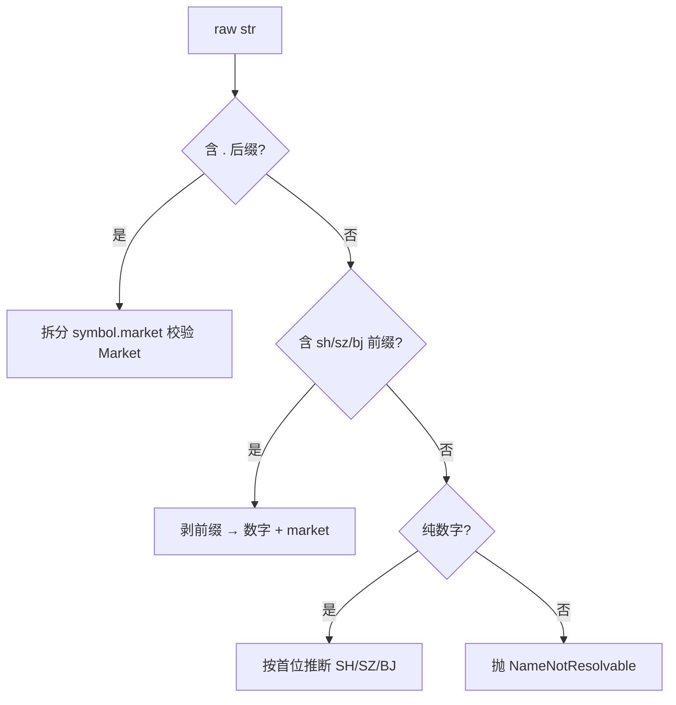

# domain 模块详细设计

| 属性 | 值 |
|------|-----|
| 包路径 | `src/dataanalysisbase/domain/` |
| 层 | 基础（最底层） |
| Phase | A |
| 依赖 | 无（仅标准库 + pydantic） |
| 被依赖 | 所有模块 |

> 关联：[../MODULE_DESIGN.md](../MODULE_DESIGN.md) §4.1 · [../ARCHITECTURE.md](../ARCHITECTURE.md) §5

---

## 1. 模块定位与边界

**做什么**：定义全系统共享的实体、ID 规范、枚举与跨模块数据契约（DTO）。这是所有模块的“共同语言”。

**不做什么**：

- 不做任何 IO（不读 DB、不调网络、不读文件）
- 不含业务逻辑（不计算指标、不对账）
- 不依赖任何上层模块

**纯度要求**：domain 可被任意模块 import 而不产生副作用；单测无需 mock。

---

## 2. 目录与文件

```text
domain/
├── __init__.py      # 导出公共符号
├── symbols.py       # SecurityId 值对象 + 解析
├── enums.py         # Market, SecurityType, DatasetType, Severity, AlertSeverity, RunStatus, DataStatus
├── models.py        # Security, Issuer, FundProfile, IndustryRef
└── contracts.py     # RawDataset, SyncResult, FusionResult, MarketRow 等跨模块 DTO
```

---

## 3. 数据结构与类

### 3.1 枚举（`enums.py`）

```python
class Market(str, Enum):
    SH = "SH"; SZ = "SZ"; BJ = "BJ"; HK = "HK"; US = "US"; OF = "OF"

class SecurityType(str, Enum):
    STOCK = "stock"; ETF = "etf"; FUND = "fund"; INDEX = "index"

class DatasetType(str, Enum):
    DAILY_BARS = "daily_bars"; VALUATION = "valuation"; FINANCIALS = "financials"
    MONEY_FLOW = "money_flow"; NEWS = "news"; ANNOUNCEMENTS = "announcements"
    FUND_NAV = "fund_nav"; FUND_HOLDINGS = "fund_holdings"; MARKET_SPOT = "market_spot"

class Severity(str, Enum):       # 对账分级
    L0 = "L0"; L1 = "L1"; L2 = "L2"; L3 = "L3"

class AlertSeverity(str, Enum):  # 监管告警级别
    HIGH = "high"; MEDIUM = "medium"; INFO = "info"

class RunStatus(str, Enum):
    RUNNING = "running"; SUCCESS = "success"; PARTIAL = "partial"; FAILED = "failed"

class DataStatus(str, Enum):
    FRESH = "fresh"; STALE = "stale"; PARTIAL = "partial"; FAILED = "failed"; OFFLINE = "offline"
```

### 3.2 SecurityId 值对象（`symbols.py`）

```python
@dataclass(frozen=True)
class SecurityId:
    symbol: str          # "600519"
    market: Market       # Market.SH

    def __str__(self) -> str:        # "600519.SH"
        return f"{self.symbol}.{self.market.value}"

    @classmethod
    def parse(cls, raw: str) -> "SecurityId": ...
```

解析规则（覆盖 ARCHITECTURE §5.2）：

| 输入 | 输出 | 规则 |
|------|------|------|
| `600519` | `600519.SH` | 6 开头 → SH |
| `000001` / `300750` | `.SZ` | 0/3 开头 → SZ |
| `920799` | `.BJ` | 8/9（北交所）→ BJ |
| `sh600519` / `SH600519` | `600519.SH` | 带前缀前缀解析 |
| `600519.SH` | 原样 | 已规范 |
| `00700.HK` / `AAPL.US` | 原样 | 显式后缀优先 |
| 名称（如 `贵州茅台`） | 抛 `NameNotResolvable` | domain 不查库；交由上层用 alias 表解析 |

> 名称→ID 的解析**不在 domain**（需查 `securities`/`security_aliases` 表），由 storage/上层提供 `resolve_name()`。domain 只做纯字符串规则。

### 3.3 实体模型（`models.py`）

```python
class Issuer(BaseModel):
    id: str; name: str; credit_code: str | None = None
    industry: str | None = None; main_business: str | None = None

class Security(BaseModel):
    id: str                      # "600519.SH"
    issuer_id: str | None = None
    market: Market; symbol: str; name: str
    type: SecurityType; currency: str = "CNY"; is_active: bool = True

class IndustryRef(BaseModel):
    code: str; name: str; source: str; level: int = 1
```

### 3.4 跨模块契约（`contracts.py`）

```python
class RawDataset(BaseModel):
    source: str                  # "akshare" | "tushare"
    dataset_type: DatasetType
    security_id: str | None      # 全市场快照时为 None
    fetched_at: datetime
    records: list[dict]
    metadata: dict = {}
    raw_hash: str                # SHA256(records)，审计与去重

class MarketRow(BaseModel):      # 全市场快照单行（canonical 字段）
    snapshot_time: datetime; security_id: str; name: str
    price: float | None; change_pct: float | None
    volume: float | None; amount: float | None
    turnover_rate: float | None; volume_ratio: float | None
    pe_ttm: float | None; pb: float | None; market_cap: float | None
    industry_code: str | None; source: str; fetched_at: datetime

class SyncResult(BaseModel):
    task: str; snapshot_time: datetime | None
    status: RunStatus; expected: int; actual: int; missing: int
    errors: list[str] = []

class FusionResult(BaseModel):
    security_id: str
    canonical_counts: dict[str, int]
    issues: list[str]            # issue id 列表
    blocked: bool                # 是否存在 L3 阻断
```

---

## 4. 核心流程

domain 无运行时流程，仅提供 `SecurityId.parse` 的解析分支：



---

## 5. 对外接口契约

| 符号 | 用途 | 调用方 |
|------|------|--------|
| `SecurityId.parse(raw)` | 字符串 → ID | providers, ingest, api |
| `to_source_code(sid, source)` | ID → 源内代码 | providers |
| `RawDataset` | 源拉取统一返回 | providers → fusion/ingest |
| `MarketRow` | 全市场快照行 | ingest → storage |
| `SyncResult` / `FusionResult` | 任务结果 | ingest/fusion → delivery/api |

```python
def to_source_code(sid: SecurityId, source: str) -> str:
    # akshare: "600519"；tushare: "600519.SH"；sina: "sh600519"
    ...
```

---

## 6. 配置与表

无。domain 不读配置、不碰表。

---

## 7. 错误处理与降级

| 异常 | 触发 | 处理建议（上层） |
|------|------|------------------|
| `InvalidSecurityId` | 非法格式 | 上层向用户报错 |
| `NameNotResolvable` | 传入名称 | 上层改用 alias 表解析 |
| `UnsupportedMarket` | 未知后缀 | 提示暂不支持该市场 |

domain 只抛异常，不吞错、不降级。

---

## 8. 测试用例清单

- `SecurityId.parse`：`600519`/`000001`/`300750`/`920799`/`sh600519`/`600519.SH`/`00700.HK` 全部正确
- 非法输入（空串、乱码、名称）抛对应异常
- `str(SecurityId)` 与 `parse` 往返一致
- `to_source_code` 三源格式正确
- `RawDataset.raw_hash` 对相同 records 稳定、不同 records 不同
- Pydantic 模型字段类型与可空性校验

---

## 9. 开放问题

- 北交所号段判定（8/9 开头）需用真实清单核对，避免与某些深市号段冲突
- 场外基金 `.OF` 与 ETF `.SH/.SZ` 的归类边界
- 是否需要 `SecurityId` 缓存 parse 结果（高频调用时）
