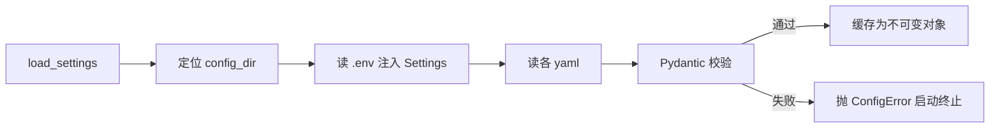

# config 模块详细设计

| 属性 | 值 |
|------|-----|
| 包路径 | `src/dataanalysisbase/config_loader/` |
| 层 | 基础 |
| Phase | A（热加载 F） |
| 依赖 | domain、pydantic、pyyaml、python-dotenv |
| 被依赖 | providers、ingest、surveillance、fusion、api |

> 关联：[../MODULE_DESIGN.md](../MODULE_DESIGN.md) §4.2 · [../CONFIG_REFERENCE.md](../CONFIG_REFERENCE.md)

---

## 1. 模块定位与边界

**做什么**：集中加载 `config/*.yaml` 与 `.env`，用 Pydantic 校验后暴露**类型化、不可变**的配置对象；非法配置在启动时即失败（fail-fast）。

**不做什么**：

- 不在各业务模块里散落 `yaml.load`
- 不持有运行时可变状态（除热加载缓存）
- 不读密钥明文入日志（只引用 env 变量名）

---

## 2. 目录与文件

```text
config_loader/
├── __init__.py
├── loader.py            # 通用：定位 config 目录、读 YAML、env 注入、校验、缓存
├── settings.py          # Settings 根配置（路径/DB/LLM/运行模式）
├── providers_cfg.py     # ProvidersConfig
├── fusion_cfg.py        # FusionPolicy + ReconcileThresholds
├── surveillance_cfg.py  # SyncSchedule + SurveillanceRules
└── watchlist_cfg.py     # Watchlist
```

---

## 3. 数据结构与类

### 3.1 根配置（`settings.py`）

```python
class Settings(BaseSettings):
    config_dir: Path = Path("config")
    data_dir: Path = Path("data")
    duckdb_path: Path = Path("data/duckdb/analytics.duckdb")
    chroma_dir: Path = Path("data/chroma")
    run_mode: Literal["live", "replay"] = "live"

    deepseek_api_key: str | None = None     # 来自 env DEEPSEEK_API_KEY
    tushare_token: str | None = None        # 来自 env TUSHARE_TOKEN

    model_config = SettingsConfigDict(env_file=".env", extra="ignore")
```

### 3.2 调度配置（`surveillance_cfg.py`，映射 sync_schedule.yaml）

```python
class TradingSession(BaseModel):
    start: str   # "09:30"
    end: str     # "11:30"

class JobConfig(BaseModel):
    description: str = ""
    interval_minutes: int | None = None
    cron: str | None = None
    trading_sessions: list[TradingSession] = []
    trading_days_only: bool = True
    on_complete: str | None = None          # 链式触发，如 surveillance_eval

    @model_validator(mode="after")
    def _check(self):                        # interval 与 cron 二选一
        if not self.interval_minutes and not self.cron:
            raise ValueError("job needs interval_minutes or cron")
        return self

class SyncSchedule(BaseModel):
    version: str
    timezone: str = "Asia/Shanghai"
    jobs: dict[str, JobConfig]
```

### 3.3 监管规则配置（映射 surveillance_rules.yaml）

```python
class Condition(BaseModel):
    field: str
    op: Literal["gte", "lte", "gt", "lt", "eq", "abs_gte"]
    value: float

class RuleConfig(BaseModel):
    rule_id: str                              # 由 dict key 注入
    scope: Literal["market", "industry", "focus"]
    severity: AlertSeverity
    condition: Condition
    enabled: bool = True
    version: str = "1.0"
    cooldown_minutes: int = 30
    explanation_template: str | None = None

class DedupeConfig(BaseModel):
    window_minutes: int = 30

class SurveillanceRules(BaseModel):
    version: str
    dedupe: DedupeConfig = DedupeConfig()
    rules: dict[str, RuleConfig]
```

### 3.4 数据源与重点股

```python
class ProviderEntry(BaseModel):
    name: str; enabled: bool = True; priority: int = 100
    rate_limit_per_min: int | None = None
    overrides: dict[str, int] = {}            # 按 dataset_type 调整优先级

class ProvidersConfig(BaseModel):
    providers: list[ProviderEntry]

class Watchlist(BaseModel):
    securities: list[str]                     # ["600519.SH", ...]
    custom_rules: dict[str, list[RuleConfig]] = {}
```

---

## 4. 核心流程

### 4.1 加载与校验



### 4.2 热加载（Phase F）

```python
class ConfigRegistry:
    """进程内单例，持有已加载配置 + mtime。"""
    def get(self, name: str) -> BaseModel: ...
    def reload(self, name: str) -> BaseModel:
        # 重新读取 + 校验；校验失败保留旧值并告警，不中断服务
        ...
```

热加载只对“规则/阈值/调度”类配置开放；`Settings`（路径、DB）不热加载。

---

## 5. 对外接口契约

```python
def load_settings() -> Settings
def load_providers() -> ProvidersConfig
def load_sync_schedule() -> SyncSchedule
def load_surveillance_rules() -> SurveillanceRules
def load_fusion_policy() -> FusionPolicy
def load_watchlist() -> Watchlist
# Phase F
registry: ConfigRegistry
def reload(name: str) -> BaseModel
```

调用约定：模块启动时加载一次并注入，不在热路径里反复读盘。

---

## 6. 配置与表

- 读取：`config/` 下全部 YAML + 根目录 `.env`
- 不读写任何 DuckDB 表
- 配置样例见 [../CONFIG_REFERENCE.md](../CONFIG_REFERENCE.md) 与 [../examples/](../examples/)

---

## 7. 错误处理与降级

| 场景 | 行为 |
|------|------|
| 文件缺失 | 必需配置抛 `ConfigError`；可选配置用默认值 |
| 字段非法 | Pydantic `ValidationError` 包装为 `ConfigError`，启动终止 |
| env 缺密钥 | 对应能力降级（如无 `TUSHARE_TOKEN` → tushare 不启用）并告警，不崩溃 |
| 热加载校验失败 | 保留旧配置 + 记录告警，不中断运行 |

---

## 8. 测试用例清单

- 合法 YAML 全部解析为对应模型
- `interval_minutes` 与 `cron` 都缺失时报错
- 非法 `op` / `severity` / `scope` 报错
- 缺 `.env` 密钥时降级标记正确（tushare/deepseek 不启用）
- 规则 dict key 正确注入 `rule_id`
- 热加载：改文件后 `reload` 生效；坏文件不覆盖旧值

---

## 9. 开放问题

- 多环境（dev/prod）配置叠加是否需要（首期单环境）
- 规则 DSL 是否需要支持组合条件（AND/OR）——当前单条件，组合留待 surveillance 模块评估
- 时区处理统一放 config 还是 common 时间工具
