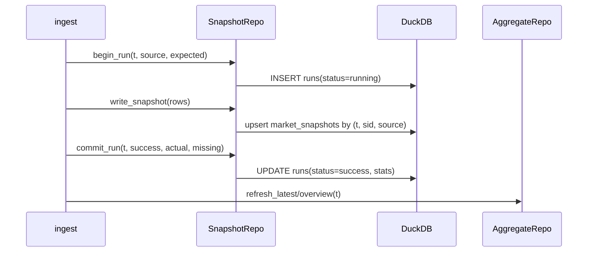

# storage 模块详细设计

| 属性 | 值 |
|------|-----|
| 包路径 | `src/dataanalysisbase/storage/` |
| 层 | 存储 |
| Phase | A（聚合表 A、归档 E） |
| 依赖 | domain、config、duckdb、chromadb |
| 被依赖 | ingest、fusion、surveillance、analytics、intelligence、portfolio、api、observability |

> 关联：[../MODULE_DESIGN.md](../MODULE_DESIGN.md) §4.3 · [../ARCHITECTURE.md](../ARCHITECTURE.md) §8 · [../MARKET_SURVEILLANCE.md](../MARKET_SURVEILLANCE.md) §2/§7

---

## 1. 模块定位与边界

**做什么**：系统**唯一**的持久化访问层。管理 DuckDB 连接、schema 与迁移、以 Repository 方式暴露读写、维护聚合表、归档历史快照、封装 Chroma 向量库。

**不做什么**：

- 不含业务规则（不判定告警、不算指标）
- 不向上层泄露原始 SQL；上层只调 repository 方法
- 不直接拉数据源

**铁律**：只有本模块写 SQL / 建表 / 迁移。

---

## 2. 目录与文件

```text
storage/
├── __init__.py
├── duckdb_store.py        # 连接池、事务、通用 upsert helper
├── schema.sql             # 全量 DDL（含主键/幂等键/索引）
├── migrations/
│   ├── __init__.py
│   ├── runner.py          # 版本表 + 顺序执行
│   ├── 001_init.sql
│   ├── 002_market_layer.sql
│   └── 003_surveillance.sql
├── repositories/
│   ├── base.py            # BaseRepo（持有连接）
│   ├── securities_repo.py
│   ├── snapshot_repo.py   # market_snapshots + runs
│   ├── focus_repo.py      # focus_snapshots
│   ├── canonical_repo.py  # canonical_* + reconciliation_issues
│   ├── alert_repo.py      # surveillance_alerts
│   ├── industry_repo.py   # industries + security_industry + industry_snapshots
│   └── aggregate_repo.py  # latest/overview 聚合表
├── archiver.py            # 超期快照 → Parquet
└── vector_store.py        # Chroma 封装
```

---

## 3. 数据结构与类

### 3.1 连接与事务（`duckdb_store.py`）

```python
class DuckDBStore:
    def __init__(self, path: Path, read_only: bool = False): ...
    def connect(self) -> duckdb.DuckDBPyConnection: ...
    @contextmanager
    def transaction(self): ...               # BEGIN/COMMIT/ROLLBACK
    def upsert(self, table: str, rows: list[dict], key: list[str]) -> int:
        # 基于 key 的幂等 upsert（DELETE+INSERT 或 INSERT OR REPLACE）
        ...
    def query(self, sql: str, params: list | None = None) -> list[dict]: ...
```

并发约定：DuckDB 单写入进程。写入集中在 ingest/surveillance 任务进程；API 进程以 `read_only=True` 连接，避免写锁冲突。

### 3.2 仓储方法（关键签名）

```python
class SnapshotRepo(BaseRepo):
    def begin_run(self, snapshot_time: datetime, source: str, expected: int) -> None
    def write_snapshot(self, rows: list[MarketRow]) -> int        # 幂等
    def commit_run(self, snapshot_time, status: RunStatus, actual: int,
                   missing: int, field_nulls: dict, error: str | None) -> None
    def latest_committed(self) -> datetime | None                  # status in success/partial
    def get_snapshot(self, snapshot_time) -> list[MarketRow]
    def previous_snapshot_time(self, before: datetime) -> datetime | None

class AggregateRepo(BaseRepo):
    def refresh_latest(self, snapshot_time) -> None      # → latest_market_snapshot
    def refresh_overview(self, snapshot_time) -> None    # → market_overview_snapshots
class AlertRepo(BaseRepo):
    def insert_alerts(self, alerts: list[Alert]) -> int
    def recent_for_dedupe(self, since: datetime) -> list[tuple]
    def query(self, filters, page, size) -> Page[Alert]
```

---

## 4. 核心流程

### 4.1 快照写入事务（被 ingest 调用）



### 4.2 迁移（`migrations/runner.py`）

```text
启动时：
  确保 schema_migrations 表存在
  读取已应用版本
  按文件名顺序执行未应用的 .sql
  记录版本 + 时间
幂等：重复启动不重复执行
```

### 4.3 归档（`archiver.py`，Phase E）

```text
对 market_snapshots 中 snapshot_time < now-90d：
  COPY 到 data/cache/parquet/market_snapshots/yyyymm.parquet
  DELETE 已归档行
  保留聚合表与告警
```

---

## 5. 对外接口契约

| Repo | 关键方法 | 调用方 |
|------|----------|--------|
| SecuritiesRepo | `resolve_name`, `upsert_securities`, `get` | ingest, api, domain 名称解析 |
| SnapshotRepo | `begin_run`/`write_snapshot`/`commit_run`/`latest_committed` | ingest, surveillance, observability |
| AggregateRepo | `refresh_*`, `get_overview`, `get_stocks_page` | ingest, api |
| AlertRepo | `insert_alerts`, `query` | surveillance, api |
| CanonicalRepo | `write_canonical`, `get_financials`, `write_issues` | fusion, intelligence |
| VectorStore | `add_documents`, `search` | analytics, intelligence |

上层禁止绕过 repository 直接执行 SQL。

---

## 6. 配置与表

读 `Settings.duckdb_path` / `chroma_dir`。本模块是下列表的属主（DDL 见 ARCHITECTURE §8、MARKET_SURVEILLANCE §2/§7）：

| 类别 | 表 | 幂等键 |
|------|----|--------|
| 实体 | `issuers`, `securities`, `security_aliases` | 主键 |
| 行业 | `industries`, `security_industry`, `industry_snapshots` | 复合键 |
| 全市场 | `market_snapshots`, `market_snapshot_runs` | `(snapshot_time, security_id, source)` |
| 聚合 | `latest_market_snapshot`, `market_overview_snapshots` | snapshot_time |
| 重点股 | `focus_snapshots`, `canonical_*`, `reconciliation_issues` | 见 FUSION 文档 |
| 监管 | `surveillance_alerts` | id + dedupe_key |
| 原始/分层 | `raw_snapshots`, `staging_*` | — |

---

## 7. 错误处理与降级

| 场景 | 行为 |
|------|------|
| 写入中途失败 | 事务回滚；run 标记 failed；不留半截快照 |
| 迁移失败 | 启动终止，打印失败版本 |
| 数据库被占用（写锁） | 重试 + 退避；API 侧只读连接规避 |
| 聚合刷新失败 | 明细已落库；聚合标记需重建，告警 |
| Chroma 不可用 | RAG 能力降级，结构化数据不受影响 |

---

## 8. 测试用例清单

- `upsert` 同键重复写入不产生重复行
- run 状态机：running→success / running→failed / running→partial
- `latest_committed` 跳过 running/failed，返回最新 success/partial
- `previous_snapshot_time` 正确取相邻前一快照
- 迁移可在空库与已有库上重放
- 聚合表与明细聚合结果一致
- 只读连接无法写入（防御）
- 归档后明细减少、聚合保留

---

## 9. 开放问题

- DuckDB 单写入约束下，ingest 与 surveillance 是否同进程串行执行（建议是）
- `market_snapshots` 是否按月分区表以加速归档
- 聚合表用物化表 vs DuckDB VIEW（首期物化表，便于读写分离）
- staging_* 是否每 dataset_type 一张表（建议是，schema 清晰）
