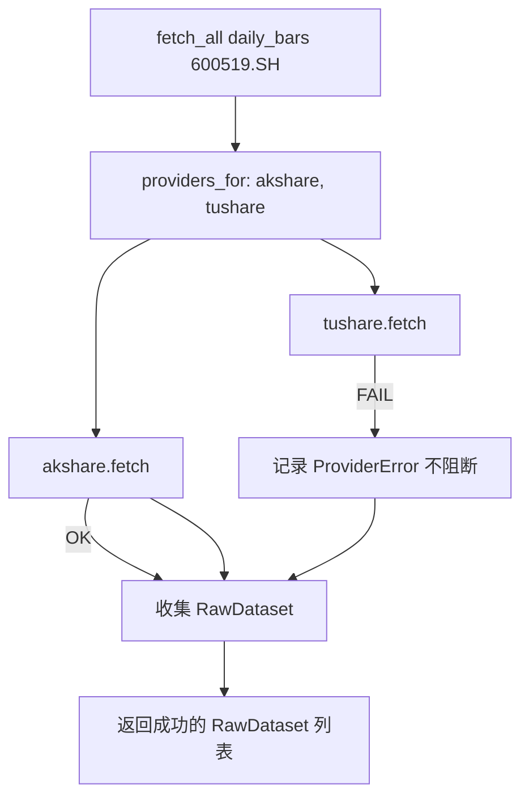

# providers 模块详细设计

| 属性 | 值 |
|------|-----|
| 包路径 | `src/dataanalysisbase/providers/` |
| 层 | 接入 |
| Phase | A（akshare 全市场）/ C（tushare）/ E（cninfo、yfinance） |
| 依赖 | domain、config、akshare、tushare |
| 被依赖 | ingest |

> 关联：[../MODULE_DESIGN.md](../MODULE_DESIGN.md) §4.4 · [../DATA_SOURCES.md](../DATA_SOURCES.md)

---

## 1. 模块定位与边界

**做什么**：把外部数据源封装为统一 `RawDataset`；按 `dataset_type` 路由到多源、并行拉取、限流、错误隔离、健康检查。

**不做什么**：

- 不做字段标准化（交给 fusion.normalizer）
- 不写 DB（返回 `RawDataset` 给 ingest 决定落库）
- 不感知融合/对账逻辑

**铁律**：这是**唯一**允许 `import akshare` / `import tushare` 的模块。

---

## 2. 目录与文件

```text
providers/
├── __init__.py
├── base.py             # DataProvider Protocol, ProviderHealth, ProviderError
├── registry.py         # ProviderRegistry：加载/路由/并行/隔离
├── ratelimit.py        # 令牌桶限流器
├── akshare_adapter.py
├── tushare_adapter.py
├── cninfo_adapter.py   # E
└── yfinance_adapter.py # E
```

---

## 3. 数据结构与类

### 3.1 协议与健康（`base.py`）

```python
class ProviderHealth(BaseModel):
    name: str
    healthy: bool
    latency_ms: float | None = None
    checked_at: datetime
    message: str | None = None

class DataProvider(Protocol):
    name: str
    priority: int
    def supports(self, dt: DatasetType) -> bool: ...
    def fetch(self, dt: DatasetType, security_id: str, **kw) -> RawDataset: ...
    def fetch_market_spot(self) -> RawDataset: ...        # 全市场一次拉取
    def health_check(self) -> ProviderHealth: ...

class ProviderError(Exception):
    def __init__(self, provider: str, dt: DatasetType | None, cause: Exception): ...
```

### 3.2 限流（`ratelimit.py`）

```python
class RateLimiter:
    def __init__(self, per_minute: int): ...
    def acquire(self) -> None:          # 阻塞直到有令牌
        ...
```

### 3.3 AKShare Adapter（`akshare_adapter.py`）

```python
class AkshareAdapter:
    name = "akshare"; priority = 2

    def supports(self, dt) -> bool:
        return dt in {DAILY_BARS, VALUATION, FINANCIALS, MONEY_FLOW,
                      NEWS, FUND_NAV, MARKET_SPOT}

    def fetch_market_spot(self) -> RawDataset:
        df = ak.stock_zh_a_spot_em()              # 全市场一次
        records = self._to_records(df)
        return RawDataset(source="akshare", dataset_type=MARKET_SPOT,
                          security_id=None, fetched_at=now(),
                          records=records, raw_hash=sha256(records))

    def fetch(self, dt, security_id, **kw) -> RawDataset:
        symbol = to_source_code(SecurityId.parse(security_id), "akshare")
        fn = self._dispatch(dt)                   # dt → akshare 函数
        df = fn(symbol=symbol, **kw)
        ...
```

接口映射见 DATA_SOURCES §2.3；全市场快照字段映射到 `MarketRow`。

### 3.4 Tushare Adapter（`tushare_adapter.py`）

```python
class TushareAdapter:
    name = "tushare"; priority = 1

    def __init__(self, token: str):
        self.pro = ts.pro_api(token)

    def fetch(self, dt, security_id, **kw) -> RawDataset:
        ts_code = security_id                     # 已是 600519.SH
        try:
            df = self._call(dt, ts_code, **kw)
        except Exception as e:
            if is_points_error(e):
                raise ProviderError("tushare", dt, e)  # 触发降级
            raise
        ...
```

### 3.5 Registry（`registry.py`）

```python
class ProviderRegistry:
    def __init__(self, cfg: ProvidersConfig):
        self.providers = self._load_enabled(cfg)   # 按 enabled/priority

    def providers_for(self, dt: DatasetType) -> list[DataProvider]:
        ps = [p for p in self.providers if p.supports(dt)]
        return sorted(ps, key=lambda p: p.effective_priority(dt))

    def fetch_all(self, dt, security_id, **kw) -> list[RawDataset]:
        # 并行拉取所有支持源，单源失败隔离
        ...

    def fetch_market_spot(self) -> RawDataset:
        # 全市场只用主源（akshare），不并行多源
        ...

    def health_check_all(self) -> dict[str, ProviderHealth]: ...
```

---

## 4. 核心流程

### 4.1 多源并行拉取与隔离



### 4.2 优先级覆盖

`effective_priority(dt)`：基础 `priority`，若 `providers.yaml` 的 `overrides` 指定了该 `dataset_type`，用覆盖值（例如资金流让 akshare 优先）。

---

## 5. 对外接口契约

| 方法 | 输入 | 输出 | 调用方 |
|------|------|------|--------|
| `fetch_market_spot()` | — | `RawDataset(MARKET_SPOT)` | ingest.MarketBulkSync |
| `fetch_all(dt, sid)` | 类型+ID | `list[RawDataset]` | ingest.FocusSync |
| `health_check_all()` | — | `dict[name, ProviderHealth]` | observability |

输出统一为 `RawDataset`（含 `raw_hash`），不含标准化字段。

---

## 6. 配置与表

- 读 `providers.yaml`（`ProvidersConfig`）、env `TUSHARE_TOKEN`
- 不直接写表；`RawDataset` 由 ingest 交 storage 落 `raw_snapshots`
- 限流参数来自配置 `rate_limit_per_min`

---

## 7. 错误处理与降级

| 场景 | 行为 |
|------|------|
| 单源 fetch 异常 | 包 `ProviderError`，隔离，不影响其他源 |
| tushare 积分不足 | 标记降级 → ingest 用 akshare 单源（DATA_SOURCES §3.5） |
| akshare 接口失效 | health 标 unhealthy；全市场快照 run 标 failed |
| 限流超时 | 退避重试，超阈值放弃并记录 |
| 全市场返回行数异常偏少 | 不在此判定（交 ingest 标 partial），但记录 metadata.row_count |

---

## 8. 测试用例清单

- mock `ak.stock_zh_a_spot_em` → `fetch_market_spot` 正确产出 `RawDataset`
- `supports` 对各 dataset_type 判定正确
- `fetch_all`：一源抛异常，另一源仍返回
- 优先级覆盖：overrides 生效
- 限流器在超频时阻塞/退避
- tushare 积分异常被识别为可降级错误
- `raw_hash` 稳定性

---

## 9. 开放问题

- 全市场快照是否需要备源（akshare 失效时无 tushare 全市场等价接口）→ 首期仅主源 + failed 状态
- akshare 版本 pin 策略与接口变更监控频率
- 限流是进程内还是跨进程（首期进程内足够）
- 港股/美股 spot 的统一字段对齐（E 阶段）
