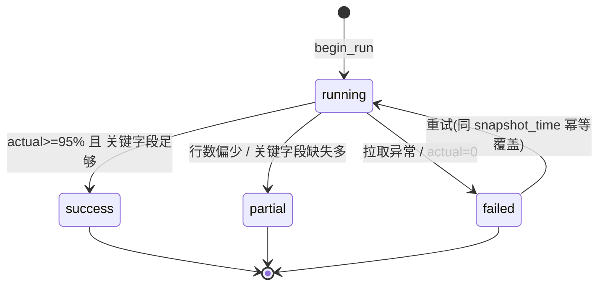
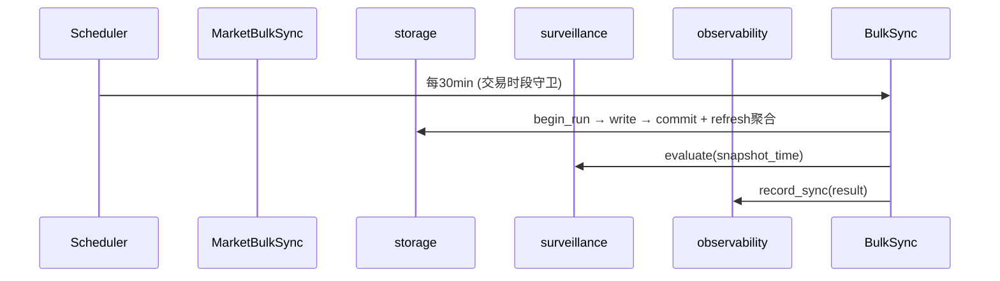

# ingest 模块详细设计

| 属性 | 值 |
|------|-----|
| 包路径 | `src/dataanalysisbase/ingest/` |
| 层 | 采集 / 同步 |
| Phase | A（bulk+eod）/ C（focus） |
| 依赖 | providers、storage、config、domain、（链式）surveillance、fusion、observability |
| 被依赖 | delivery（CLI/调度入口）、api（手动触发） |

> 关联：[../MODULE_DESIGN.md](../MODULE_DESIGN.md) §5.1 · [../MARKET_SURVEILLANCE.md](../MARKET_SURVEILLANCE.md) §2/§3/§6

---

## 1. 模块定位与边界

**做什么**：编排“拉取 → 入库 → 刷新聚合 → 触发下游”的同步任务；管理快照任务状态与幂等；区分全市场（30min）、重点股（5min）、日终三类节奏；提供调度入口与交易日历。

**不做什么**：

- 不实现规则告警（交 surveillance）
- 不做多源对账融合（交 fusion）
- 不直接 import 数据源（交 providers）

---

## 2. 目录与文件

```text
ingest/
├── __init__.py
├── market_bulk_sync.py  # 30min 全市场快照
├── focus_sync.py        # 5min 重点股深度
├── eod_sync.py          # 日终：日K/主数据/行业/指数
├── run_tracker.py       # market_snapshot_runs 状态机
├── trading_calendar.py  # 交易日历（前置基础设施）
└── scheduler.py         # APScheduler 注册与触发
```

---

## 3. 数据结构与类

### 3.1 全市场快照任务（`market_bulk_sync.py`）

```python
class MarketBulkSync:
    def __init__(self, registry, snapshot_repo, aggregate_repo,
                 calendar, surveillance, metrics): ...

    def run(self, snapshot_time: datetime | None = None) -> SyncResult:
        # 1. 校验交易时段/交易日
        # 2. begin_run(running)
        # 3. registry.fetch_market_spot() → RawDataset
        # 4. normalize 到 list[MarketRow]（轻量映射，非多源融合）
        # 5. snapshot_repo.write_snapshot（幂等 upsert）
        # 6. 完整性判定 → status(success/partial)
        # 7. commit_run + refresh_latest/overview
        # 8. on_complete: surveillance.evaluate(snapshot_time)
        ...
```

### 3.2 完整性判定（partial 判据）

```python
def classify(expected: int, actual: int, field_nulls: dict) -> RunStatus:
    if actual == 0: return RunStatus.FAILED
    if actual < expected * 0.95: return RunStatus.PARTIAL
    if field_nulls.get("price", 0) > actual * 0.1: return RunStatus.PARTIAL
    return RunStatus.SUCCESS
```

`expected` 来源：最近一次成功快照的行数（或证券主表活跃数）。

### 3.3 交易日历（`trading_calendar.py`）

```python
class TradingCalendar:
    def is_trading_day(self, d: date) -> bool
    def in_trading_session(self, t: datetime, sessions) -> bool
    def previous_trading_day(self, d: date) -> date
    def is_ex_dividend(self, security_id: str, d: date) -> bool   # 除权除息标记
```

数据来源：日终任务从 akshare 交易日历接口落 `trading_days` 表；除权标记从日终复权信息落库，供 surveillance 价格规则使用。

### 3.4 重点股同步（`focus_sync.py`）

```python
class FocusSync:
    def run(self, watchlist: list[str]) -> SyncResult:
        for sid in watchlist:
            raws = self.registry.fetch_all(VALUATION, sid)
            # 落 focus_snapshots；可选触发 fusion（Phase D）
        ...
```

### 3.5 调度（`scheduler.py`）

```python
class Scheduler:
    def __init__(self, schedule: SyncSchedule, jobs: dict[str, Callable]): ...
    def register_all(self) -> None:
        # interval_minutes → IntervalTrigger；cron → CronTrigger
        # trading_days_only / trading_sessions 包装为运行前守卫
    def start(self) -> None
```

---

## 4. 核心流程

### 4.1 全市场快照状态机



### 4.2 链式触发



### 4.3 首快照与除权处理（与 surveillance 协作）

- 当日**首快照**：无 T-1，价格类衍生以**昨收**为基准（ingest 在快照行内带 `prev_close`）。
- **除权除息日**：`trading_calendar.is_ex_dividend` 为真时，ingest 在快照标记 `ex_div=true`，surveillance 价格类规则当天跳过或改用前复权。

---

## 5. 对外接口契约

| 入口 | 触发方式 | 说明 |
|------|----------|------|
| `MarketBulkSync.run()` | 调度 30min / CLI | 全市场快照主流程 |
| `FocusSync.run(watchlist)` | 调度 5min / CLI | 重点股深度同步 |
| `EodSync.run()` | cron 15:35/15:40 | 日 K、主数据、行业、交易日历 |
| `Scheduler.register_all()` | 进程启动 | 注册所有任务 |

返回统一 `SyncResult`，交 observability 记录、交 delivery 展示。

---

## 6. 配置与表

- 读 `sync_schedule.yaml`、`watchlist.yaml`
- 写：`market_snapshots`、`market_snapshot_runs`、`focus_snapshots`、`canonical_daily_bars`、`securities`、`industries`、`trading_days`
- 触发聚合：`latest_market_snapshot`、`market_overview_snapshots`、`industry_snapshots`

---

## 7. 错误处理与降级

| 场景 | 行为 |
|------|------|
| 非交易日/非交易时段 | 守卫跳过，不建 run |
| 全市场拉取失败 | run=failed，沿用上一成功快照，UI 显示失败 |
| 行数异常偏少 | run=partial，保留上一 success 供对比 |
| 重试 | 同 `snapshot_time` 幂等覆盖，不产生重复 |
| 下游 surveillance 失败 | 快照数据仍可用，告警延迟，记录错误 |
| tushare 降级 | focus 改 akshare 单源 |

---

## 8. 测试用例清单

- 交易时段守卫：盘中触发、盘后/周末跳过
- run 状态机：success/partial/failed 三路判定阈值
- 重试幂等：同 snapshot_time 两次 run 不产生重复明细
- 首快照以昨收为基准（无 T-1 不报错）
- 除权日标记正确传递
- 链式触发 surveillance 被调用一次
- 调度：interval 与 cron 任务都正确注册

---

## 9. 开放问题

- ingest 与 surveillance 是否同进程串行（受 DuckDB 单写约束，建议是）
- `expected` 基准取“上次成功行数”还是“活跃证券数”（建议前者，更贴近真实波动）
- 5min focus 同步对 watchlist 较大时的限流与耗时（分批）
- 交易日历首次冷启动（无历史）如何引导（首次全量拉取）
