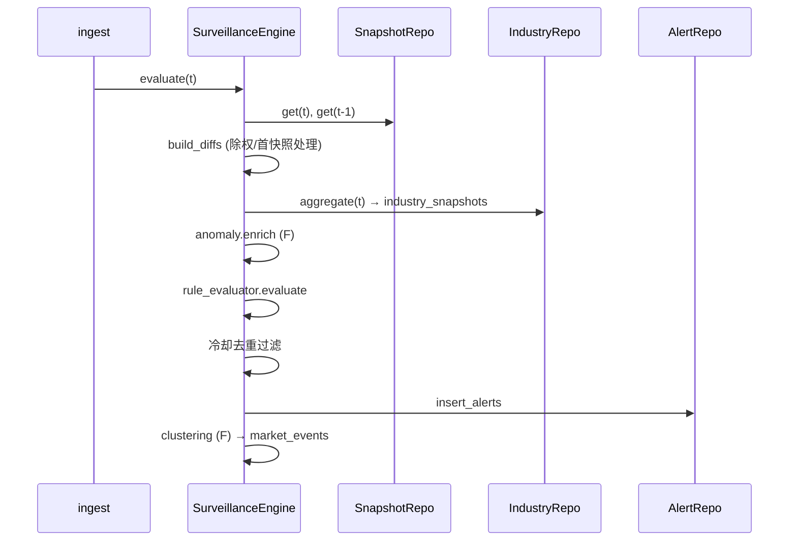

# surveillance 模块详细设计

| 属性 | 值 |
|------|-----|
| 包路径 | `src/dataanalysisbase/surveillance/` |
| 层 | 监管 |
| Phase | B（规则）/ F（异常分、聚类） |
| 依赖 | storage、config、domain、observability |
| 被依赖 | api、delivery；intelligence（读告警做叙事） |

> 关联：[../MODULE_DESIGN.md](../MODULE_DESIGN.md) §5.3 · [../MARKET_SURVEILLANCE.md](../MARKET_SURVEILLANCE.md) §4/§5 · [../INTELLIGENCE_ROADMAP.md](../INTELLIGENCE_ROADMAP.md) §2.1/§2.2

---

## 1. 模块定位与边界

**做什么**：基于相邻快照计算变化与异常分，按规则产生**可解释、可去重**的告警；行业聚合；告警聚类成候选事件（F）。

**不做什么**：

- **不调用 LLM**（叙事在 intelligence.narrative）
- 不拉数据、不写快照明细（只读快照、只写告警/行业聚合）
- 不直接推送（推送在 delivery.notifier）

**触发方式**：由 ingest 在快照 commit 后链式调用 `evaluate(snapshot_time)`。

---

## 2. 目录与文件

```text
surveillance/
├── __init__.py
├── engine.py            # SurveillanceEngine 编排
├── snapshot_diff.py     # T vs T-1 衍生字段（含除权/首快照处理）
├── anomaly.py           # zscore / 分位 / 行业相对强弱（F）
├── rule_evaluator.py    # 规则求值 + 冷却去重
├── industry_agg.py      # industry_snapshots 聚合
├── alert_writer.py      # surveillance_alerts 落库
└── clustering.py        # 告警聚类 → 候选 market_events（F）
```

---

## 3. 数据结构与类

### 3.1 衍生行与告警（domain/本模块内部 DTO）

```python
class DiffRow(BaseModel):
    security_id: str
    snapshot_time: datetime
    change_pct: float | None          # 相对昨收
    delta_price_pct: float | None     # 相对 T-1 快照（除权日置 None）
    volume_ratio: float | None
    delta_amount: float | None
    # 异常分（F）
    zscore_change: float | None = None
    pct_rank_change_60d: float | None = None
    rel_strength_vs_industry: float | None = None
    industry_code: str | None = None
    ex_div: bool = False

class Alert(BaseModel):
    id: str
    alert_time: datetime
    alert_type: str
    rule_id: str
    rule_version: str
    severity: AlertSeverity
    security_id: str | None = None
    industry_code: str | None = None
    title: str
    message: str
    trigger_value: float | None
    threshold_value: float | None
    metrics_json: dict
    snapshot_time: datetime
    is_focus: bool = False
    dedupe_key: str
```

### 3.2 引擎（`engine.py`）

```python
class SurveillanceEngine:
    def __init__(self, snapshot_repo, alert_repo, industry_repo,
                 rules: SurveillanceRules, calendar, metrics): ...

    def evaluate(self, snapshot_time: datetime) -> list[Alert]:
        # 1. 取 T 与 T-1 快照
        # 2. snapshot_diff → list[DiffRow]
        # 3. industry_agg.aggregate(snapshot_time)
        # 4. anomaly.enrich(diffs)（F；B 阶段空实现）
        # 5. rule_evaluator.evaluate(diffs, industry_aggs)
        # 6. 去重过滤（冷却窗口）
        # 7. alert_writer.persist(alerts)
        # 8. clustering.cluster(alerts)（F）
        # 9. metrics.record_surveillance(...)
        ...
```

### 3.3 快照对比（`snapshot_diff.py`）

```python
def build_diffs(curr: list[MarketRow], prev: list[MarketRow] | None,
                calendar) -> list[DiffRow]:
    prev_map = {r.security_id: r for r in (prev or [])}
    for r in curr:
        p = prev_map.get(r.security_id)
        ex_div = calendar.is_ex_dividend(r.security_id, r.snapshot_time.date())
        delta = None
        if p and p.price and not ex_div:        # 除权日不算 delta，避免误报
            delta = (r.price - p.price) / p.price * 100
        # 首快照 prev=None → delta=None，change_pct(相对昨收) 仍有效
        ...
```

### 3.4 异常分（`anomaly.py`，Phase F）

```python
def enrich(diffs: list[DiffRow], history, industry_aggs) -> None:
    for d in diffs:
        d.zscore_change = zscore(d.change_pct, history[d.security_id])
        d.pct_rank_change_60d = percentile_rank(d.change_pct, history[d.security_id])
        ind = industry_aggs.get(d.industry_code)
        if ind:
            d.rel_strength_vs_industry = d.change_pct - ind.change_pct_avg
```

### 3.5 规则求值与去重（`rule_evaluator.py`）

```python
OPS = {"gte": ge, "lte": le, "gt": gt, "lt": lt, "eq": eq,
       "abs_gte": lambda x, v: abs(x) >= v}

class RuleEvaluator:
    def evaluate(self, diffs, industry_aggs) -> list[Alert]:
        # 对每条 enabled 规则按 scope 选数据集求值
        ...
    def is_suppressed(self, alert: Alert, recent: list) -> bool:
        # dedupe_key = (security_id|industry_code, alert_type, bucket(snapshot_time, window))
        # 冷却窗口内同 key 抑制
        ...
```

---

## 4. 核心流程

### 4.1 评估主流程



### 4.2 去重分桶

```text
bucket = floor(snapshot_time / dedupe.window_minutes)
dedupe_key = f"{scope_key}:{alert_type}:{bucket}"
同 key 已存在 → 抑制（不再重复落库/推送）
```

### 4.3 触发路径（双路）

```text
绝对阈值：change_pct >= 9.9 → limit_up
相对异常(F)：|rel_strength_vs_industry| 超阈 或 zscore 超阈 → 异常告警
两路命中同标的同类型 → 去重合并，附异常分到 metrics_json
```

---

## 5. 对外接口契约

| 方法 | 输入 | 输出 | 调用方 |
|------|------|------|--------|
| `SurveillanceEngine.evaluate(t)` | snapshot_time | `list[Alert]`（已落库） | ingest |
| `IndustryAggregator.aggregate(t)` | snapshot_time | 写 `industry_snapshots` | engine 内部 / ingest |
| （读）`AlertRepo.query(...)` | 过滤/分页 | 告警页 | api |

---

## 6. 配置与表

- 读 `surveillance_rules.yaml`（含 `dedupe.window_minutes`、每规则 `cooldown_minutes`/`version`）
- 读：`market_snapshots`（T、T-1）、`trading_days`/除权标记、`industry_snapshots`
- 写：`surveillance_alerts`、`industry_snapshots`、`market_events`（F）

告警表结构见 MARKET_SURVEILLANCE §5.4（含 `rule_version`/`trigger_value`/`threshold_value`/`metrics_json`/`snapshot_time`）。

---

## 7. 错误处理与降级

| 场景 | 行为 |
|------|------|
| T-1 缺失（首快照） | delta 类规则跳过，change_pct 规则正常 |
| 除权日 | 价格类规则跳过（ex_div 标记） |
| 单条规则配置错误 | 跳过该规则并记录，不阻断其他规则 |
| 行业聚合失败 | 个股规则照常，行业规则降级跳过 |
| 写告警失败 | 标记本轮失败，下一快照重评（幂等 dedupe_key 防重复） |

---

## 8. 测试用例清单

- 涨停（change_pct≥9.9）产生 high 告警，含 rule_version/trigger/threshold
- 除权日不产生 price_spike 误报
- 首快照无 T-1 时 delta 规则不报错
- 冷却窗口内同标的同规则只告警一次
- `abs_gte` 等算子正确
- 行业均涨跌≥2% 触发 industry_move
- 规则停用（enabled=false）不触发
- F：异常分计算正确；双路命中合并去重
- F：同板块多告警聚成一个候选事件

---

## 9. 开放问题

- 异常分历史窗口（60 日）数据来源：实时从 canonical_daily_bars 算还是预物化（建议预物化加速）
- 概念板块聚类的板块归属数据源（首期用行业，概念待 E）
- 去重 bucket 与 cooldown 双机制是否冗余（bucket 防同窗刷屏，cooldown 防跨窗连发，保留两者）
- focus 自定义规则与全市场规则的优先级合并
