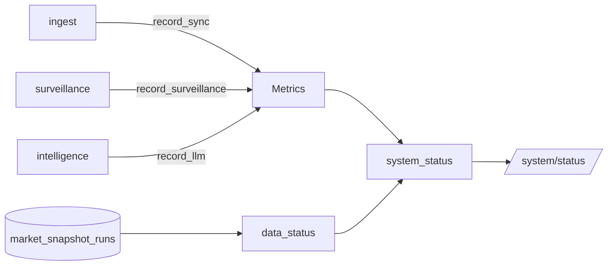

# observability 模块详细设计

| 属性 | 值 |
|------|-----|
| 包路径 | `src/dataanalysisbase/observability/` |
| 层 | 横切 |
| Phase | A 起持续完善 |
| 依赖 | storage（读 runs）、domain |
| 被依赖 | api、ingest、surveillance、intelligence（埋点） |

> 关联：[../MODULE_DESIGN.md](../MODULE_DESIGN.md) §7.4 · [../MARKET_SURVEILLANCE.md](../MARKET_SURVEILLANCE.md) §2.1.2 · [../UI_DESIGN.md](../UI_DESIGN.md)

---

## 1. 模块定位与边界

**做什么**：采集运行指标（同步耗时、成功率、告警量、LLM 调用与成本）、判定数据新鲜度状态，汇总给 `/system/status` 与前端状态栏。

**不做什么**：

- 不做业务决策（只观测不干预）
- 不持久化大量时序（首期轻量：进程内计数 + 读 runs 表）
- 不替代专业 APM（个人本地项目，够用即可）

---

## 2. 目录与文件

```text
observability/
├── __init__.py
├── metrics.py         # 进程内计数器/计时器 + 埋点 API
├── data_status.py     # fresh/stale/partial/failed/offline 判定
└── system_status.py   # 汇总 SystemStatus 给 api
```

---

## 3. 数据结构与类

### 3.1 数据状态判定（`data_status.py`）

```python
def compute_data_status(latest_run, now, stale_after_min=45) -> DataStatus:
    if latest_run is None:
        return DataStatus.OFFLINE
    if latest_run.status == RunStatus.FAILED:
        return DataStatus.FAILED
    if latest_run.status == RunStatus.PARTIAL:
        return DataStatus.PARTIAL
    age = (now - latest_run.finished_at).total_seconds() / 60
    return DataStatus.STALE if age > stale_after_min else DataStatus.FRESH
```

判定阈值对齐 MARKET_SURVEILLANCE §2.1.2（45 分钟）。

### 3.2 指标埋点（`metrics.py`）

```python
class Metrics:
    """进程内轻量指标；可选导出 Prometheus 文本。"""
    def record_sync(self, result: SyncResult, elapsed_ms: float) -> None
    def record_surveillance(self, n_alerts: int, elapsed_ms: float) -> None
    def record_llm(self, model: str, tokens: int, cost_cny: float) -> None
    def snapshot(self) -> MetricsSnapshot     # 给 system_status
```

```python
class MetricsSnapshot(BaseModel):
    sync_success_rate_24h: float
    avg_sync_ms: float
    alerts_today: int
    llm_calls_today: int
    llm_cost_today_cny: float
```

### 3.3 系统状态汇总（`system_status.py`）

```python
class SystemStatus(BaseModel):
    data_status: DataStatus
    latest_snapshot_time: datetime | None
    missing_count: int
    providers: dict[str, ProviderHealth]
    metrics: MetricsSnapshot
    run_mode: str          # live | replay

def build_system_status(snapshot_repo, registry, metrics, now) -> SystemStatus: ...
```

---

## 4. 核心流程

### 4.1 埋点流向



### 4.2 数据状态优先级

```text
OFFLINE  无任何 run
FAILED   最近一次 run 失败
PARTIAL  最近 run 部分成功
STALE    最近成功但超过 45min
FRESH    最近成功且新鲜
```

---

## 5. 对外接口契约

| 方法 | 用途 | 调用方 |
|------|------|--------|
| `Metrics.record_sync/surveillance/llm` | 埋点 | ingest/surveillance/intelligence |
| `compute_data_status(...)` | 单快照状态 | api 各响应包装 |
| `build_system_status(...)` | 全局状态 | api `/system/status` |

所有 API 响应的 `data_status` 字段统一由本模块计算（UI_DESIGN 约定）。

---

## 6. 配置与表

- 读 `market_snapshot_runs`（状态、时间、缺失数）
- 读 `ProviderRegistry.health_check_all()`
- 无独立写表（首期指标进程内；如需持久化可加 `metrics_daily` 表，Phase F）

---

## 7. 错误处理与降级

| 场景 | 行为 |
|------|------|
| runs 表为空 | data_status=OFFLINE，不报错 |
| 进程重启指标清零 | 24h 成功率改读 runs 表回填 |
| health_check 超时 | 该 provider 标 unhealthy，不阻塞 status |

---

## 8. 测试用例清单

- 五种数据状态判定边界（含 45min 临界）
- runs 为空 → OFFLINE
- 成功率统计与 runs 表一致
- LLM 成本累加正确
- system_status 聚合字段完整
- replay 模式下 run_mode 正确反映

---

## 9. 开放问题

- 指标是否需要持久化（首期进程内 + runs 回填；长期看板再加表）
- 是否引入 Prometheus/Grafana（个人项目暂不，预留导出接口）
- LLM 成本统计的 token 计价表来源与更新
