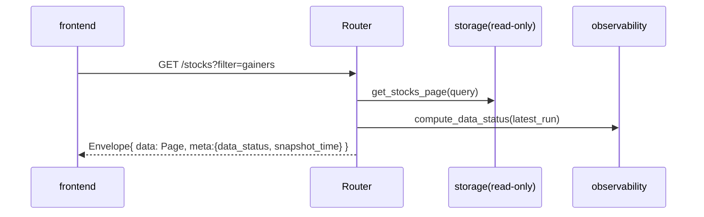

# api 模块详细设计

| 属性 | 值 |
|------|-----|
| 包路径 | `src/dataanalysisbase/api/` |
| 层 | 交付 |
| Phase | A 起，随能力增量加路由 |
| 依赖 | storage、surveillance、analytics、intelligence、portfolio、observability、config |
| 被依赖 | frontend |

> 关联：[../MODULE_DESIGN.md](../MODULE_DESIGN.md) §7.1 · [../UI_DESIGN.md](../UI_DESIGN.md) §5

---

## 1. 模块定位与边界

**做什么**：把各模块能力暴露为 REST + WebSocket；统一响应包装（含 `data_status`）、分页、排序、错误格式、依赖注入。

**不做什么**：

- 不含业务计算（只编排 repository/service 调用）
- 不写业务表（只读聚合表/canonical；POST 类只转发给对应 service）
- 不直连数据源

**进程模型**：API 进程以 `DuckDBStore(read_only=True)` 连接，规避与写进程（ingest/surveillance）的写锁冲突。

---

## 2. 目录与文件

```text
api/
├── __init__.py
├── main.py            # FastAPI app、CORS、lifespan、路由挂载
├── deps.py            # 依赖注入：repo/service/settings
├── envelope.py        # 统一响应包装 + data_status 注入
├── errors.py          # 错误码枚举 + 异常处理器
├── schemas/           # Pydantic 响应 DTO（与 domain 解耦的对外契约）
│   ├── market.py
│   ├── stock.py
│   ├── industry.py
│   ├── alert.py
│   ├── focus.py
│   └── system.py
├── routers/
│   ├── health.py      # /health, /system/status
│   ├── market.py      # /market/overview, /market/status
│   ├── stocks.py      # /stocks, /stocks/{id}, /bars, /intraday
│   ├── industries.py
│   ├── alerts.py
│   ├── focus.py       # /focus, /reconciliation, /research(D)
│   └── portfolio.py   # F
└── ws.py              # /ws/v1/alerts
```

---

## 3. 数据结构与类

### 3.1 响应包装（`envelope.py`）

```python
class Meta(BaseModel):
    snapshot_time: datetime | None = None
    stale: bool = False
    data_status: DataStatus
    source: str | None = None
    total: int | None = None
    missing_count: int = 0

class Envelope(BaseModel, Generic[T]):
    success: bool = True
    data: T | None = None
    meta: Meta

def ok(data, *, snapshot_repo, total=None) -> Envelope:
    status = compute_data_status(snapshot_repo.latest_run(), now())   # observability
    ...
```

对应 UI_DESIGN §5.2 的响应结构。

### 3.2 错误码（`errors.py`）

```python
class ErrorCode(str, Enum):
    MARKET_SNAPSHOT_STALE = "MARKET_SNAPSHOT_STALE"
    MARKET_SNAPSHOT_FAILED = "MARKET_SNAPSHOT_FAILED"
    SECURITY_NOT_FOUND = "SECURITY_NOT_FOUND"
    NO_DATA = "NO_DATA"
    INVALID_PARAM = "INVALID_PARAM"
    LLM_UNAVAILABLE = "LLM_UNAVAILABLE"

class ApiError(Exception):
    def __init__(self, code: ErrorCode, message: str, recoverable: bool = True,
                 http_status: int = 400, meta: dict | None = None): ...
```

错误响应结构对应 UI_DESIGN §5.2.1（`code`/`message`/`recoverable` + meta）。

### 3.3 分页与排序参数（`deps.py`）

```python
class PageParams(BaseModel):
    page: int = 1                 # 1-based
    size: int = Field(50, le=200)
    sort: str | None = None
    order: Literal["asc", "desc"] = "desc"

class StockQuery(PageParams):
    industry: str | None = None
    q: str | None = None          # 代码/名称模糊
    filter: Literal["gainers","losers","limit_up","limit_down","volume"] | None = None

class Page(BaseModel, Generic[T]):
    items: list[T]; total: int; page: int; size: int
```

### 3.4 依赖注入（`deps.py`）

```python
def get_settings() -> Settings: ...
def get_store() -> DuckDBStore: ...                 # read_only
def get_snapshot_repo(store=Depends(get_store)) -> SnapshotRepo: ...
def get_alert_repo(...) -> AlertRepo: ...
def get_aggregate_repo(...) -> AggregateRepo: ...
# service 层（research/portfolio）惰性注入
```

---

## 4. 核心流程

### 4.1 请求处理与 data_status 注入



### 4.2 股票列表查询（服务端分页）

```text
GET /stocks?page=1&size=200&sort=change_pct&order=desc&filter=gainers&industry=...&q=...
→ AggregateRepo.get_stocks_page(query)   读 latest_market_snapshot
→ 服务端排序/过滤/分页，不查历史全表（UI_DESIGN 性能约束）
```

### 4.3 WebSocket 告警推送（`ws.py`）

```python
@router.websocket("/ws/v1/alerts")
async def alerts_ws(ws: WebSocket):
    await ws.accept()
    filters = await ws.receive_json()      # {action: subscribe, filters:{severity:[...]}}
    async for msg in alert_bus.subscribe(filters):
        await ws.send_json(msg)            # {type: alert|snapshot_complete, data:{...}}
```

`alert_bus`：进程内发布订阅；surveillance 落库后 publish，或 API 进程轮询 `surveillance_alerts` 新增（读写分进程时用轮询/通知文件，见开放问题）。

---

## 5. 对外接口契约

完整端点见 UI_DESIGN §5.3。按 Phase：

| Phase | 端点 |
|-------|------|
| A | `/health`, `/system/status`, `/market/overview`, `/market/status`, `/stocks`, `/stocks/{id}`, `/industries`, `/industries/{code}/stocks` |
| B | `/alerts`, `WS /ws/v1/alerts` |
| C | `/stocks/{id}/bars`, `/stocks/{id}/snapshots/intraday`, `/stocks/{id}/alerts`, `/focus`, `/focus/{id}/reconciliation` |
| D | `POST /focus/{id}/research` |
| F | `/portfolio`, `/research/nl-query` |

所有 GET 返回 `Envelope`，列表类 `data` 为 `Page`。

---

## 6. 配置与表

- 读 `Settings`（端口、CORS、duckdb 路径）
- 只读：`latest_market_snapshot`、`market_overview_snapshots`、`industry_snapshots`、`surveillance_alerts`、`canonical_*`、`market_snapshot_runs`
- 不写业务表；`POST /research` 转发 intelligence，`portfolio` 转发 portfolio.service

---

## 7. 错误处理与降级

| 场景 | 行为 |
|------|------|
| 快照 stale | 仍返回数据，meta.data_status=stale；不报错 |
| 快照 failed | 返回上一可用快照 + `MARKET_SNAPSHOT_FAILED`（recoverable） |
| 标的不存在 | 404 + `SECURITY_NOT_FOUND` |
| 非法参数 | 422/400 + `INVALID_PARAM` |
| LLM 不可用（research） | 503 + `LLM_UNAVAILABLE`，提示稍后重试 |
| DB 只读连接异常 | 500 + 记录；前端顶栏标失败 |

全局异常处理器把 `ApiError` 与 `ValidationError` 转成统一错误响应。

---

## 8. 测试用例清单

- envelope 包装：每个 GET 都含 data_status/snapshot_time
- 分页边界：size>200 被截断；page 越界返回空 items + 正确 total
- 排序/过滤：filter=gainers 与 sort=change_pct 结果正确
- 404/422/503 错误码与结构符合契约
- stale/failed 时仍返回上一快照而非 500
- WS：订阅后能收到新告警与 snapshot_complete
- read_only 连接下写操作被拒

---

## 9. 开放问题

- 读写分进程下，WS 告警实时性：进程内 bus（同进程）vs 轮询 surveillance_alerts vs DuckDB 通知文件（建议首期轮询 + snapshot_complete 触发）
- schemas 是否直接复用 domain DTO（建议对外单独定义，避免内部模型泄露）
- 鉴权：本地单用户首期免鉴权，是否预留 token 开关
- `/research` 长耗时是否改异步任务 + 轮询结果
