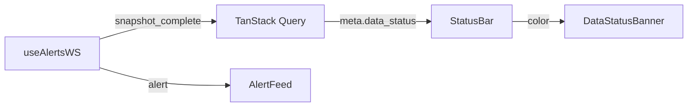

# frontend 模块详细设计

| 属性 | 值 |
|------|-----|
| 目录 | `frontend/`（独立于 Python 包） |
| 层 | 交付 |
| Phase | A 起，随页面增量 |
| 依赖 | api（REST + WS） |
| 被依赖 | 终端用户 |

> 关联：[../UI_DESIGN.md](../UI_DESIGN.md)（信息架构与页面） · [08-api.md](./08-api.md)（契约）

---

## 1. 模块定位与边界

**做什么**：本地 Web 仪表盘。可视化全市场行情、行业、告警、重点股、个股详情；统一展示数据状态（fresh/stale/partial/failed/offline）。

**不做什么**：

- 不做业务计算（所有数值来自 API）
- 不直连 DuckDB / 数据源
- 不缓存权威数据（只用 TanStack Query 做请求级缓存）

**核心约束**：5000+ 行表格不卡（虚拟滚动 + 服务端分页）；任何页面必须显式呈现 `data_status`，避免误读旧数据。

---

## 2. 目录结构

```text
frontend/
├── src/
│   ├── app/                 # router、AppShell 布局、providers
│   ├── pages/
│   │   ├── MarketOverview.tsx
│   │   ├── IndustryPage.tsx
│   │   ├── StockListPage.tsx
│   │   ├── AlertFeedPage.tsx
│   │   ├── FocusPage.tsx
│   │   └── StockDetailPage.tsx
│   ├── components/
│   │   ├── charts/          # KLine, Heatmap, MarketBreadth, IntradayLine
│   │   ├── tables/          # StockTable (virtualized)
│   │   ├── alerts/          # AlertBadge, AlertRow, AlertSummary
│   │   └── layout/          # AppShell, StatusBar, DataStatusBanner
│   ├── api/                 # typed fetch clients（与 envelope 对齐）
│   ├── hooks/               # useAlertsWS, useMarketStatus, useStocksQuery
│   └── types/               # 共享 TS 类型（镜像 api/schemas）
├── package.json
└── vite.config.ts
```

技术栈见 UI_DESIGN §2（React 18 + TS + Vite + TanStack Query/Table + ECharts + Tailwind + shadcn/ui）。

---

## 3. 关键类型与 API 客户端

### 3.1 Envelope 类型（`types/`）

```ts
type DataStatus = "fresh" | "stale" | "partial" | "failed" | "offline";

interface Meta {
  snapshot_time: string | null;
  stale: boolean;
  data_status: DataStatus;
  source?: string;
  total?: number;
  missing_count: number;
}
interface Envelope<T> { success: boolean; data: T | null; meta: Meta; }
interface Page<T> { items: T[]; total: number; page: number; size: number; }
```

### 3.2 API 客户端（`api/`）

```ts
async function apiGet<T>(path: string): Promise<Envelope<T>> {
  const res = await fetch(`/api/v1${path}`);
  const body = await res.json();
  if (!body.success) throw new ApiError(body.error, body.meta);
  return body;
}
// 每个端点一个 typed 函数：getMarketOverview, getStocks(query), getStockDetail(id) ...
```

错误（stale/failed）不直接抛断页面：列表/详情仍渲染上一快照，由 `DataStatusBanner` 提示。

---

## 4. 状态与数据流

### 4.1 全局数据状态



- `useMarketStatus`：轮询 `/market/status` + 监听 WS `snapshot_complete`，驱动顶栏颜色（绿/黄/红，UI_DESIGN §3.1）
- 任一查询返回 `data_status != fresh`，对应页面顶部显示 `DataStatusBanner`

### 4.2 缓存策略（TanStack Query）

| 查询 | staleTime |
|------|-----------|
| overview | 60s |
| stocks 列表 | 30s |
| 个股详情/bars | 60s |
| alerts 列表 | 15s（叠加 WS 实时插入） |

### 4.3 WebSocket（`hooks/useAlertsWS`）

```ts
useAlertsWS({ severity: ["high","medium"] }, (msg) => {
  if (msg.type === "alert") prependAlert(msg.data);          // 顶部插入 + 可选提示音
  if (msg.type === "snapshot_complete") invalidate(["market","stocks"]);
});
```

断线重连（指数退避）；离线时切 `offline` 态，只读已缓存数据。

---

## 5. 页面与组件映射

| 页面 | 路由 | 主要 API | 关键组件 |
|------|------|----------|----------|
| 市场总览 | `/` | `/market/overview` | StatCard, MarketBreadth, AlertSummary |
| 行业板块 | `/industries` | `/industries`, `/industries/{code}/stocks` | Treemap(Heatmap), DataTable |
| 全市场股票 | `/stocks` | `/stocks?page&size&sort&...` | StockTable(虚拟滚动), FilterBar |
| 监管告警 | `/alerts` | `/alerts` + WS | AlertRow, FilterBar |
| 重点股专区 | `/focus` | `/focus`, `/focus/{id}/reconciliation` | FocusCard, ReconBadge |
| 个股详情 | `/stocks/{id}` | `/stocks/{id}`(+bars/intraday/alerts) | KLine, IntradayLine, AlertHistory |

阶段可见页面对照 UI_DESIGN §9（A：总览/行业/列表；B：+告警/热力；C：+重点股/K线；D：+对账/研报）。

### 5.1 StockTable（性能核心）

- TanStack Table + TanStack Virtual：仅渲染可视行
- 服务端分页（每页 ≤200），排序/快捷榜单/行业筛选走 API 参数
- 不在前端持有全量 5000 行历史，只持当前页

---

## 6. 构建与本地启动

```text
make dev-web      # vite dev，proxy /api → localhost:8000
make dev          # backend + frontend + scheduler
```

- `vite.config.ts`：`server.proxy['/api']` 与 `['/ws']` → `localhost:8000`
- 访问 `http://localhost:5173`

---

## 7. 错误处理与降级

| 场景 | UI 行为 |
|------|---------|
| `stale` | 顶栏黄 + Banner「数据滞后」，页面照常 |
| `failed` | 顶栏红 + Banner「使用上一可用快照 HH:MM」 |
| `partial` | 展示 `missing_count` 与来源 |
| `offline` | 顶栏灰，禁用刷新，只读缓存 |
| API 4xx/5xx | toast + 局部错误占位，不白屏 |
| WS 断开 | 静默重连，重连成功后失效相关查询 |

---

## 8. 测试用例清单

- StockTable：5000 行虚拟滚动帧率与分页参数正确
- data_status 各态对应 Banner/顶栏颜色
- WS 新告警插顶、snapshot_complete 触发刷新
- 离线态只读缓存、重连恢复
- 筛选/排序/搜索 URL 同步（可分享/刷新保持）
- 错误响应（stale/failed）不导致白屏

---

## 9. 开放问题

- 是否从后端 OpenAPI 自动生成 TS 类型（建议生成，保证契约一致）
- 提示音/桌面通知开关粒度
- 暗色主题是否首期支持
- ECharts 按需引入以控包体
- 重点股 5min 与全市场 30min 在同一页混排时的「更新时间」呈现口径
