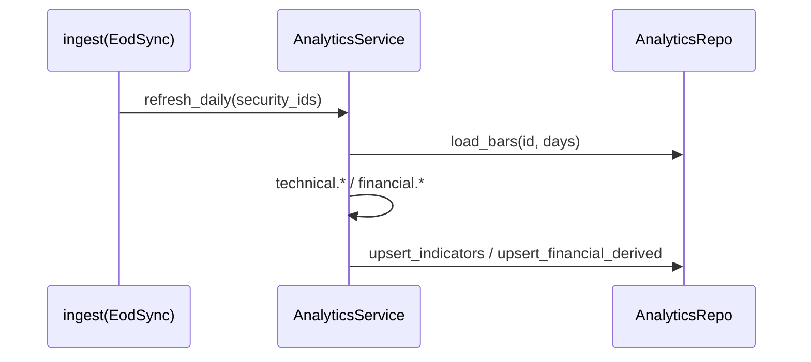

# analytics 模块详细设计

| 属性 | 值 |
|------|-----|
| 包路径 | `src/dataanalysisbase/analytics/` |
| 层 | 分析 |
| Phase | C（指标/技术形态）· E/F（相似检索、相关性） |
| 依赖 | domain、storage、config |
| 被依赖 | api、intelligence（analytics_tools）、surveillance（可选复用） |

> 关联：[../MODULE_DESIGN.md](../MODULE_DESIGN.md) · [../INTELLIGENCE_ROADMAP.md](../INTELLIGENCE_ROADMAP.md)（相似形态/相关性）· [../AGENT_INTELLIGENCE.md](../AGENT_INTELLIGENCE.md) §3.1（`get_indicators` 工具）

---

## 1. 模块定位与边界

**做什么**：基于已落地的 `canonical_*` / `market_snapshots` / 日 K，**纯计算**派生指标与分析结果，预计算并落表供 api 与 intelligence 读取。

- 技术指标：MA/EMA/MACD/RSI/BOLL/量比/换手
- 财务派生：增长率、利润率、ROE 趋势（基于 canonical_financials）
- 技术形态/相似检索（E/F）：序列特征化 + 相似度
- 相关性（F）：标的间/与指数的滚动相关

**不做什么**：

- 不调用 LLM（intelligence 才做解读）
- 不直连数据源、不写 canonical（只读 canonical/快照，写 analytics 派生表）
- 不做预测（无 `predict_price`，对应 AGENT_INTELLIGENCE 防幻觉铁律）

**关键定位**：「LLM 不产数字」——所有给 Agent 的数字都由本模块预计算，Agent 只读不算。

---

## 2. 目录与文件

```text
analytics/
├── __init__.py
├── indicators/
│   ├── technical.py     # MA/EMA/MACD/RSI/BOLL，纯函数（输入序列→输出序列）
│   └── financial.py     # 增长率/利润率/ROE 趋势
├── patterns/            # E/F
│   ├── featurize.py     # K 线序列 → 归一化特征向量
│   └── similarity.py    # 相似形态/相似股检索
├── correlation.py       # F：滚动相关、与行业/指数相关
├── service.py           # AnalyticsService：编排计算 + 落表
├── repo.py              # AnalyticsRepo：读 canonical/bars，写派生表
└── schemas.py           # IndicatorSet / FinancialDerived / SimilarMatch DTO
```

技术指标用纯函数实现，便于单测与复用（surveillance 的自适应异常分也可复用 rolling 统计）。

---

## 3. 数据结构与类

### 3.1 指标纯函数（`indicators/technical.py`）

```python
def sma(series: Sequence[float], window: int) -> list[float | None]: ...
def ema(series: Sequence[float], window: int) -> list[float | None]: ...
def rsi(close: Sequence[float], window: int = 14) -> list[float | None]: ...
def macd(close, fast=12, slow=26, signal=9) -> MacdResult: ...
def boll(close, window=20, k=2.0) -> BollResult: ...
def rolling_mean_std(series, window) -> tuple[list[float|None], list[float|None]]: ...
```

约定：输入定长序列，输出等长（不足窗口处为 `None`），无副作用、无 IO。

### 3.2 DTO（`schemas.py`）

```python
@dataclass(frozen=True)
class IndicatorSet:
    security_id: SecurityId
    as_of: date
    ma5: float | None; ma20: float | None; ma60: float | None
    rsi14: float | None
    macd: float | None; macd_signal: float | None; macd_hist: float | None
    boll_upper: float | None; boll_lower: float | None
    vol_ratio: float | None

@dataclass(frozen=True)
class FinancialDerived:
    security_id: SecurityId; end_date: date
    revenue_yoy: float | None; net_profit_yoy: float | None
    gross_margin: float | None; roe: float | None

@dataclass(frozen=True)
class SimilarMatch:
    security_id: SecurityId; score: float; window: tuple[date, date]
```

### 3.3 服务（`service.py`）

```python
class AnalyticsService:
    def compute_indicators(self, security_id, days=120) -> IndicatorSet: ...
    def compute_financial_derived(self, security_id, years=3) -> list[FinancialDerived]: ...
    def find_similar_patterns(self, security_id, lookback=60, top_k=10) -> list[SimilarMatch]: ...  # F
    def correlation(self, base_id, peer_ids, days=120) -> dict[str, float]: ...                      # F
    def refresh_daily(self, security_ids: list[SecurityId]) -> int: ...   # EOD 后批量预计算落表
```

---

## 4. 核心流程

### 4.1 EOD 指标预计算（被 ingest 链式触发）



落表后 api 直接读，避免请求时实时计算。

### 4.2 相似形态检索（F）

```text
featurize: 取近 lookback 日收盘 → 收益率序列 → z-score 归一化 → 特征向量
similarity: 对候选池向量算距离（余弦/DTW 简化版）→ top_k
范围：先支持「同行业池」检索，控量级；后续可接向量库
```

### 4.3 相关性（F）

```text
对齐 base 与 peers 的日收益率序列 → 滚动 Pearson 相关
输出 {peer_id: corr}，供 compare_peers / 组合暴露分析
```

---

## 5. 对外接口契约

| 调用方 | 用法 |
|--------|------|
| api | `GET /stocks/{id}` 详情读 `analytics_indicators`；`compare_peers` 读相关性 |
| intelligence | `analytics_tools.get_indicators(security_id)` → IndicatorSet（只读派生表） |
| ingest | EOD 后调用 `refresh_daily()` 预计算 |

intelligence 经 tool 读取的数据须来自本模块派生表，保证「Agent 不算数」。

---

## 6. 配置与表

读 `Settings`（窗口默认值可配）。写派生表：

```sql
CREATE TABLE IF NOT EXISTS analytics_indicators (
    security_id TEXT NOT NULL,
    as_of DATE NOT NULL,
    ma5 DOUBLE, ma20 DOUBLE, ma60 DOUBLE,
    rsi14 DOUBLE,
    macd DOUBLE, macd_signal DOUBLE, macd_hist DOUBLE,
    boll_upper DOUBLE, boll_lower DOUBLE,
    vol_ratio DOUBLE,
    computed_at TIMESTAMP DEFAULT now(),
    PRIMARY KEY (security_id, as_of)
);

CREATE TABLE IF NOT EXISTS analytics_financial_derived (
    security_id TEXT NOT NULL,
    end_date DATE NOT NULL,
    revenue_yoy DOUBLE, net_profit_yoy DOUBLE,
    gross_margin DOUBLE, roe DOUBLE,
    computed_at TIMESTAMP DEFAULT now(),
    PRIMARY KEY (security_id, end_date)
);
```

相似检索/相关性首期可即时计算不落表；量级大时再加缓存表。

---

## 7. 错误处理与降级

| 场景 | 处理 |
|------|------|
| 历史 K 不足窗口 | 指标返回 None，不抛错；标注 `insufficient_history` |
| canonical_financials 缺失 | 财务派生跳过该期，记日志 |
| 序列含停牌/缺口 | 按交易日对齐，缺口不前向填充价格（避免假指标） |
| 相似池为空 | 返回空列表 |

---

## 8. 测试用例清单

- 指标纯函数对拍：用已知序列校验 MA/RSI/MACD（与 TA-Lib 或手算基准）
- 窗口不足返回 None 且长度对齐
- 财务派生：同比/利润率口径正确，分母为 0 时安全
- refresh_daily 幂等：重复跑结果一致（upsert）
- 相似检索：构造明显相似/不相似序列验证排序
- 缺口序列不产生前向填充偏差

---

## 9. 开放问题

- 相似检索算法：余弦 vs DTW vs 简单欧氏（首期建议归一化收益率 + 余弦，控复杂度）
- 是否引入向量库（Chroma）做大池检索，还是限同行业池暴力计算
- 指标是否需要复权口径统一（建议技术指标一律用前复权序列）
- 财务派生与 fusion 的 canonical 版本如何对齐（lineage 透传）
