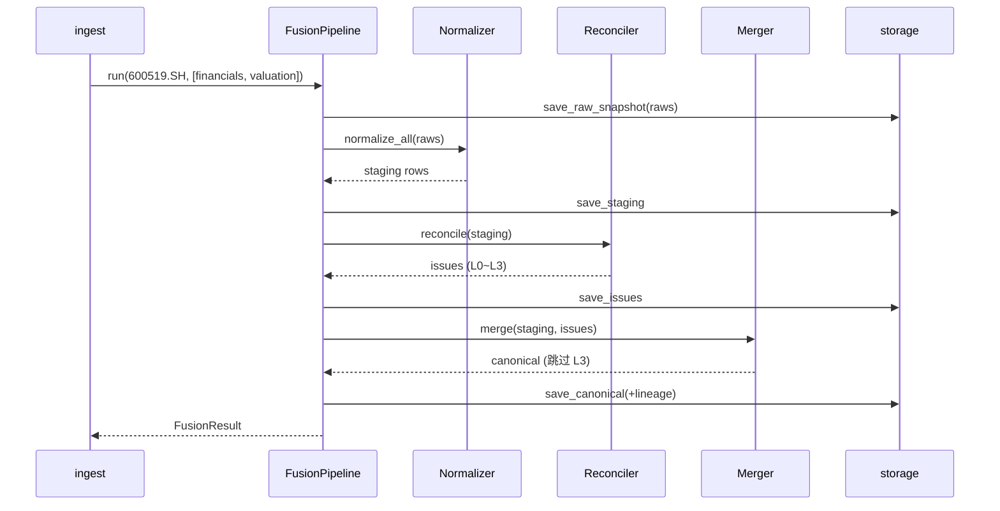

# fusion 模块详细设计

| 属性 | 值 |
|------|-----|
| 包路径 | `src/dataanalysisbase/fusion/` |
| 层 | 融合 |
| Phase | D |
| 依赖 | domain、storage、config、providers（经 ingest 提供的 RawDataset） |
| 被依赖 | intelligence（读 canonical/issues）、api（对账面板）、analytics（读 canonical） |

> 关联：[../FUSION_RECONCILE.md](../FUSION_RECONCILE.md)（完整算法与策略） · [../MODULE_DESIGN.md](../MODULE_DESIGN.md)

---

## 1. 模块定位与边界

**做什么**：平台核心差异化能力。把多源 `RawDataset` 标准化 → 对账分级 → 按策略融合 → 写 `canonical_*` + `reconciliation_issues` + lineage。

四步流水线（FUSION_RECONCILE §2）：Normalizer → Reconciler → Merger → Lineage。

**不做什么**：

- 不直连数据源（RawDataset 由 ingest/providers 提供）
- 不调用 LLM（差异「解释」由 intelligence 的 ReconcileAgent 做；本模块只做规则分级）
- 不做技术指标计算（analytics 负责）

**核心服务对象**：FocusLayer 重点股（重点股才走多源融合；全市场单源快照不进 fusion）。

---

## 2. 目录与文件

```text
fusion/
├── __init__.py
├── normalizer.py      # 多源字段映射 → staging_*
├── field_mappings.py  # 加载 field_mappings.yaml
├── reconciler.py      # 同源异值对账 + 分级 L0~L3
├── merger.py          # 策略融合：priority/median/authoritative/union/latest
├── lineage.py         # 构造 lineage_json
├── pipeline.py        # FusionPipeline 编排
├── repo.py            # 读 staging / 写 canonical / issues
└── schemas.py         # ReconciliationResult / MergeResult / FusionResult
```

---

## 3. 数据结构与类

### 3.1 DTO（`schemas.py`）

```python
class Severity(str, Enum):   # 复用 domain
    L0 = "L0"; L1 = "L1"; L2 = "L2"; L3 = "L3"

@dataclass(frozen=True)
class ReconciliationResult:
    field_name: str
    values: dict[str, float]        # {"akshare": 24.1, "tushare": 23.7}
    diff_pct: float
    severity: Severity
    recommendation: str

@dataclass(frozen=True)
class MergeResult:
    value: Any
    lineage: dict                   # 见 FUSION_RECONCILE §6.1

@dataclass(frozen=True)
class FusionResult:
    security_id: SecurityId
    issues: list[ReconciliationResult]
    canonical_counts: dict[DatasetType, int]
    blocked: list[str]              # 因 L3 阻断未写入的 dataset/field
```

### 3.2 核心类

```python
class Normalizer:
    def __init__(self, mappings: FieldMappings): ...
    def normalize_all(self, raws: list[RawDataset]) -> list[StagingRow]: ...
    # 字段名/类型映射、日期格式、单位换算、空值处理（FUSION_RECONCILE §3）

class Reconciler:
    def __init__(self, thresholds: ReconcileThresholds): ...
    def reconcile(self, staging: list[StagingRow]) -> list[ReconciliationResult]: ...
    # 按 match key 分组（§3.3），同字段多源 → diff_pct → classify_severity

class Merger:
    def __init__(self, policy: FusionPolicy): ...
    def merge(self, staging, issues) -> dict[DatasetType, list[CanonicalRow]]: ...
    # 按 dataset_type 选策略；L3 未解决 → 跳过该字段/记录写入

class FusionPipeline:
    def run(self, security_id, dataset_types) -> FusionResult: ...
```

匹配键（FUSION_RECONCILE §3.3）：daily_bars=id+trade_date；financials=id+end_date+report_type；valuation=id+as_of_date；money_flow=id+trade_date。

---

## 4. 核心流程

### 4.1 融合流水线



### 4.2 对账分级（Reconciler）

```text
对每个 (security_id, dataset_type, match_key, field):
  values = {source: value}
  if len(values) < 2: → L0
  median = median(values)
  diff_pct = max pairwise |a-b| / median
  severity = classify_severity(field, diff_pct, thresholds)
```

级别与系统行为（FUSION_RECONCILE §4.2）：L0 自动融合不记录；L1 记 issues 继续；L2 降 confidence 标注；**L3 阻断 canonical 写入 + 告警**。

### 4.3 L3 阻断（§7）

```text
revenue diff = 6.2% (L3)
  → 跳过 canonical_financials 该记录写入
  → reconciliation_issues.status = 'open'
  → 供 surveillance/MonitorAgent 告警，intelligence 读取时 confidence=0
```

### 4.4 融合策略（Merger，§5.1）

| 策略 | 适用 |
|------|------|
| priority | 日 K、资金流（trusted 主、另源校验） |
| median_of_sources | 估值 |
| authoritative | 财务、公告 |
| union_dedupe | 新闻（按标题相似度去重） |
| latest | 实时行情（取 fetched_at 最新） |

---

## 5. 对外接口契约

```python
class FusionPipeline:
    def run(self, security_id: str, dataset_types: list[DatasetType]) -> FusionResult: ...
```

| 调用方 | 用法 |
|--------|------|
| ingest（FocusSync/EodSync） | 重点股同步后调用 `run()` |
| intelligence | 经 fusion_tools 只读 `canonical_*` + `reconciliation_issues`（不调用 pipeline） |
| api | 读 `reconciliation_issues` 渲染 `/focus/{id}/reconciliation` |
| analytics | 读 `canonical_financials/bars` 做派生计算 |

---

## 6. 配置与表

配置（FUSION_RECONCILE 关联）：

- `field_mappings.yaml` — 各源字段映射
- `reconcile_thresholds.yaml` — 分级阈值（按 field）
- `fusion_policy.yaml` — 各 dataset_type 策略 + trusted_source + version

表：

```sql
CREATE TABLE IF NOT EXISTS reconciliation_issues (
    id TEXT PRIMARY KEY,
    security_id TEXT NOT NULL,
    dataset_type TEXT NOT NULL,
    field_name TEXT NOT NULL,
    as_of_date DATE,
    values_json JSON NOT NULL,
    diff_pct DOUBLE,
    severity TEXT NOT NULL,           -- L0~L3
    status TEXT DEFAULT 'open',       -- open/resolved/ignored
    recommendation TEXT,
    created_at TIMESTAMP DEFAULT now()
);

-- canonical_* 每条附 lineage_json（结构见 FUSION_RECONCILE §6.1）
-- 例：canonical_daily_bars / canonical_financials / canonical_valuation
```

`fusion_policy_version` 写入 lineage，支持策略升级后的可追溯。

---

## 7. 错误处理与降级

| 场景 | 处理 |
|------|------|
| 单源缺失 | 退化为单源（lineage.degraded=true），不报 L 级 |
| 全源缺失 | NoDataError，提示先 sync |
| L3 未解决 | 阻断写入，保留上一可用 canonical |
| 字段映射缺失 | 跳过该字段并记录，不中断整条流水线 |
| match key 冲突（重复记录） | 取最新 fetched_at，记录告警 |

---

## 8. 测试用例清单

- Normalizer：字段名/单位/日期映射正确，空值处理
- Reconciler 分级：构造各级 diff 验证 L0~L3 边界
- L3 阻断：canonical 不写入、issue=open、blocked 包含该字段
- Merger 各策略：priority/median/authoritative/union 结果与 lineage 正确
- 单源退化：lineage.degraded=true
- 集成：双源 mock → 验证 canonical + issues（FUSION_RECONCILE §10）
- 回归：固定 snapshot 对比融合结果

---

## 9. 开放问题

- 新闻去重相似度算法与阈值（标题向量 vs 编辑距离）
- L3 resolved 的人工/自动闭环流程（谁改 status）
- 基金类融合规则的独立配置位置（FUSION_RECONCILE §8）
- staging_* 是否长期保留还是融合后清理（建议保留近 N 期供审计）
- 三源以上时 diff_pct 的 pairwise 口径是否改为对中位数偏离
