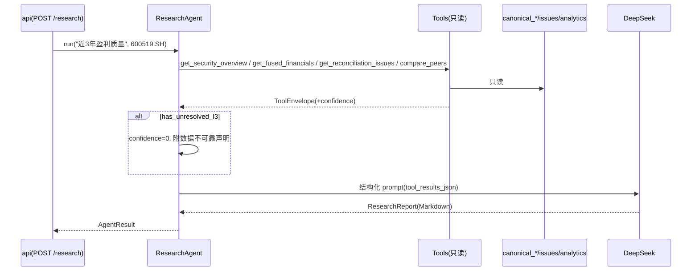

# intelligence 模块详细设计

| 属性 | 值 |
|------|-----|
| 包路径 | `src/dataanalysisbase/intelligence/` |
| 层 | 智能 |
| Phase | D（研报/对账解释/事件抽取）· F（告警聚类叙事、NLQ、每日市场综述） |
| 依赖 | domain、config、storage、fusion(读 canonical/issues)、analytics(读派生)、（F）surveillance |
| 被依赖 | api（`POST /research`、NLQ）、delivery（日报） |

> 关联：[../AGENT_INTELLIGENCE.md](../AGENT_INTELLIGENCE.md)（Agent/Tool/Prompt 完整设计） · [../INTELLIGENCE_ROADMAP.md](../INTELLIGENCE_ROADMAP.md)（聚类叙事/NLQ）

---

## 1. 模块定位与边界

**解读与编排层，不是数据生产层**。封装 LLM（DeepSeek）、Agent 执行循环、只读 Tool、Prompt 模板。

### 1.1 铁律（AGENT_INTELLIGENCE §1.1）

```
LLM 不生产数字 · 不直连数据源 · 只读 canonical_* + reconciliation_issues
解读必须引用 Tool 返回的结构化数据 · 存在未解决 L3 时禁止确定性投资结论
```

**做什么**：ResearchAgent（研报/问答）、ReconcileAgent（差异解释）、MonitorAgent（事件监控）；F 期：告警聚类叙事、每日市场综述、自然语言查询（NLQ → 结构化筛选条件）。

**不做什么**：不算指标（analytics 已预计算）、不做对账分级（fusion 规则负责）、不写 canonical、不提供 `predict_price`/直连源工具。

**v0.2 范围**：服务 FocusLayer 重点股；全市场不逐只走 LLM（避免 5000×成本与幻觉）。

---

## 2. 目录与文件

```text
intelligence/
├── __init__.py
├── llm/
│   ├── client.py        # DeepSeekClient：chat / extract_structured（OpenAI 兼容）
│   ├── base.py          # LLM 抽象（后期 LiteLLM 切换 Claude/GPT）
│   └── prompts/         # research_system/user, reconcile_system, news_extract, daily_brief
├── agents/
│   ├── base.py          # BaseAgent 执行循环（max_iterations=5）
│   ├── research.py      # ResearchAgent
│   ├── reconcile.py     # ReconcileAgent
│   └── monitor.py       # MonitorAgent
├── tools/
│   ├── registry.py      # ToolRegistry：schema() + execute()
│   ├── security_tools.py
│   ├── fusion_tools.py
│   ├── analytics_tools.py
│   └── rag_tools.py     # E 期：Chroma 检索
├── narrative/           # F
│   ├── alert_cluster.py # 告警聚类 → 市场事件叙事
│   ├── daily_brief.py   # 每日市场综述
│   └── nl_query.py      # 自然语言 → 结构化查询条件
└── schemas.py           # AgentResult / ResearchReport / ToolEnvelope / NewsEvent
```

---

## 3. 数据结构与类

### 3.1 Tool 返回 envelope（`schemas.py`，AGENT_INTELLIGENCE §3.2）

```python
class ToolMeta(BaseModel):
    source: str
    as_of: date | None
    has_unresolved_l3: bool = False
    confidence: float = 1.0

class ToolEnvelope(BaseModel, Generic[T]):
    success: bool
    security_id: str
    data: T | None
    meta: ToolMeta
```

confidence 规则：每个 open L2 −0.2；任一 open L3 → 0.0（阻断）。

### 3.2 LLM 客户端（`llm/client.py`）

```python
class DeepSeekClient:
    def __init__(self, api_key: str, model: str = "deepseek-chat"): ...
    async def chat(self, messages, tools=None, response_format=None) -> LlmResponse: ...
    async def extract_structured(self, text: str, schema: type[BaseModel]) -> BaseModel: ...
```

### 3.3 Agent 基类（`agents/base.py`，§2.2）

```python
class BaseAgent:
    max_iterations: int = 5
    async def run(self, task: str, security_id: str) -> AgentResult:
        messages = [system_prompt, user_message(task, security_id)]
        for _ in range(self.max_iterations):
            resp = await self.llm.chat(messages, tools=self.tools.schema())
            if resp.tool_calls:
                for call in resp.tool_calls:
                    result = self.tools.execute(call.name, call.arguments)
                    messages.append(tool_result(call, result))
            else:
                return self.parse_output(resp)
        raise MaxIterationsError
```

### 3.4 Tool Registry（`tools/registry.py`）

只读工具清单见 AGENT_INTELLIGENCE §3.1（`get_security_overview` / `get_fused_financials` / `get_fused_valuation` / `get_fused_bars` / `get_reconciliation_issues` / `compare_peers` / `get_indicators` / `search_documents` / `get_event_timeline` / `get_money_flow`）。禁用 `predict_price` / `get_live_api_data` / `calculate_financials`。

```python
class ToolRegistry:
    def register(self, name, fn, schema): ...
    def schema(self) -> list[dict]: ...           # function-calling schema
    def execute(self, name, arguments) -> ToolEnvelope: ...   # 统一 envelope + confidence
```

---

## 4. 核心流程

### 4.1 研报生成（ResearchAgent，§4.2）



输出结构见 AGENT_INTELLIGENCE §4.3（摘要/财务趋势/估值同业/多源数据说明/风险/待验证/免责声明）。

### 4.2 事件结构化抽取（§7.2）

```python
class NewsEvent(BaseModel):
    event: str; entities: list[str]; sentiment: float   # -1~1
    impact_chain: list[str]; confidence: float
    source: str; published_at: datetime
# extract_structured(news_text, NewsEvent) → EventTimeline 入库
```

### 4.3 告警聚类叙事（F，INTELLIGENCE_ROADMAP）

```text
surveillance 产出大量原子告警
  → alert_cluster: 按行业/题材/时间窗聚类
  → daily_brief: LLM 把聚类摘要成「市场事件叙事」（含异常分解释）
约束：叙事只引用 surveillance/analytics 的数字，不新增数字
```

### 4.4 自然语言查询（F）

```text
"找今天放量涨停的医药股" → nl_query → 结构化条件
  {industry:"医药", filter:"limit_up", volume_ratio:">2"}
  → 交给 api/storage 执行（LLM 只翻译条件，不查数据）
```

---

## 5. 对外接口契约

| 调用方 | 用法 |
|--------|------|
| api | `POST /focus/{id}/research` → ResearchAgent.run；`/research/nl-query` → nl_query |
| delivery | 日报调用 daily_brief / 研报缓存 |
| ingest/surveillance | fusion 后可链式触发 MonitorAgent / 告警聚类 |

返回 `AgentResult{ report_md, confidence, tool_trace, used_sources }`，confidence=0 时 api 标注「数据不可靠」。

---

## 6. 配置与表

配置（`Settings`）：`DEEPSEEK_API_KEY`、model、max_iterations、token 预算、RAG top_k。

表：

```sql
CREATE TABLE IF NOT EXISTS research_reports (
    id TEXT PRIMARY KEY,
    security_id TEXT NOT NULL,
    report_date DATE NOT NULL,
    content_md TEXT NOT NULL,
    confidence DOUBLE,
    model TEXT,
    token_cost INTEGER,
    created_at TIMESTAMP DEFAULT now(),
    UNIQUE (security_id, report_date)     -- 同日同标的不重复生成（§7.3 缓存）
);

CREATE TABLE IF NOT EXISTS event_timeline (
    id TEXT PRIMARY KEY,
    security_id TEXT,
    event TEXT, sentiment DOUBLE,
    entities_json JSON, impact_chain_json JSON,
    source TEXT, published_at TIMESTAMP,
    confidence DOUBLE
);
```

成本优化（§7.3）：Tool 返回摘要、RAG Top-5、研报缓存、抽取用便宜模型。

---

## 7. 错误处理与降级（AGENT_INTELLIGENCE §10）

| 场景 | 处理 |
|------|------|
| DeepSeek API 失败 | 重试 3 次，降级输出「仅数据表格无解读」 |
| Tool 无数据 | 明确提示先 `sync` |
| 未解决 L3 | 输出对账报告，不生成投资性结论（confidence=0） |
| Tool 循环 | max_iterations=5 强制终止（MaxIterationsError） |
| LLM 输出含编造数字 | 幻觉检测：输出数字须 ⊆ Tool 返回数字，否则拒绝/重生成 |

---

## 8. 测试用例清单

- Tool 单测：mock DuckDB，验证 envelope schema 与 confidence 计算
- Agent 集成：mock LLM，验证 tool 调用顺序（§4.2）
- 幻觉检测：输出数字 ⊆ Tool 返回数字（铁律）
- L3 阻断：confidence=0 且无确定性结论
- 研报缓存：同日同标的命中不重复调用 LLM
- NewsEvent 抽取：JSON Mode + Pydantic 校验
- NLQ：自然语言 → 结构化条件正确，非法查询安全降级

---

## 9. 开放问题

- LLM 抽象层何时切 LiteLLM（首期直连 DeepSeek）
- 幻觉检测的数字比对粒度（精确匹配 vs 容差）
- 告警聚类的相似度/聚类算法（题材标签 vs 嵌入聚类）
- `POST /research` 长耗时是否改异步任务 + 轮询（与 api 模块开放问题一致）
- RAG（rag_tools/Chroma）落地排期与 E 期边界
