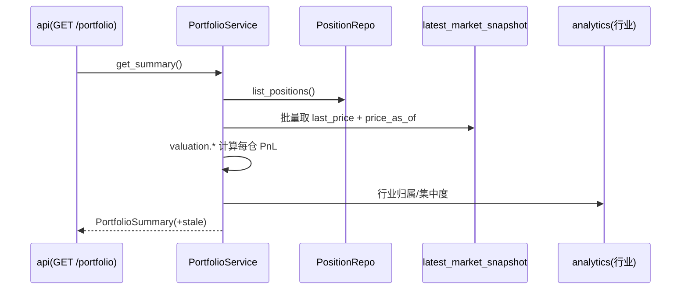

# portfolio 模块详细设计

| 属性 | 值 |
|------|-----|
| 包路径 | `src/dataanalysisbase/portfolio/` |
| 层 | 分析（应用域） |
| Phase | F |
| 依赖 | domain、storage、config、analytics（行业/相关性）、（读）市场快照 |
| 被依赖 | api（`/portfolio`）、surveillance（告警附盈亏语境）、delivery（日报持仓段） |

> 关联：[../INTELLIGENCE_ROADMAP.md](../INTELLIGENCE_ROADMAP.md) §3.1（持仓模型）· [../MODULE_DESIGN.md](../MODULE_DESIGN.md)

---

## 1. 模块定位与边界

**做什么**：把重点股从「我关注（watchlist）」升级为「我持有」。维护持仓（数量/成本/建仓时间），基于最新快照价计算市值、浮动盈亏、行业与个股敞口占比，给告警与个股详情提供**盈亏语境**。

**不做什么**：

- 不接券商、不下单、不同步真实账户（手工录入持仓，PRODUCT_OUTCOMES §7「不会有自动下单」）
- 不直连数据源、不算技术指标（价格取自 market_snapshot/canonical，行业相关取 analytics）
- 不做收益预测

**定位**：纯本地组合记账 + 暴露分析层，是 watchlist 的超集语境。

---

## 2. 目录与文件

```text
portfolio/
├── __init__.py
├── models.py        # Position / PositionView / PortfolioSummary / Exposure DTO
├── repo.py          # PositionRepo：CRUD positions，读最新价
├── valuation.py     # 市值/浮动盈亏/收益率计算（纯函数）
├── exposure.py      # 行业敞口、个股集中度、（F）相关性聚合
└── service.py       # PortfolioService：编排估值 + 暴露 + 盈亏语境
```

---

## 3. 数据结构与类

### 3.1 DTO（`models.py`）

```python
@dataclass(frozen=True)
class Position:
    id: str
    security_id: SecurityId
    quantity: float
    avg_cost: float
    opened_at: datetime
    note: str | None = None

@dataclass(frozen=True)
class PositionView:               # Position + 行情派生
    position: Position
    last_price: float | None
    market_value: float | None
    unrealized_pnl: float | None      # (last_price - avg_cost) * quantity
    return_pct: float | None          # last_price / avg_cost - 1
    industry_name: str | None
    price_as_of: datetime | None      # 价格快照时间（透明度）

@dataclass(frozen=True)
class Exposure:
    by_industry: dict[str, float]     # 行业 → 市值占比
    top_concentration: list[tuple[SecurityId, float]]   # 个股集中度

@dataclass(frozen=True)
class PortfolioSummary:
    total_cost: float
    total_market_value: float
    total_unrealized_pnl: float
    total_return_pct: float
    positions: list[PositionView]
    exposure: Exposure
    price_as_of: datetime | None
    stale: bool                        # 价格快照是否滞后
```

### 3.2 估值纯函数（`valuation.py`）

```python
def market_value(qty: float, price: float | None) -> float | None: ...
def unrealized_pnl(qty: float, avg_cost: float, price: float | None) -> float | None: ...
def return_pct(avg_cost: float, price: float | None) -> float | None: ...   # avg_cost>0 守卫
```

### 3.3 服务（`service.py`）

```python
class PortfolioService:
    def list_positions(self) -> list[Position]: ...
    def upsert_position(self, p: PositionInput) -> Position: ...
    def delete_position(self, position_id: str) -> None: ...
    def get_summary(self) -> PortfolioSummary: ...          # 估值 + 暴露
    def pnl_context(self, security_id: SecurityId) -> PositionView | None: ...  # 供告警附带
```

---

## 4. 核心流程

### 4.1 组合估值



价格统一取 `latest_market_snapshot`，并回传 `price_as_of`；快照 stale 时 summary.stale=true，与全局数据状态口径一致。

### 4.2 告警盈亏语境（与 surveillance 协作）

```text
surveillance 产出某持仓股告警
  → portfolio.pnl_context(security_id)
  → 告警附带：持仓数量、浮动盈亏、收益率
让「我持有」的告警比「我关注」更有处置价值（ROADMAP 缺口表：高优先级）
```

### 4.3 暴露分析

```text
by_industry: 各行业市值 / 总市值
top_concentration: 个股市值占比 Top-N（集中度风险）
（F 进阶）结合 analytics.correlation 评估持仓相关性聚集
```

---

## 5. 对外接口契约

| 调用方 | 用法 |
|--------|------|
| api | `GET /portfolio`→get_summary；`POST/PUT/DELETE /portfolio/positions`→CRUD |
| surveillance | `pnl_context(id)` 为持仓股告警附盈亏 |
| delivery | 日报「持仓盈亏」段读 get_summary |

CRUD 输入校验：quantity>0、avg_cost>0、security_id 合法（domain.SecurityId 解析）。

---

## 6. 配置与表

配置：`Settings` 中持仓估值价源（默认 latest_market_snapshot）、集中度 Top-N。

表（INTELLIGENCE_ROADMAP §3.1 扩展）：

```sql
CREATE TABLE IF NOT EXISTS positions (
    id           TEXT PRIMARY KEY,
    security_id  TEXT NOT NULL,
    quantity     DOUBLE NOT NULL,
    avg_cost     DOUBLE NOT NULL,
    opened_at    TIMESTAMP,
    note         TEXT,
    updated_at   TIMESTAMP DEFAULT now()
);
CREATE INDEX IF NOT EXISTS idx_positions_security ON positions(security_id);
```

写路径：positions 为用户录入，写操作经 api（非只读连接）；估值为只读派生不落表（实时计算）。后续如需历史净值曲线，再加 `portfolio_nav_daily` 快照表。

---

## 7. 错误处理与降级

| 场景 | 处理 |
|------|------|
| 无最新价（停牌/新股/快照失败） | last_price=None，PnL=None，标注「价格不可用」，不参与总市值或单独列示 |
| 快照 stale | summary.stale=true，前端顶栏提示，仍展示上一价 |
| avg_cost<=0 | 校验拒绝写入（INVALID_PARAM） |
| 行业归属缺失 | 计入「未分类」敞口桶 |
| 持仓为空 | 返回零值 summary，不报错 |

---

## 8. 测试用例清单

- valuation 纯函数：盈亏/收益率正确，price=None 安全，avg_cost=0 守卫
- get_summary：多仓位市值/总盈亏/占比汇总正确
- 停牌股 last_price=None 不污染总市值
- 行业敞口占比合计≈100%（含未分类桶）
- pnl_context 与 summary 数值一致
- CRUD 校验：非法 quantity/avg_cost/security_id 被拒
- stale 价格透传 price_as_of 与 stale 标志

---

## 9. 开放问题

- 是否记多笔买卖流水（成本法 vs 移动加权）而非单一 avg_cost（首期单一，后续加 transactions 表）
- 是否支持已实现盈亏（卖出记录）与分红除权调整成本
- 港股/美股持仓的多币种与汇率换算（随多市场扩展）
- 历史净值曲线 `portfolio_nav_daily` 的采样时点（EOD 后）
- 与 watchlist 的关系：持仓是否自动并入重点股同步范围（建议自动纳入 FocusLayer）
