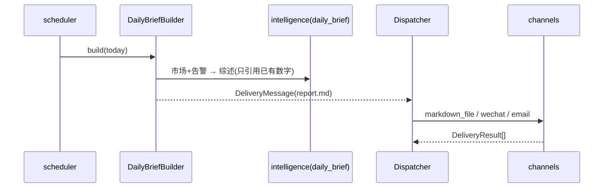

# delivery 模块详细设计

| 属性 | 值 |
|------|-----|
| 包路径 | `src/dataanalysisbase/delivery/` |
| 层 | 交付 |
| Phase | A（CLI）· E（日报/推送通道） |
| 依赖 | domain、config、storage、observability、surveillance、intelligence、portfolio、analytics |
| 被依赖 | 用户（CLI）、外部通道（企业微信/邮件） |

> 关联：[../AGENT_INTELLIGENCE.md](../AGENT_INTELLIGENCE.md) §6.3（推送通道）· [../PRODUCT_OUTCOMES.md](../PRODUCT_OUTCOMES.md) §3 · [../MODULE_DESIGN.md](../MODULE_DESIGN.md)

---

## 1. 模块定位与边界

**做什么**：把平台产出**送达用户**的最后一公里——

- **CLI**（Phase A 起）：`sync` / `research` / `ask` / `reconcile` / `monitor` 等命令，与 Web 并存（PRODUCT_OUTCOMES §4.3）
- **日报生成**（Phase E）：每日市场综述 + 重点股 + 告警摘要 + 持仓盈亏 → Markdown 文件
- **推送通道**（Phase E）：企业微信 Webhook / 邮件 SMTP / 本地 Markdown 告警文件

**不做什么**：

- 不算业务数字（综述文案来自 intelligence，数据来自各 repo / observability）
- 不直连数据源、不写业务表（只读 + 写 reports 文件、写 delivery 日志）
- 不做实时推流（实时告警由 api 的 WebSocket 负责；本模块负责异步/批量/外部通道）

---

## 2. 目录与文件

```text
delivery/
├── __init__.py
├── cli/
│   ├── main.py        # Typer/argparse 入口，子命令注册
│   ├── sync_cmd.py    # 手动触发同步（调 ingest）
│   ├── research_cmd.py# research/ask（调 intelligence）
│   └── reconcile_cmd.py
├── report/
│   ├── daily_brief.py # 组装日报（编排各源 + intelligence 综述）
│   └── templates/     # Jinja2：daily_report.md.j2
├── channels/
│   ├── base.py        # Channel 协议：send(subject, body, level)
│   ├── markdown_file.py
│   ├── wechat.py      # 企业微信 Webhook
│   └── email.py       # SMTP
└── dispatcher.py      # 按配置路由告警/日报到启用通道 + 重试/去重
```

---

## 3. 数据结构与类

### 3.1 Channel 协议（`channels/base.py`）

```python
class Channel(Protocol):
    name: str
    def send(self, msg: DeliveryMessage) -> DeliveryResult: ...

@dataclass(frozen=True)
class DeliveryMessage:
    subject: str
    body_md: str
    level: AlertSeverity          # info/medium/high → 决定是否推送某通道
    dedupe_key: str | None = None

@dataclass(frozen=True)
class DeliveryResult:
    channel: str
    success: bool
    error: str | None = None
```

### 3.2 日报组装（`report/daily_brief.py`）

```python
class DailyBriefBuilder:
    def build(self, trade_date: date) -> str:        # 返回 Markdown
        market = self.market_repo.overview(trade_date)
        alerts = self.alert_repo.summary(trade_date)
        focus  = self.focus_repo.snapshot(trade_date)
        pnl    = self.portfolio_svc.get_summary()
        narrative = self.intelligence.daily_brief(market, alerts)  # F：LLM 综述
        return render("daily_report.md.j2", ...)
```

### 3.3 分发器（`dispatcher.py`）

```python
class Dispatcher:
    def __init__(self, channels: list[Channel], rules: DeliveryRules): ...
    def dispatch(self, msg: DeliveryMessage) -> list[DeliveryResult]:
        # 按 level 与通道配置过滤 → 去重(dedupe_key) → 逐通道 send + 重试
```

---

## 4. 核心流程

### 4.1 日报生成与推送（EOD 后定时）



### 4.2 CLI 命令（Phase A）

```text
dab sync market            # 触发一次全市场快照（→ ingest）
dab sync focus             # 重点股深度同步
dab research 600519.SH     # 生成研报（→ intelligence）
dab ask "茅台近3年ROE趋势"  # 问答
dab reconcile 600519.SH    # 对账报告（→ fusion + intelligence 解释）
dab status                 # 系统/数据状态（→ observability）
```

CLI 复用各模块 service，不重复实现逻辑；输出走 stdout + 可选 Markdown 落盘。

### 4.3 告警外部推送（与 api WS 互补）

```text
surveillance 高级别告警 → Dispatcher.dispatch(level=high)
  → 仅 high/medium 推企业微信/邮件（info 只落 Markdown 文件）
  → dedupe_key 避免同一告警重复推送
```

---

## 5. 对外接口契约

| 调用方 | 用法 |
|--------|------|
| 用户 | CLI 子命令 |
| scheduler | EOD 调 `DailyBriefBuilder.build` + `Dispatcher.dispatch` |
| surveillance | 高级别告警调 `Dispatcher.dispatch`（异步/批量外推） |

CLI 退出码：0 成功；非 0 表示同步/生成失败（便于脚本编排）。

---

## 6. 配置与表

配置（`Settings` / delivery 段）：

```yaml
delivery:
  reports_dir: data/reports
  channels:
    markdown_file: { enabled: true }
    wechat:  { enabled: false, webhook_url_env: WECHAT_WEBHOOK }
    email:   { enabled: false, smtp_host: ..., to: [...] }
  push_levels: [high, medium]        # 仅这些级别外推
  daily_brief_time: "16:00"
```

敏感信息（webhook、SMTP 密码）走环境变量，不入库不入配置明文。

落盘 / 日志表：

```sql
CREATE TABLE IF NOT EXISTS delivery_log (
    id TEXT PRIMARY KEY,
    kind TEXT,                 -- daily_brief | alert_push
    channel TEXT,
    dedupe_key TEXT,
    success BOOLEAN,
    error TEXT,
    created_at TIMESTAMP DEFAULT now()
);
```

日报文件：`data/reports/daily/YYYY-MM-DD.md`；AI 研报导出沿用 `data/reports/`（PRODUCT_OUTCOMES §5）。

---

## 7. 错误处理与降级

| 场景 | 处理 |
|------|------|
| 通道发送失败 | 重试（指数退避，上限 3），记 delivery_log，不阻断其他通道 |
| 所有外部通道失败 | 至少保证 markdown_file 落盘（兜底通道） |
| intelligence 综述失败 | 日报降级为「纯数据表格无综述」（与 AGENT_INTELLIGENCE §10 一致） |
| 数据 stale/failed | 日报头部标注数据状态，仍生成 |
| 重复告警 | dedupe_key 命中则跳过外推 |

---

## 8. 测试用例清单

- CLI 各子命令：参数解析、退出码、调用正确 service（mock）
- DailyBriefBuilder：模板渲染、各段缺数据时占位降级
- Dispatcher：按 level 过滤、dedupe 去重、重试逻辑
- markdown_file 兜底：外部通道全失败仍落盘
- 综述失败降级为纯数据表
- delivery_log 记录成功/失败
- 敏感配置从 env 读取，不出现在日志

---

## 9. 开放问题

- CLI 框架选型：Typer（体验好）vs argparse（零依赖），建议 Typer
- 日报是否区分「盘后日报」与「盘中异动速报」两种模板
- 企业微信/邮件之外是否加 Telegram/Server酱
- 多市场（港股/美股）日报是否分时区分别生成
- 推送频控：高频告警的聚合窗口（与 intelligence 告警聚类叙事协同）
